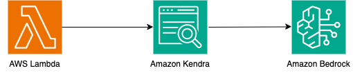

# AWS Lambda from Amazon Kendra to Amazon Bedrock

This pattern contains a sample stack that utilizes an AWS Lambda function to retrieve documents from an Amazon Kendra index and then pass it to Amazon Bedrock to generate a response. The pattern includes usage of the Amazon S3 data source connector. 

Important: this application uses various AWS services and there are costs associated with these services after the Free Tier usage - please see the AWS Pricing page for details. You are responsible for any AWS costs incurred. No warranty is implied in this example.

## Requirements
* [Create an AWS account](https://portal.aws.amazon.com/gp/aws/developer/registration/index.html) if you do not already have one and log in. The IAM user that you use must have sufficient permissions to make necessary AWS service calls and manage AWS resources.
* [AWS CLI](https://docs.aws.amazon.com/cli/latest/userguide/install-cliv2.html) installed and configured
* [Git Installed](https://git-scm.com/book/en/v2/Getting-Started-Installing-Git)
* [AWS CDK CLI](https://docs.aws.amazon.com/cdk/v2/guide/getting_started.html) (AWS CDK) installed
* [Request Amazon Bedrock Model Access for Anthropic Claude models on Amazon Bedrock](https://docs.aws.amazon.com/bedrock/latest/userguide/model-access.html)
* [Create an S3 Bucket](https://docs.aws.amazon.com/AmazonS3/latest/userguide/creating-bucket.html) and [upload documents](https://docs.aws.amazon.com/AmazonS3/latest/userguide/upload-objects.html) that you want to be indexed. If you already have an S3 bucket with data that you want to crawl, you can skip this step. Note down the name of the S3 bucket for later use.

## Deployment Instructions
1. Create a new directory, navigate to that directory in a terminal and clone the GitHub repository:
    ```
    git clone https://github.com/aws-samples/serverless-patterns
    ```
1. Change directory to the pattern directory:
    ```
    cd kendra-bedrock-cdk-python
    ```
1. From the command line, use AWS CDK to deploy the AWS resources for the pattern as specified in the app.py file:
    ```
    cdk deploy --parameters S3DSBucketName=${YourS3BucketName}
    ```

1. Note the outputs from the CDK deployment process. These contain the resource names and/or ARNs which are used for testing.

# How it works
Please refer to the architecture diagram below:



Here's a breakdown of the steps:

**AWS Lambda:** Two AWS Lambda functions are created. `DataSourceSync` crawls and indexes the content. `InvokeBedrockLambda` invokes the specified model by passing the retrieved content from Amazon Kendra as context to the generative AI model.

**Amazon Kendra:** An Amazon Kendra index is created with a S3 data source connector. When a the `InvokeBedrockLambda` function is called, documents are retrieved from the Amazon Kendra index.

**Amazon Bedrock:** Documents retrieved from the Amazon Kendra index are sent to Amazon Bedrock which responds with a generated response.

## Testing

CLI Lambda invoke with test event:

```bash
payload_base64=$(echo -n '{"question": "Value"}' | base64)

aws lambda invoke \
  --function-name INVOKE_LAMBDA_FUNCTION_ARN \
  --payload "$payload_base64" \
  output.txt
```

The output.txt will contain the response generated by Amazon Bedrock.

Example JSON Lambda test event:

```
{
    "question": "Value"
}
```

## Cleanup

1. Delete the stack
    ```bash
    cdk destroy
    ```
----
Copyright 2024 Amazon.com, Inc. or its affiliates. All Rights Reserved.

SPDX-License-Identifier: MIT-0