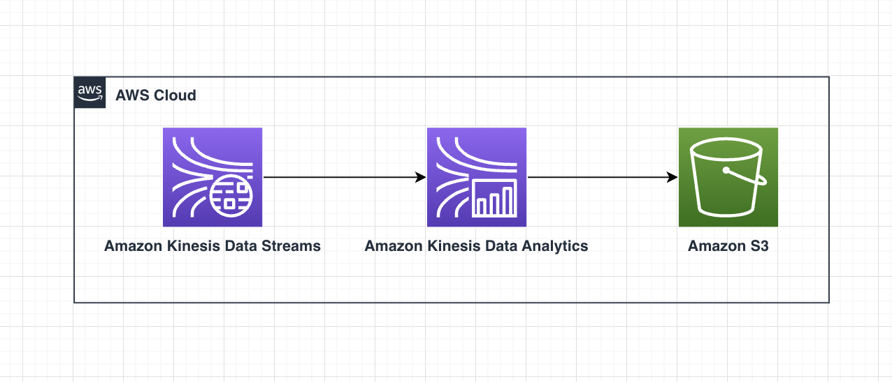

# Kinesis Data Analytics Writing Stream Data to Amazon S3 Bucket as a Sink

The purpose of this pattern is to deploy the infrastructure necessary to enable Kinesis Data Analytics to write streaming data to Amazon S3 Bucket.

With Amazon Kinesis Data Analytics for Apache Flink, you can use Java, Scala, or Python to process and analyze streaming data. The service enables you to author and run code against streaming sources to perform time-series analytics, feed real-time dashboards, and create real-time metrics. 

Kinesis Data Analytics provides the underlying infrastructure for your Apache Flink applications. It handles core capabilities like provisioning compute resources, parallel computation, automatic scaling, and application backups (implemented as checkpoints and snapshots). You can use the high-level Flink programming features (such as operators, functions, sources, and sinks) in the same way that you use them when hosting the Flink infrastructure yourself.

In this project, you create an Amazon Kinesis Data Analytics for Apache Flink application that has a Kinesis data stream as a source and an Amazon S3 bucket as a sink. 

Learn more about this pattern at [Serverless Land Patterns](https://serverlessland.com/patterns/firehose-dataanalytics-flink-s3-sink).

Important: this application uses various AWS services and there are costs associated with these services after the Free Tier usage - please see the [AWS Pricing page](https://aws.amazon.com/pricing/) for details. You are responsible for any AWS costs incurred. No warranty is implied in this example.

## Requirements

* [Create an AWS account](https://portal.aws.amazon.com/gp/aws/developer/registration/index.html) if you do not already have one and log in. The IAM user that you use must have sufficient permissions to make necessary AWS service calls and manage AWS resources.
* [AWS CLI](https://docs.aws.amazon.com/cli/latest/userguide/install-cliv2.html) installed and configured
* [Git Installed](https://git-scm.com/book/en/v2/Getting-Started-Installing-Git)
* [Terraform](https://learn.hashicorp.com/tutorials/terraform/install-cli?in=terraform/aws-get-started) installed

## Deployment Instructions

1. Clone the project to your local working directory

   ```sh
   git clone https://github.com/aws-samples/serverless-patterns/ 
   ```

2. Change the working directory to this pattern's directory

   ```sh
   cd serverless-patterns/firehose-dataanalytics-flink-s3-sink
   ```

3. From the command line, initialize terraform to  to downloads and installs the providers defined in the configuration:
    ```
    terraform init
    ```

4. From the command line, apply the configuration in the main.tf file:
    ```
    terraform apply
    ```

5. During the prompts:
   - Enter yes

## How it works



This pattern deploys a Kinesis Analytics streaming application, Kinesis Stream, a destination S3 bucket, and all of the additional required infrastructure services.

In this project, you create an Amazon Kinesis Data Analytics for Apache Flink application that has a Kinesis data stream as a source and an Amazon S3 bucket as a sink. 

Note: The default region is `us-east-1`, it can also be changed using the variable `region`.

**Note:** Variables can be supplied in different options, check the [Terraform documentation](https://developer.hashicorp.com/terraform/language/values/variables) for more details.

## Testing

To test this project, follow the below steps:

1. Sign in to your aws console at https://console.aws.amazon.com 

2. Navigate to Amazon Kinesis and go to the Analytics applications. This should display the list of all the streaming applications.

3. Select the Streaming application that you created as part of the deployment stack.

4. Press the **Run** button on the upper panel and in the next screen, choose 'Run with latest snapshot' and press the **Run** button on the bottom of the screen. Wait till the streaming application gets started successfully.

5. Generating Data: 
    ```sh
        cd serverless-patterns/firehose-dataanalytics-flink-s3-sink/test
        python stock.py
    ```
    The stock.py generates stream data and puts it in the kinesis stream that you created as part of the deployment stack.

    Note: Change the STREAM_NAME and region_name in the stock.py per your testing needs before you run it.

6. Wait for few minutes and then stop the data generation process.
   
7. Go to S3 in the AWS console and select the bucket that you created as part of the deployment stack. You should now see the stock data paritioned based on the stock symbol. For example: ticker:AAPL/, ticker:AMZN/ etc.

8. For further analysis, you could go back to the Amazon Kinesis page in the AWS console and go to the Analytics applications. Select the Streaming application that you created and Press the **Open Apache Flink dashboard** button on the upper panel.

9. This should list the running jobs, select the Job that is currently in the 'RUNNING' status and you could drill down for further analysis.

## Cleanup

1. Change directory to the pattern directory:
    ```sh
    cd serverless-patterns/firehose-dataanalytics-flink-s3-sink
    ```

2. Delete all created resources
    ```sh
    terraform destroy
    ```

3. During the prompts:
    * Enter yes

4. Confirm all created resources has been deleted
    ```sh
    terraform show
    ```

## Reference
- [Amazon Kinesis Data Analytics for Apache Flink](https://docs.aws.amazon.com/kinesisanalytics/latest/java/what-is.html)
- [Send Streaming Data to Amazon S3 in Python](https://docs.aws.amazon.com/kinesisanalytics/latest/java/examples-python-s3.html)

----
Copyright 2023 Amazon.com, Inc. or its affiliates. All Rights Reserved.

SPDX-License-Identifier: MIT-0