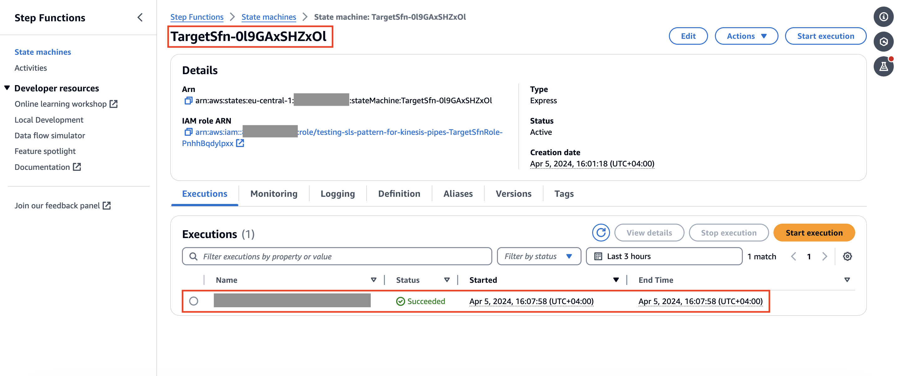
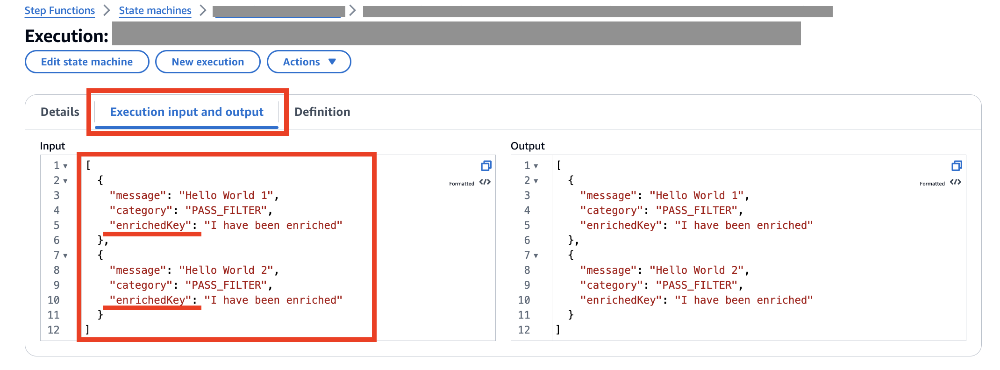

# Amazon Kinesis Data Streams to AWS Step Functions through Amazon EventBridge Pipes

Create an EventBridge Pipe to connect a Kinesis Data Stream and a Step Functions Workflow.

Learn more about this pattern at Serverless Land Patterns: https://serverlessland.com/patterns/kinesis-eventbridge-pipes-filter-enrichment-sfn

Important: this application uses various AWS services and there are costs associated with these services after the Free Tier usage - please see the [AWS Pricing page](https://aws.amazon.com/pricing/) for details. You are responsible for any AWS costs incurred. No warranty is implied in this example.

## Requirements

* [Create an AWS account](https://portal.aws.amazon.com/gp/aws/developer/registration/index.html) if you do not already have one and log in. The IAM user that you use must have sufficient permissions to make necessary AWS service calls and manage AWS resources.
* [AWS CLI](https://docs.aws.amazon.com/cli/latest/userguide/install-cliv2.html) installed and configured
* [Git Installed](https://git-scm.com/book/en/v2/Getting-Started-Installing-Git)
* [AWS Serverless Application Model](https://docs.aws.amazon.com/serverless-application-model/latest/developerguide/serverless-sam-cli-install.html) (AWS SAM) installed

## Deployment Instructions

1. Create a new directory, navigate to that directory in a terminal and clone the GitHub repository:
    ``` 
    git clone https://github.com/aws-samples/serverless-patterns
    ```
2. Change directory to the pattern directory:
    ```
    cd kinesis-eventbridge-pipes-filter-enrichment-sfn
    ```
3. From the command line, use AWS SAM to deploy the AWS resources for the pattern as specified in the template.yml file:
    ```
    sam build && sam deploy --guided
    ```
4. During the prompts:
    * Enter a stack name
    * Enter the desired AWS Region
    * Allow SAM CLI to create IAM roles with the required permissions.

    Once you have run `sam deploy --guided` mode once and saved arguments to a configuration file (samconfig.toml), you can use `sam deploy` in future to use these defaults.

5. Note the outputs from the SAM deployment process. These contain the resource names and/or ARNs which are used for testing.

## How it works

This pattern shows how to build a pipeline that filters and enriches messages comming in an Amazon Kinesis Stream to an AWS Step Function Workflow. It leverages EventBridge Pipes to connect the source stream and the target workflow. On top of just connecting a source and a target, EventBridge Pipes allow to filter and enrich messages before they reach the target.

## Testing

Follow the steps below to test out the pattern:
1. Grab the Amazon Kinesis Stream name from the SAM deployment outputs
2. Run the following command from your terminal
   ```curl
    aws kinesis put-records \
    --stream-name sam-kinesis-pattern-testing-SourceStream-PyauFK64vCGM \
    --records Data=$(echo -n '{ "message": "Hello World 1", "category": "PASS_FILTER" }' | base64),PartitionKey=MY_PARTITION_KEY Data=$(echo -n '{ "message": "Bye World", "category": "NO_PASS_FILTER" }' | base64),PartitionKey=MY_PARTITION_KEY Data=$(echo -n '{ "message": "Hello World 2", "category": "PASS_FILTER" }' | base64),PartitionKey=MY_PARTITION_KEY\
    --cli-binary-format base64
   ```
3. Visit the [AWS Step Functions console](https://console.aws.amazon.com/states/home?#/statemachines) in the region you deployed this sample in, locate the state machine containing `TargetSfn` in its name and click on it.
4. You should see a successful execution, click on it.
   
5. Click on the `Execution Input and Output` tab, you should see an array with 2 message structured as follows:
  ```json
  [
    {
      "message": "Hello World 1",
      "category": "PASS_FILTER",
      "enrichedKey": "I have been enriched"
    },
    {
      "message": "Hello World 2",
      "category": "PASS_FILTER",
      "enrichedKey": "I have been enriched"
    }
  ]
  ```
  Notice the additional `enrichedKey` key that has been added in the enrichment step and that one of the three messages was dropped due to the filter.
  
   

## Cleanup
 
1. Delete the stack
    ```bash
    sam delete
    ```
----
Copyright 2023 Amazon.com, Inc. or its affiliates. All Rights Reserved.

SPDX-License-Identifier: MIT-0
