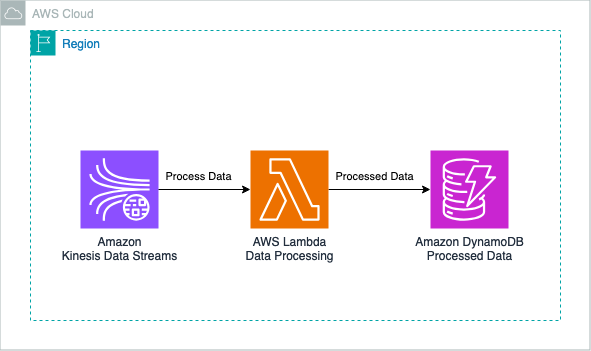

# Real-time Data Pipeline with Kinesis, Lambda, and DynamoDB using AWS CDK .NET

This pattern demonstrates how to create a serverless real-time data pipeline using Amazon Kinesis for data ingestion, AWS Lambda for processing, Amazon DynamoDB for data storage. The pattern is implemented using AWS CDK with .NET.

Learn more about this pattern at Serverless Land Patterns: https://serverlessland.com/patterns/kinesis-lambda-dynamodb-pipeline-dotnet-cdk

Important: this application uses various AWS services and there are costs associated with these services after the Free Tier usage - please see the [AWS Pricing page](https://aws.amazon.com/pricing/) for details. You are responsible for any AWS costs incurred. No warranty is implied in this example.

## Architecture


## Requirements

* [Create an AWS account](https://portal.aws.amazon.com/gp/aws/developer/registration/index.html) if you do not already have one and log in. The IAM user that you use must have sufficient permissions to make necessary AWS service calls and manage AWS resources.
* [AWS CLI](https://docs.aws.amazon.com/cli/latest/userguide/install-cliv2.html) installed and configured
* [Git Installed](https://git-scm.com/book/en/v2/Getting-Started-Installing-Git)
* [Node and NPM](https://nodejs.org/en/download/) installed
* [AWS Cloud Development Kit](https://docs.aws.amazon.com/cdk/latest/guide/cli.html) (AWS CDK) installed
* [.NET](https://dotnet.microsoft.com/en-us/download/dotnet/8.0) (.NET 8.0) installed

## Deployment Instructions

1. Create a new directory, navigate to that directory in a terminal and clone the GitHub repository:
    ``` 
    git clone https://github.com/aws-samples/serverless-patterns
    ```
2. Change the working directory to this pattern's directory:
    ```
    cd kinesis-lambda-dynamodb-pipeline-dotnet-cdk
    ```
3. Build the .NET CDK project:
    ```
    dotnet build src
    ```
4. Deploy the stack to your default AWS account and region. The output of this command should give you the Kinesis stream name:
    ```
    cdk deploy
    ```
5. Other useful commands:
    ```
    cdk diff         compare deployed stack with current state    
    cdk synth        emits the synthesized CloudFormation template
    ```

## How it works

This pattern creates a serverless real-time data pipeline:

1. Data is ingested through an Amazon Kinesis Data Stream.
2. An AWS Lambda function is triggered by new records in the Kinesis stream.
3. The Lambda function processes the data and stores it in an Amazon DynamoDB table.
4. If any errors occur during processing, they are logged to CloudWatch. It can also be stored in a separate database table for error tracking. The Lambda function will retry processing failed records up to maximum retry count. If a record consistently fails processing after these retries, you can use SQS Dead Letter Queue (DLQ) for further investigation and handling, ensuring no data is lost due to processing errors.

The AWS CDK is used to define and deploy all the necessary AWS resources, including the Kinesis stream, Lambda function, DynamoDB tables and associated IAM roles and permissions.

## Testing

1. Put new record into Kinesis stream.

    - Use the AWS CLI to put a record into the Kinesis stream (replace `<KinesisStreamName>` with the actual stream name from the CDK output):

    ```
    aws kinesis put-record \
    --stream-name <KinesisStreamName> \
    --cli-binary-format raw-in-base64-out \
    --partition-key 1 \
    --data '{ "Timestamp": "2024-09-13T23:06:55.934081Z", "Value": 81, "Category": "C" }'
    ```
2. Check the DynamoDB tables in the AWS Console:
   - The "processed-data-table" should contain the processed record.
   - If any errors occurred, they would be logged in the CloudWatch.

3. You can also check the CloudWatch Logs for the Lambda function to see the processing details and any potential errors.

4. If you have implemented DLQ, to test error scenarios, you can intentionally send malformed data to the Kinesis stream and verify that it ends up in the Dead Letter Queue after the retry attempts.

5. Additional unit and integration tests are located in the `test` directory under each Lambda function's directory. These tests can be run locally to verify the behavior of individual components:
    ```
    dotnet test src
    ```
6. For a more comprehensive end-to-end test, you can use the AWS Step Functions service to orchestrate a test workflow that includes putting records into Kinesis, waiting for processing, and then checking the results in DynamoDB and the DLQ.

Remember to clean up any test data from your DynamoDB table after testing to avoid unnecessary storage costs.

## Cleanup
 
1. Run the given command to delete the resources that were created. It might take some time for the CloudFormation stack to get deleted.
    ```
    cdk destroy
    ```

----
Copyright 2024 Amazon.com, Inc. or its affiliates. All Rights Reserved.

SPDX-License-Identifier: MIT-0