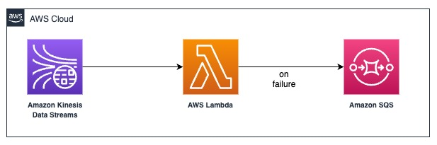

# Effective consumer strategies for handling Kinesis Data Stream anomalies

The purpose of this pattern is to showcase on how to handle the consumer(AWS Lambda) failure when reading/processing the records from the Amazon Kinesis data stream. 

A Kinesis data stream is a set of shards. Each shard contains a sequence of data records. A consumer is an application that processes the data from a Kinesis data stream. The event source mapping that reads records from the Kinesis stream, invokes AWS Lambda function synchronously, and retries on errors. If Lambda throttles the function or returns an error without invoking the function, Lambda retries until the records expire or exceed the maximum age that you configure on the event source mapping.

If the error handling measures fail, Lambda discards the records and continues processing batches from the stream. With the default settings, this means that a bad record can block processing on the affected shard for up to one week. To avoid this, we are going to configure function's event source mapping in this pattern with a reasonable number of retries and a maximum record age.

To retain a record of discarded batches, we are going to configure a failed-event destination. Lambda sends the failed record to the destination - AWS SQS. 

Learn more about this pattern at [Serverless Land Patterns](https://serverlessland.com/patterns/kinesis-lambda-error-handling).

Important: this application uses various AWS services and there are costs associated with these services after the Free Tier usage - please see the [AWS Pricing page](https://aws.amazon.com/pricing/) for details. You are responsible for any AWS costs incurred. No warranty is implied in this example.

## Requirements

* [Create an AWS account](https://portal.aws.amazon.com/gp/aws/developer/registration/index.html) if you do not already have one and log in. The IAM user that you use must have sufficient permissions to make necessary AWS service calls and manage AWS resources.
* [AWS CLI](https://docs.aws.amazon.com/cli/latest/userguide/install-cliv2.html) installed and configured
* [Git](https://git-scm.com/book/en/v2/Getting-Started-Installing-Git) Installed
* [AWS SAM](https://aws.amazon.com/serverless/sam/) The AWS Serverless Application Model (SAM) is an open-source framework for building serverless applications.

* [AWS Cloud9](https://aws.amazon.com/cloud9/) Other alternative is to use Cloud IDE which comes with prepackaged programming languages, CLIs needed for this project.

## Deployment Instructions

1. Clone the project to your local working directory

   ```sh
   git clone https://github.com/aws-samples/serverless-patterns/ 
   ```

2. Change the working directory to this pattern's directory

   ```sh
   cd serverless-patterns/kinesis-lambda-error-handling
   ```
3. From the command line, use AWS SAM to build and deploy the AWS resources for the pattern as specified in the template.yml file:
   ```
   sam build
   sam deploy --guided
   ```
4. During the prompts:

   - Enter a stack name
   - Enter the desired AWS Region
   - Allow SAM CLI to create IAM roles with the required permissions.

   Once you have run `sam deploy --guided` mode and saved arguments to a configuration file (samconfig.toml), you can use `sam deploy` in the future to use these defaults.
   Note the outputs from the SAM deployment process. These contain the resource names and/or ARNs which are used for testing.

## How it works


The pattern builds infrastructure with Amazon Kinesis data stream, a consumer Lambda function, SQS queue to load the failed records for further troubleshooting, and cloudwatch to validate the logs for the success, failure with retries.

The event source mapping that reads records from your Kinesis stream, invokes AWS Lambda function synchronously, and retries on errors. If Lambda throttles the function or returns an error without invoking the function, Lambda retries until the records expire or exceed the maximum age that you configure on the event source mapping.

## Testing 
To test the pattern, we are breaking the test cases into two scenarios.

### Scenario 1: Put messages without the Poision pill
- test-records-without-poison-pill.json --> Holds the base64 data with partition key
- without-poison-pill-put-records.sh --> bash script to put records into Kinesis data stream

```
chmod +x kinesis-producer/*.sh;
./kinesis-producer/without-poison-pill-put-records.sh
```
- In the Cloudwatch logs, you should see all the 3 messages processed without any exception. 

### Scenario 2: Put messages with the Poision pill
- test-records-with-poison-pill.json --> Holds the base64 data with partition key
- with-poison-pill-put-records.sh --> bash script to put records into Kinesis data stream

```
./kinesis-producer/with-poison-pill-put-records.sh
```

- In the Cloudwatch logs, you should see poison message and Lambda splitting the batch in half to resume each half separately. Finally placing the posion message to AWS SQS for further troubleshooting.

## Validation
After the Scenario 2, the invalid/poison pill message is put in the SQS queue for the further research. 
Replace the AWSACCOUNTID with the AWS account number in the validation-scripts/read-sqs-queue.sh 

```
vi validation-scripts/read-sqs-queue.sh
```
Run the script as below to see the message details. 
```
chmod +x validation-scripts/read-sqs-queue.sh;
./validation-scripts/read-sqs-queue.sh
```

We highly recommend to use [Amazon Kinesis Data Generator(KDG)](https://aws.amazon.com/blogs/big-data/test-your-streaming-data-solution-with-the-new-amazon-kinesis-data-generator/) for the high volume testing. The KDG makes it simple to send test data to your Amazon Kinesis stream or Amazon Kinesis Firehose delivery stream. 

## Cleanup
```
sam delete
```

## Reference
- [AWS SAM](https://aws.amazon.com/serverless/sam/)
- [AWS Lambda with Amazon Kinesis](https://docs.aws.amazon.com/lambda/latest/dg/with-kinesis.html)
- [Lambda event source mappaings](https://docs.aws.amazon.com/lambda/latest/dg/invocation-eventsourcemapping.html)
- [Amazon Kinesis Data Generator](https://aws.amazon.com/blogs/big-data/test-your-streaming-data-solution-with-the-new-amazon-kinesis-data-generator/)
----
Copyright 2023 Amazon.com, Inc. or its affiliates. All Rights Reserved.
SPDX-License-Identifier: MIT-0
