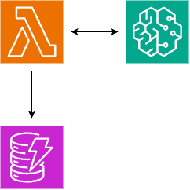

# Amazon Bedrock to Amazon DynamoDB

This pattern demonstrates how to use AWS Lambda to process queries using Amazon Bedrock's model and store the conversation results in Amazon DynamoDB.

Learn more about this pattern at Serverless Land Patterns: [Serverless Land](https://serverlessland.com/patterns/)

Important: this application uses various AWS services and there are costs associated with these services after the Free Tier usage - please see the [AWS Pricing page](https://aws.amazon.com/pricing/) for details. You are responsible for any AWS costs incurred. No warranty is implied in this example.

## Requirements

* [Create an AWS account](https://portal.aws.amazon.com/gp/aws/developer/registration/index.html) if you do not already have one and log in. The IAM user that you use must have sufficient permissions to make necessary AWS service calls and manage AWS resources.
* Python 3.12
* [AWS CLI](https://docs.aws.amazon.com/cli/latest/userguide/install-cliv2.html) installed and configured
* [Git Installed](https://git-scm.com/book/en/v2/Getting-Started-Installing-Git)
* [AWS Serverless Application Model](https://docs.aws.amazon.com/serverless-application-model/latest/developerguide/serverless-sam-cli-install.html) (AWS SAM CLI) installed
* This pattern uses foundation models provided by Amazon Bedrock. It is required to request access to the model before starting using the pattern. Please refer to the link below for instructions: [Model access](https://docs.aws.amazon.com/bedrock/latest/userguide/model-access.html).


## Architecture

- AWS Lambda function
- Amazon Bedrock
- Amazon DynamoDB



## Deployment Instructions

1. Create a new directory, navigate to that directory in a terminal and clone the GitHub repository:
    ``` 
    git clone https://github.com/aws-samples/serverless-patterns/lambda-bedrock-dynamodb-sam
    
    ```
1. Change directory to the pattern directory:
    ```
    cd lambda-bedrock-dynamodb-sam
    ```
1. From the command line, use AWS SAM to build the SAM application:
   ```
   sam build
   ```
1. From the command line, use AWS SAM to deploy the AWS resources for the pattern as specified in the template.yml file:
    ```
    sam deploy --guided
    ```
1. During the prompts:
    * Enter a stack name
    * Enter the desired AWS Region (We suggest ```us-east-1``` as the code has been tested in this region)
    * Enter a name for your DynamoDB table
    * Enter the model-id of your choice [Example : ```anthropic.claude-3-haiku-20240307-v1:0```](You'll need to have the model access as a pre-requiste)
    * Allow SAM CLI to create IAM roles with the required permissions.

    After the first run of `sam deploy --guided` and saving the arguments to a configuration file (samconfig.toml), you can use `sam deploy` in future to use these defaults.

1. Note the outputs from the SAM deployment process. These contain the resource names and/or ARNs which are used for testing.


## Usage Example

Invoke the Lambda function with a query:

```bash
aws lambda invoke \
  --function-name lambda-processor \
  --cli-binary-format raw-in-base64-out \
  --payload '{"query": "What is the capital of France?"}' \
  output.txt
```

Verify the stored results:

```bash
aws dynamodb scan --table-name YOUR_TABLE_NAME
```

Replace `YOUR_TABLE_NAME` with the actual name of your DynamoDB table.


## Resources Created

- **DynamoDB Table**: Stores the queries and responses.
- **Lambda Function**: Processes queries using Bedrock and stores results in DynamoDB.
  

## Configuration

The main configuration parameters are set in the SAM template:

- `tableName`: The name of the DynamoDB table (passed as a parameter during deployment)
- Lambda function timeout: 180 seconds
- Lambda function memory: 128 MB
  

## IAM Permissions

The Lambda function is granted the following permissions:

- `dynamodb:PutItem` on the created DynamoDB table
- `bedrock:InvokeModel` for the model provided in
  

## Environment Variables

The Lambda function uses the following environment variable:

- `table_name`: Set to the name of the created DynamoDB table
- `model_ID` : Set to the name of the choosen Bedrock's model ID


## Cleanup

1. To delete the resources deployed to your AWS account via AWS SAM, run the following command:

```bash
   sam delete
```


---

Copyright 2024 Amazon.com, Inc. or its affiliates. All Rights Reserved.

SPDX-License-Identifier: MIT-0
