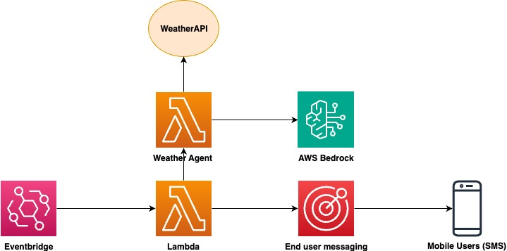

# Amazon Lambda - Bedrock - End user messaging

This sample pattern delivers personalized daily briefing SMS messages using Lambda, AWS End User Messaging and Amazon Bedrock. It combines real-time weather data with Amazon Bedrock's AI models to create natural language weather summaries that are automatically delivered to users' phones at their preferred time. You can extend this pattern to deliver additional personalized content such as news headlines, stock market updates, or sports scores by integrating relevant APIs and adapting the AI prompt engineering approach. 

Built with a serverless-first approach, this solution automatically sends you tailored information at your preferred time each day, eliminating the need to manually check multiple sources.
 
**Important:** this application uses various AWS services and there are costs associated with these services after the Free Tier usage - please see the [AWS Pricing page](https://aws.amazon.com/pricing/) for details. You are responsible for any AWS costs incurred. No warranty is implied in this example.

### Getting Started

The entire solution is built using AWS Cloud Development Kit (CDK) and AWS Lambda functions running on Python 3.11 runtime. This serverless architecture ensures minimal operational overhead while providing maximum flexibility for customization.

### Requirements

* [Create an AWS account](https://portal.aws.amazon.com/gp/aws/developer/registration/index.html) if you do not already have one and log in. The IAM user that you use must have sufficient permissions to make necessary AWS service calls and manage AWS resources.
* [AWS CLI](https://docs.aws.amazon.com/cli/latest/userguide/install-cliv2.html) installed and configured
* [Git Installed](https://git-scm.com/book/en/v2/Getting-Started-Installing-Git)
* [AWS Cloud Development Kit](https://docs.aws.amazon.com/cdk/v2/guide/getting_started.html) installed
* [Node.js](https://nodejs.org/en) and [npm](https://www.npmjs.com/) installed (required for CDK)
* [Docker](https://www.docker.com/) is installed and the docker daemon is running
* This solution requires an [WeatherAPI](https://www.weatherapi.com//) API key. To obtain one, please create a free account at [Weatherapi.com](https://www.weatherapi.com/) and retrieve your API key.
* A destination phone number to receive SMS messages
* An originating number based on your [country’s requirements](https://docs.aws.amazon.com/sms-voice/latest/userguide/phone-numbers-sms-by-country.html)
* Access to Bedrock Foundation Models. Please refer to this [documentation](https://docs.aws.amazon.com/bedrock/latest/userguide/model-access-modify.html) to add or remove access to Bedrock foundation models. In this example, we are using the Anthropic Claude 3 Haiku foundation model.

### AWS Services Used

* AWS Lambda
* Amazon Bedrock 
* AWS Secret Manager
* Amazon EventBridge 
* AWS End User Messaging

### Architecture Diagram


### How it works

* EventBridge triggers the Lambda function daily at your specified time
* Main Lambda function performs the following actions:
    * Invokes the Weather Agent Lambda to retrieve weather data from the WeatherAPI and summarize the content with Bedrock
    * Receives the processed message and uses End User Messaging to send SMS

### Deployment Instructions

1. Create a new directory, navigate to that directory in a terminal and clone the GitHub repository:
    ``` 
    git clone https://github.com/aws-samples/serverless-patterns/
    ```
2. Change directory to the pattern directory:
    ```
    cd lambda-bedrock-endusermessaging
    ```

3. Create [AWS Secrets Manager Secret](https://docs.aws.amazon.com/secretsmanager/latest/userguide/create_secret.html) Secrets for your WeatherAPI key,destination  phone number, and origination phone number. 

    Log in to your AWS account and navigate to the AWS Secrets Manager service in the AWS Console in your preferred region. Then select the Store a new secret button.

    For the secret type, select Other type of secret. Under Key/value pair, select the Plaintext tab and enter the weather API key. For the encryption key, you can either encrypt using the AWS KMS key that AWS Secrets Manager creates or use a customer-managed AWS KMS key that you create. Select Next, provide the secret name as WeatherAPIKey, select Next, and click the Store button to create the secret. Note the secret ARN, as this will be needed for the next step.

    Repeat this process for your destination and origination phone numbers, creating separate secrets named DestinationPhone and OriginationPhone respectively.

    If you prefer the CLI option, use the commands below. Replace the placeholder values with your actual API key, destination, and origination phone numbers, along with your preferred region. 

    ```
    aws secretsmanager create-secret \
    --name "WeatherAPIKey" \
    --description "API key for WeatherAPI service" \
    --secret-string "your-actual-weather-api-key-here" \
    --region us-east-1


    aws secretsmanager create-secret \
        --name "OriginationPhone" \
        --description "Origination phone number for SMS sending" \
        --secret-string "+12065550100" \
        --region us-east-1

    aws secretsmanager create-secret \
        --name "DestinationPhone" \
        --description "Destination phone number for weather alerts" \
        --secret-string "+12065550123" \
        --region us-east-1

    ```
 
4. Edit the constants.py file under the folder personalized_sms_briefing_bedrock and customize the following parameters according to your preferences:
    1. DESTINATION_PHONE_NUMBER: The phone number where you want to receive SMS briefings
    2. ORIGINATION_IDENTITY_PHONE_NUMBER: Your verified sender ID for SMS messages
    3. LOCATION: Your preferred location for weather forecasts
    4. SCHEDULE_HOUR and SCHEDULE_MINUTE: Your desired delivery time (in UTC)
    5. AWS_BEDROCK_MODEL_ID: The Bedrock model to use for content generation
    6. WEATHER_API_KEY: Your personal API key from WeatherAPI

    Example below 

    ```
    DESTINATION_PHONE_SECRET_ARN = "arn:aws:secretsmanager:us-west-2:123456789012:secret:destination-phone-Abc123"
    ORIGINATION_PHONE_SECRET_ARN = "arn:aws:secretsmanager:us-west-2:123456789012:secret:origination-phone-Def456"
    WEATHER_API_KEY_SECRET_ARN = "arn:aws:secretsmanager:us-west-2:123456789012:secret:weather-api-key-Ghi789"
    LOCATION = "Seattle"
    SCHEDULE_HOUR = 15
    SCHEDULE_MINUTE = 0
    AWS_BEDROCK_MODEL_ID= "anthropic.claude-3-haiku-20240307-v1:0"

    ```

5. Create a virtualenv on MacOS and Linux 
    ``` 
    python3 -m venv .venv
    ```
6. After the init process completes and the virtualenv is created, you can use the following step to activate your virtualenv
    ```
    source .venv/bin/activate
    ```
    [Optional - for Windows] If you are a Windows platform, you would activate the virtualenv with below command

    ```
    .venv\Scripts\activate.bat
    ```
7. Once the virtualenv is activated, you can install the required dependencies  
    ``` 
    pip install -r requirements.txt
    ```
8. Synthesize the CloudFormation template for this code 
    ```
    cdk synth
    ```
9. Deploy the stack

    ```
    cdk deploy
    ```
### Testing Your Deployment

* For quick verification of your deployment using only the AWS CLI.Invoke the SMS sender function to trigger an immediate briefing:

    ```
   aws lambda invoke \
    --function-name $(aws cloudformation describe-stacks --stack-name PersonalizedSmsBriefingBedrockStack --query "Stacks[0].Outputs[?OutputKey=='SmsSenderFunctionName'].OutputValue" --output text) \
    --payload '{}' \
    --cli-binary-format raw-in-base64-out \
    response.json

    ```

* Check the execution status for detailed logs and any error messages.You should also have received an SMS on the destination phone number.

    ```
    cat response.json
    ```

### SMS Message samples

```
    "Hello! It's 59°F in Seattle. Partly cloudy. Grab a light jacket and enjoy the day! 🌤️"
    "Hello! It's 45°F in Chicago. Overcast skies. Layer up and stay cozy! ☁️"
```
### Cleanup
 
1. To cleanup/delete resources created while deploying the solution, go to the root folder of the project repository and run 
    ```
    cdk destroy
    ```

### Useful commands

 * `cdk ls`          list all stacks in the app
 * `cdk synth`       emits the synthesized CloudFormation template
 * `cdk deploy`      deploy this stack to your default AWS account/region
 * `cdk diff`        compare deployed stack with current state
 * `cdk docs`        open CDK documentation

------
Copyright 2025 Amazon.com, Inc. or its affiliates. All Rights Reserved.

SPDX-License-Identifier: MIT-0
