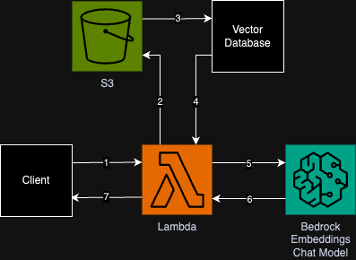
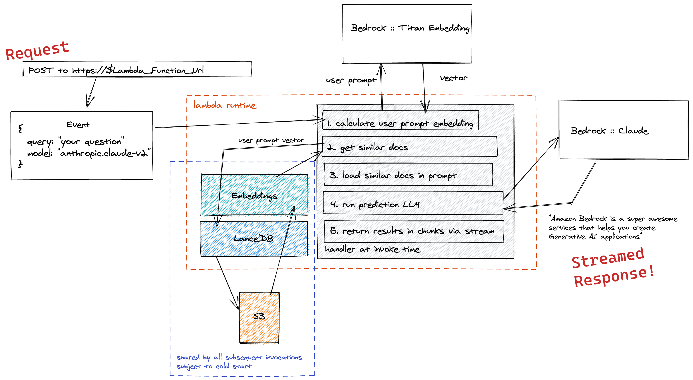

# Streaming Serverless Retrieval Augmented Generation (RAG) with Amazon Bedrock, Lambda, and S3

This pattern demonstates an implementation of streaming Retrieval Augmented Generation, making usage of Bedrock, Lambda Function URLs, and LanceDB embedding store backed by S3.

Learn more about this pattern at Serverless Land Patterns [here](https://github.com/aws-samples/serverless-patterns/tree/main/lambda-bedrock-s3-streaming-rag)

Important: this application uses various AWS services and there are costs associated with these services after the Free Tier usage - please see the [AWS Pricing page](https://aws.amazon.com/pricing/) for details. You are responsible for any AWS costs incurred. No warranty is implied in this example.

## Requirements

* [Create an AWS account](https://portal.aws.amazon.com/gp/aws/developer/registration/index.html) if you do not already have one and log in. The IAM user that you use must have sufficient permissions to make necessary AWS service calls and manage AWS resources.
* [AWS CLI](https://docs.aws.amazon.com/cli/latest/userguide/install-cliv2.html) installed and configured
* [Git Installed](https://git-scm.com/book/en/v2/Getting-Started-Installing-Git)
* [AWS Serverless Application Model](https://docs.aws.amazon.com/serverless-application-model/latest/developerguide/serverless-sam-cli-install.html) (AWS SAM) installed
* [Docker Installed and Running](https://docs.aws.amazon.com/serverless-application-model/latest/developerguide/install-docker.html)

## Deployment Instructions

1. Create a new directory, navigate to that directory in a terminal and clone the GitHub repository:
    ``` 
    git clone https://github.com/aws-samples/serverless-patterns
    ```
1. Change directory to the pattern directory:
    ```
    cd lambda-bedrock-s3-streaming-rag
    ```
1. From the command line, use AWS SAM to deploy the AWS resources for the pattern as specified in the template.yml file:
    ```
    sam build -u
    sam deploy --guided
    ```
1. During the prompts:
    * Enter a stack name
    * Enter the desired AWS Region
    * Allow SAM CLI to create IAM roles with the required permissions.

    Once you have run `sam deploy --guided` mode once and saved arguments to a configuration file (samconfig.toml), you can use `sam deploy` in future to use these defaults.

1. Note your stack name and outputs from the SAM deployment process. These contain the resource names and/or ARNs which are used for testing.

## How it works


With this pattern we want to showcase how to implement a streaming serverless Retrieval Augmented Generation (RAG) architecture.  
Customers asked for a way to quickly test RAG capabilities on a small number of documents without managing infrastructure for contextual knowledge and non-parametric memory.  
In this pattern, we run a RAG workflow in a single Lambda function, so that customers only pay for the infrastructure they use, when they use it.  
We use [LanceDB](https://lancedb.com/) with Amazon S3 as backend for embedding storage.  
This pattern deploys one Lambda function behind an API Gateway and an S3 Bucket where to store your embeddings.  
This pattern makes use of Bedrock to calculate embeddings with Amazon Titan Embedding and any Amazon Bedrock chat model as prediction LLM. 
The responses are streamed using Lambda URL function streaming for a quicker time to first byte and a better user experience.
We also provide a local pipeline to ingest your PDFs and upload them to S3.



## Ingest Documents
Once your stack has been deployed, you can ingest PDF documents by following the instructions in [`./data-pipeline/README.md`](./data-pipeline/README.md)

## Testing
Once your stack has been deployed and you have loaded in your documents, follow the testing instructions in [`./testing/README.md`](./testing/README.md)

## Cleanup
 
1. Delete the stack
    ```bash
    sam delete
    ```

----
Copyright 2023 Amazon.com, Inc. or its affiliates. All Rights Reserved.

SPDX-License-Identifier: MIT-0