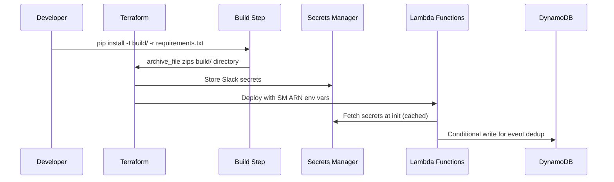

# Design Document: PR Cleanup & Hardening

## Overview

Comprehensive cleanup of the lambda-df-slack serverless pattern project addressing PR review feedback across four areas: removing vendored dependencies and fixing the build pipeline, hardening Terraform IAM policies and secrets management, fixing durable function determinism and code quality issues in the Python Lambda source, and correcting documentation inaccuracies in the README.

## Main Algorithm/Workflow



## Core Interfaces/Types

```python
# --- secrets.py (new module) ---
from typing import Optional
import json
import os
import boto3
import logging

logger = logging.getLogger(__name__)

_secrets_cache: Optional[dict] = None


def get_slack_secrets() -> dict:
    """
    Fetch Slack bot token and signing secret from AWS Secrets Manager.
    Caches result for Lambda container lifetime to avoid repeated API calls.

    Returns:
        dict with keys 'SLACK_BOT_TOKEN' and 'SLACK_SIGNING_SECRET'
    """
    global _secrets_cache
    if _secrets_cache is not None:
        return _secrets_cache

    secret_arn = os.environ['SLACK_SECRETS_ARN']
    client = boto3.client('secretsmanager')
    response = client.get_secret_value(SecretId=secret_arn)
    _secrets_cache = json.loads(response['SecretString'])
    return _secrets_cache
```

```python
# --- dedup.py (new module) ---
import os
import time
import logging
import boto3
from botocore.exceptions import ClientError

logger = logging.getLogger(__name__)

dynamodb = boto3.resource('dynamodb')
dedup_table = dynamodb.Table(os.environ['CALLBACKS_TABLE_NAME'])

# TTL for dedup entries: 5 minutes
DEDUP_TTL_SECONDS = 300


def is_duplicate_event(event_id: str) -> bool:
    """
    Check if a Slack event has already been processed using DynamoDB conditional write.
    Works correctly across concurrent Lambda instances.

    Uses a conditional PutItem that fails if the item already exists,
    providing atomic deduplication.

    Args:
        event_id: The Slack event_id to check

    Returns:
        True if event was already processed (duplicate), False if new
    """
    try:
        dedup_table.put_item(
            Item={
                'user_id': f'DEDUP#{event_id}',
                'step': 'event',
                'ttl': int(time.time()) + DEDUP_TTL_SECONDS,
            },
            ConditionExpression='attribute_not_exists(user_id)',
        )
        return False  # Successfully wrote — this is a new event
    except ClientError as e:
        if e.response['Error']['Code'] == 'ConditionalCheckFailedException':
            return True  # Already exists — duplicate
        raise
```

```python
# --- Updated agentcore_client.py interface ---
import os
import json
import logging
import boto3
from typing import Optional, Dict, Any

logger = logging.getLogger(__name__)


class AgentCoreClient:
    """Client for invoking AgentCore agent runtime"""

    def __init__(self, agent_runtime_arn: Optional[str] = None):
        self.agent_runtime_arn = agent_runtime_arn or os.environ.get('AGENT_RUNTIME_ARN')
        if not self.agent_runtime_arn:
            raise ValueError("AGENT_RUNTIME_ARN environment variable or parameter required")

        # Use AWS_REGION from Lambda runtime — no hardcoded fallback
        region = os.environ['AWS_REGION']
        self.client = boto3.client('bedrock-agentcore', region_name=region)
        logger.info("Initialized AgentCoreClient with runtime: %s", self.agent_runtime_arn)

    def generate_itinerary(
        self,
        destination: str,
        dates: str,
        budget: str,
        interests: str,
        callback_id: str,
    ) -> Dict[str, Any]:
        # Read model ID from environment — no hardcoded model
        model_id = os.environ.get('BEDROCK_MODEL_ID', 'us.anthropic.claude-sonnet-4-6')
        payload = {
            "prompt": self._build_prompt(destination, dates, budget, interests),
            "callbackId": callback_id,
            "model": {"modelId": model_id},
        }
        return self._invoke_agent(payload)
```

## Key Functions with Formal Specifications

### Function 1: `get_slack_secrets()`

```python
def get_slack_secrets() -> dict:
    ...
```

**Preconditions:**
- `SLACK_SECRETS_ARN` environment variable is set and points to a valid Secrets Manager secret
- The Lambda execution role has `secretsmanager:GetSecretValue` permission on the secret ARN
- The secret JSON contains keys `SLACK_BOT_TOKEN` and `SLACK_SIGNING_SECRET`

**Postconditions:**
- Returns a dict containing at minimum `SLACK_BOT_TOKEN` and `SLACK_SIGNING_SECRET`
- On subsequent calls within the same Lambda container, returns cached value without API call
- Never stores secret values in logs

**Loop Invariants:** N/A

---

### Function 2: `is_duplicate_event(event_id)`

```python
def is_duplicate_event(event_id: str) -> bool:
    ...
```

**Preconditions:**
- `event_id` is a non-empty string (Slack event ID)
- `CALLBACKS_TABLE_NAME` env var points to the DynamoDB table
- Lambda role has `dynamodb:PutItem` permission with condition expressions

**Postconditions:**
- Returns `True` if the event_id was already recorded in DynamoDB (duplicate)
- Returns `False` if the event_id is new (conditional write succeeded)
- The DynamoDB item has a TTL of 5 minutes from write time
- Atomic: two concurrent invocations with the same event_id will have exactly one succeed

**Loop Invariants:** N/A

---

### Function 3: `send_callback_to_orchestration(user_id, channel, message)`

```python
def send_callback_to_orchestration(user_id: str, channel: str, message: str) -> None:
    ...
```

**Preconditions:**
- `user_id` is a valid Slack user ID with an active callback in DynamoDB
- Lambda role has `lambda:SendDurableExecutionCallbackSuccess` on the orchestrator ARN

**Postconditions:**
- If callback found: sends callback success and deletes the DynamoDB item
- If callback not found: logs warning, does not crash
- If callback send fails: logs error AND re-raises the exception (conversation must not silently stall)
- Never silently swallows errors from `send_durable_execution_callback_success`

**Loop Invariants:** N/A

---

### Function 4: Orchestrator `execution_id` generation (determinism fix)

```python
@durable_execution
def travel_planning_orchestrator(event: Dict[str, Any], context: DurableContext) -> Dict[str, Any]:
    user_id = event['user_id']
    channel = event['channel']
    # execution_id MUST come from the event (set by caller) — NOT generated here
    execution_id = event['execution_id']
    ...
```

**Preconditions:**
- `event` contains `execution_id` set by the slack_handler at invocation time
- No `datetime.now()` or other non-deterministic calls occur outside `context.step()`

**Postconditions:**
- On replay, `execution_id` resolves to the same value as the original execution
- All wall-clock dependent operations are wrapped in `context.step()`

**Loop Invariants:** N/A

---

### Function 5: Deterministic submitter callbacks

```python
def request_destination(callback_id: str, ctx):
    """Submitter for wait_for_callback — writes callback mapping to DynamoDB."""
    ctx.logger.info("Callback ID for destination: %s", callback_id)
    # Use callback_id as a deterministic identifier — no datetime.now()
    callbacks_table.put_item(Item={
        'user_id': user_id,
        'callback_id': callback_id,
        'step': 'destination',
    })
```

**Preconditions:**
- `callback_id` is provided by the durable execution SDK (deterministic on replay)
- `user_id` is captured from the enclosing orchestrator scope

**Postconditions:**
- DynamoDB write uses only deterministic values (no `datetime.now()`)
- On replay, the submitter produces the same side effects as the original execution
- No `timestamp` field derived from wall clock

**Loop Invariants:** N/A

## Algorithmic Pseudocode

### Lambda Deployment Build Process

```python
# build.sh — replaces raw archive_file usage
"""
Build script for Lambda deployment package.
Installs dependencies into a build directory, then copies source files.
Terraform calls this via a null_resource before creating the zip.
"""
import subprocess
import shutil
from pathlib import Path

BUILD_DIR = Path("build")
SRC_DIR = Path("../src")
REQUIREMENTS = Path("../requirements.txt")

def build_lambda_package():
    # Step 1: Clean build directory
    if BUILD_DIR.exists():
        shutil.rmtree(BUILD_DIR)
    BUILD_DIR.mkdir()

    # Step 2: Install dependencies (including durable execution SDK)
    subprocess.run(
        ["pip", "install", "-r", str(REQUIREMENTS), "-t", str(BUILD_DIR),
         "--platform", "manylinux2014_x86_64", "--only-binary=:all:"],
        check=True,
    )

    # Step 3: Copy application source (only .py files and utils/)
    for py_file in SRC_DIR.glob("*.py"):
        shutil.copy2(py_file, BUILD_DIR)
    shutil.copytree(SRC_DIR / "utils", BUILD_DIR / "utils", dirs_exist_ok=True)
```

**Preconditions:**
- `requirements.txt` lists `aws-durable-execution-sdk-python`
- `pip` is available in the build environment
- Source directory contains only application code (no vendored libs)

**Postconditions:**
- `build/` contains all Python dependencies AND application source
- The resulting zip can be deployed to Lambda and imports will succeed
- No vendored libraries remain in `src/`

---

### Secrets Manager Integration in Terraform

```python
# Terraform resource structure (expressed as data flow):
#
# 1. aws_secretsmanager_secret "slack_secrets"
#      → creates the secret container
#
# 2. aws_secretsmanager_secret_version "slack_secrets"
#      → stores JSON: {"SLACK_BOT_TOKEN": var.slack_bot_token,
#                      "SLACK_SIGNING_SECRET": var.slack_signing_secret}
#
# 3. Lambda env vars reference:
#      SLACK_SECRETS_ARN = aws_secretsmanager_secret.slack_secrets.arn
#      (removes SLACK_BOT_TOKEN and SLACK_SIGNING_SECRET from env vars)
#
# 4. IAM policy grants:
#      secretsmanager:GetSecretValue on the specific secret ARN
```

---

### IAM Scope Tightening

```python
# Current (overly broad):
#   "bedrock-agentcore:InvokeAgentRuntime" → Resource: "*"
#   "lambda:SendDurableExecutionCallback*" → Resource: "*"
#   "bedrock:InvokeModel" → Resource: "*"
#   "ecr:*" → Resource: "*"

# Target (least-privilege):
SCOPED_POLICIES = {
    "bedrock-agentcore:InvokeAgentRuntime": "arn:aws:bedrock-agentcore:{region}:{account}:runtime/{runtime_id}",
    "lambda:SendDurableExecutionCallback*": "{orchestrator_function_arn}",
    "bedrock:InvokeModel": [
        "arn:aws:bedrock:*::foundation-model/anthropic.claude-*",
        "arn:aws:bedrock:*:*:inference-profile/*",
    ],
    "ecr:GetAuthorizationToken": "*",  # Must stay on *
    "ecr:BatchCheckLayerAvailability,GetDownloadUrlForLayer,BatchGetImage": "{ecr_repo_arn}",
}
```

## Example Usage

```python
# --- Using the new secrets module in slack_handler.py ---
from secrets import get_slack_secrets

def verify_slack_request(event: dict) -> bool:
    secrets = get_slack_secrets()
    signing_secret = secrets['SLACK_SIGNING_SECRET']
    # ... signature verification using signing_secret ...


# --- Using DynamoDB dedup instead of in-memory dict ---
from dedup import is_duplicate_event

def lambda_handler(event, context):
    body = json.loads(event.get('body', '{}'))
    if body.get('type') == 'event_callback':
        event_id = body.get('event_id', '')
        if event_id and is_duplicate_event(event_id):
            logger.info("Duplicate event %s, skipping", event_id)
            return {'statusCode': 200, 'body': json.dumps({'ok': True})}
        # ... process event ...


# --- Deterministic orchestrator invocation ---
def handle_message_event(event: dict):
    user_id = event.get('user')
    channel = event.get('channel')
    # execution_id generated HERE (in slack_handler, non-durable context)
    # and passed into the orchestrator as event data
    execution_id = f"{user_id}_{int(time.time())}"
    lambda_client.invoke(
        FunctionName=ORCHESTRATOR_FUNCTION_ARN,
        InvocationType='Event',
        Payload=json.dumps({
            'execution_id': execution_id,  # deterministic from orchestrator's POV
            'user_id': user_id,
            'channel': channel,
        }),
    )


# --- Callback error propagation ---
def send_callback_to_orchestration(user_id: str, channel: str, message: str):
    try:
        item = _get_active_callback(user_id)
        if not item:
            logger.warning("No active callback for user %s", user_id)
            return

        lambda_client.send_durable_execution_callback_success(
            CallbackId=item['callback_id'],
            Result=json.dumps(message),
        )
        _delete_callback(user_id, item['step'])
    except Exception:
        logger.exception("Failed to send callback for user %s", user_id)
        raise  # Re-raise — don't leave conversation stuck
```

## Correctness Properties

*A property is a characteristic or behavior that should hold true across all valid executions of a system — essentially, a formal statement about what the system should do. Properties serve as the bridge between human-readable specifications and machine-verifiable correctness guarantees.*

### Property 1: Event deduplication atomicity

For any Slack event_id processed by the `is_duplicate_event()` function, the DynamoDB conditional write shall ensure that the first call returns `False` (new event) and all subsequent calls with the same event_id return `True` (duplicate), regardless of concurrency.

**Validates: Requirements 5.1, 5.2**

### Property 2: Secrets caching invariant

For any number of calls N (where N >= 1) to `get_slack_secrets()` within a single Lambda container lifetime, the Secrets Manager API shall be invoked exactly once, and all N calls shall return the same cached dictionary.

**Validates: Requirements 3.3, 3.4**

### Property 3: Orchestrator replay determinism

For any durable function replay, the orchestrator shall produce identical `execution_id` values and identical DynamoDB writes (same `user_id`, `callback_id`, `step` — no `timestamp` field) as the original execution, with no dependency on wall-clock time.

**Validates: Requirements 6.1, 6.3, 6.4, 6.5**

### Property 4: Callback failure propagation

For any exception raised by `send_durable_execution_callback_success`, the `send_callback_to_orchestration` function shall log the error and re-raise the exception, ensuring the caller does not receive a successful return.

**Validates: Requirements 7.2**

### Property 5: Dedup TTL correctness

For any event_id written by the dedup module, the `ttl` attribute shall be set to the write-time plus exactly 300 seconds (5 minutes), and the DynamoDB key shall be formatted as `DEDUP#{event_id}`.

**Validates: Requirements 5.3, 5.5**

### Property 6: Deployment package completeness

For any Lambda deployment zip produced by the build step, all modules listed in `requirements.txt` shall be present in the zip, and all application source `.py` files from `src/` shall be importable.

**Validates: Requirements 2.1, 2.2**
