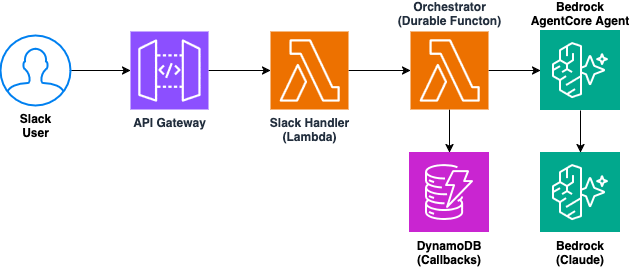

# AWS Lambda Durable Functions to Slack via Bedrock AgentCore

This pattern demonstrates a Slack chatbot that uses AWS Lambda durable functions for stateful, multi-turn conversations with human-in-the-loop interactions. The bot collects travel preferences from users via Slack, generates personalized itineraries using Amazon Bedrock (Claude) through AgentCore, and delivers results back to the user — all with automatic state persistence across invocations.

Learn more about this pattern at Serverless Land Patterns: https://serverlessland.com/patterns/lambda-df-slack

Important: this application uses various AWS services and there are costs associated with these services after the Free Tier usage - please see the [AWS Pricing page](https://aws.amazon.com/pricing/) for details. You are responsible for any AWS costs incurred. No warranty is implied in this example.

## Requirements

* [Create an AWS account](https://portal.aws.amazon.com/gp/aws/developer/registration/index.html) if you do not already have one and log in. The IAM user that you use must have sufficient permissions to make necessary AWS service calls and manage AWS resources.
* [AWS CLI](https://docs.aws.amazon.com/cli/latest/userguide/install-cliv2.html) v2.30.0+ installed and configured (v2.30.0+ required for Lambda durable functions)
* [Git Installed](https://git-scm.com/book/en/v2/Getting-Started-Installing-Git)
* [Terraform](https://developer.hashicorp.com/terraform/downloads) >= 1.5.0 installed
* [Finch](https://github.com/runfinch/finch) installed (for building the AgentCore agent container). Docker users can alias `finch` to `docker` or modify `terraform/main.tf` provisioners.
* Amazon Bedrock access enabled for **Anthropic Claude Sonnet 4** (`us.anthropic.claude-sonnet-4-6`) in us-east-2
* A Slack workspace where you can create apps

## Slack Bot Setup

Follow these steps to create a Slack bot and obtain the required credentials.

### Create Slack App

1. Go to https://api.slack.com/apps
2. Click **"Create New App"** → **"From scratch"**
3. App Name: `Travel Assistant` (or your choice)
4. Select your workspace → Click **"Create App"**

### Add Bot Token Scopes

1. In the left sidebar, click **"OAuth & Permissions"**
2. Scroll to **"Scopes"** → **"Bot Token Scopes"**
3. Add these scopes:
   - `app_mentions:read`
   - `channels:history`
   - `chat:write`
   - `chat:write.public`
   - `im:history`
   - `im:read`
   - `im:write`
   - `users:read`

### Install App to Workspace

1. Scroll up to **"OAuth Tokens"** → Click **"Install to Workspace"**
2. Review permissions → Click **"Allow"**
3. Copy the **Bot User OAuth Token** (starts with `xoxb-`)

### Get Signing Secret

1. Go to **"Basic Information"** in the left sidebar
2. Under **"App Credentials"**, copy the **Signing Secret**

Save both values — you'll need them during deployment.

## Deployment Instructions

1. Clone the repository and navigate to the project directory:
    ```bash
    git clone https://github.com/aws-samples/serverless-patterns
    cd serverless-patterns/lambda-df-slack/terraform
    ```

2. Initialize and deploy:
    ```bash
    terraform init
    terraform apply
    ```

   When prompted, enter:
    - **prefix** - this will be the prefix for all resource names
    - **slack_bot_token** - **Bot User OAuth Token** (starts with `xoxb-`)
    - **slack_signing_secret** - **Signing Secret** copied earlier from **"App Credentials"**

   > **What happens during apply:** Terraform automatically runs `build.sh` to install Python dependencies and package the Lambda code, then builds and pushes the AgentCore container image to ECR using Finch. See [Troubleshooting](#troubleshooting) if either step fails.

3. Get the API Gateway URL from the output:
    ```bash
    terraform output api_gateway_url
    ```

4. Configure Slack Event Subscriptions:
    - Go to https://api.slack.com/apps → Select your app
    - Click **"Event Subscriptions"** → Toggle **Enable Events** to ON
    - Set **Request URL** to your API Gateway URL (e.g., `https://abc123.execute-api.us-east-2.amazonaws.com/prod/slack/events`)
    - Wait for **"Verified ✓"**
    - Under **"Subscribe to bot events"**, add: `app_mention`,`message.channels`,`message.im` 
    - Click **"Save Changes"**
    - Go to **"Install App"** → Click **"Reinstall to Workspace"** → **"Allow"**

## How it works



1. **Slack Handler Lambda** receives webhook events from Slack via API Gateway, verifies the request signature, deduplicates events, and starts a new durable function execution for new conversations.

2. **Orchestrator (Durable Function)** manages the multi-turn conversation flow. It uses `wait_for_callback()` to pause execution while waiting for user responses — the Lambda is not running during the wait. When the user replies, the callback resumes the orchestrator exactly where it left off.

3. **DynamoDB Callbacks Table** stores pending callback IDs mapped to execution IDs, enabling the Slack Handler to route incoming user messages back to the correct waiting orchestrator.

4. **AgentCore Agent** receives the collected travel preferences, invokes Amazon Bedrock (Claude) via the Strands framework to generate a personalized itinerary, and sends the result back via a durable execution callback.

5. **Slack Handler** posts the final itinerary back to the user in Slack.

The key innovation is the **wait-for-callback pattern**: the orchestrator suspends (costs nothing while waiting) and automatically resumes when the user responds — enabling multi-turn conversations without managing state manually.

## Testing

### Find Your Bot

1. Open Slack → Go to **"Apps"** in the sidebar
2. Click **"Travel Assistant"**

### Start a Conversation

Send a DM to your bot:
```
Plan a trip for me
```

**Expected response:**
```
Great! I'll help you plan an amazing trip. Let me ask you a few questions...
📍 Where would you like to go? (e.g., Japan, Paris, New York)
```

### Complete the Flow

Answer the bot's questions:
1. **Destination:** `Tokyo`
2. **Dates:** `June 1-10`
3. **Budget:** `$3000`
4. **Interests:** `food`

Wait for a ~2 minutes for Bedrock to generate the itinerary.

### Verify via CLI

```bash
# Check Slack Handler logs
aws logs tail /aws/lambda/<prefix>-slack-handler --follow --region us-east-2

# Check Orchestrator logs
aws logs tail /aws/lambda/<prefix>-orchestrator --follow --region us-east-2

# Check DynamoDB for conversation state
aws dynamodb scan --table-name <prefix>-callbacks --region us-east-2
```

## Troubleshooting

### `pip: command not found` during apply

The `build.sh` script uses `pip` to install Python dependencies. If your system uses a different command:

- **macOS with Homebrew Python:** Replace `pip` with `pip3` or `python3.13 -m pip` in `terraform/build.sh` (line 22)
- **uv users:** Replace the `pip install --target ...` line with `uv pip install --target "$BUILD_DIR" -r /dev/stdin`

The Lambda runtime requires **Python 3.11+**, so ensure your pip points to a 3.11+ installation.

### Finch errors during container build

The AgentCore image build uses [Finch](https://github.com/runfinch/finch). Common issues:

- **`finch: command not found`** — Install Finch or, if you use Docker, replace `finch` with `docker` in the `null_resource.agentcore_image_build` provisioner in `terraform/main.tf`
- **`instance "finch" does not exist`** — Run `finch vm init && finch vm start` before applying
- **Permission errors** — Ensure `aws ecr get-login-password` works with your configured AWS credentials

### Re-running a failed build

If `terraform apply` fails mid-way through a provisioner, fix the underlying issue and re-run:

```bash
terraform apply
```

Terraform will re-trigger the failed provisioner on the next apply since the resource was not marked as created.

## Cleanup

1. Delete all created resources
    ```bash
    terraform destroy -auto-approve
    ```
    
1. During the prompts, enter all details as entered during creation.

1. Confirm all created resources has been deleted
    ```
    terraform show
    ```

----
Copyright 2026 Amazon.com, Inc. or its affiliates. All Rights Reserved.

SPDX-License-Identifier: MIT-0
