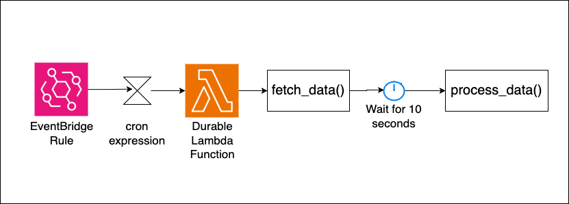

# EventBridge Cron to Durable Lambda Function

This pattern demonstrates how to trigger a durable Lambda function using EventBridge on a cron schedule. The Lambda function uses the AWS Durable Execution SDK to implement a multi-step workflow with checkpointing and automatic replay capabilities.

Learn more about this pattern at Serverless Land Patterns: << Add the live URL here >>

Important: this application uses various AWS services and there are costs associated with these services after the Free Tier usage - please see the [AWS Pricing page](https://aws.amazon.com/pricing/) for details. You are responsible for any AWS costs incurred. No warranty is implied in this example.

## Architecture



This architecture demonstrates a serverless cron job implementation using EventBridge and durable Lambda functions. An EventBridge rule configured with a cron expression triggers the durable Lambda function every minute. The Lambda function uses the AWS Durable Execution SDK to implement a multi-step workflow that can span multiple invocations through checkpointing - when `context.wait()` is called, the function suspends execution and creates a checkpoint, then resumes from that point in a subsequent invocation without re-executing previous steps. 

## Requirements

* [Create an AWS account](https://portal.aws.amazon.com/gp/aws/developer/registration/index.html) if you do not already have one and log in. The IAM user that you use must have sufficient permissions to make necessary AWS service calls and manage AWS resources.
* [AWS CLI](https://docs.aws.amazon.com/cli/latest/userguide/install-cliv2.html) installed and configured
* [Git Installed](https://git-scm.com/book/en/v2/Getting-Started-Installing-Git)
* [AWS Serverless Application Model](https://docs.aws.amazon.com/serverless-application-model/latest/developerguide/serverless-sam-cli-install.html) (AWS SAM) installed
* [Python 3.14](https://www.python.org/downloads/) installed and available in your PATH

## Deployment Instructions

1. Create a new directory, navigate to that directory in a terminal and clone the GitHub repository:
    ``` 
    git clone https://github.com/aws-samples/serverless-patterns
    ```
1. Change directory to the pattern directory:
    ```
    cd lambda-durable-eventbridge-cron-python-sam
    ```
1. From the command line, use AWS SAM to build and deploy the AWS resources for the pattern as specified in the template.yaml file:
    ```
    sam build
    sam deploy --guided
    ```
1. During the prompts:
    * Enter a stack name
    * Enter the desired AWS Region
    * Allow SAM CLI to create IAM roles with the required permissions.

    Once you have run `sam deploy --guided` mode once and saved arguments to a configuration file (samconfig.toml), you can use `sam deploy` in future to use these defaults.

1. Note the outputs from the SAM deployment process. These contain the resource names and/or ARNs which are used for testing.

## How it works

This pattern creates:

1. **Durable Lambda Function**: A Python 3.14 Lambda function that uses the AWS Durable Execution SDK to implement a multi-step workflow with automatic checkpointing and replay capabilities.

2. **EventBridge Cron Rule**: An EventBridge rule configured with `cron(* * * * ? *)` that triggers the Lambda function every minute.

3. **Function Versioning**: The Lambda function uses `AutoPublishAlias: live` to automatically publish a new version on each deployment and point the `live` alias to it.

4. **Targeted Invocation**: The EventBridge rule specifically targets the published version via the alias as it is a best practice to use numbered versions or aliases for production durable functions rather than $LATEST.

### Durable Execution Flow

The Lambda function implements a durable workflow with three steps:

1. **Data Fetching**: Simulates fetching data from an external API (checkpointed)
2. **Wait Period**: Suspends execution for 10 seconds using `context.wait()` - no compute costs during wait
3. **Data Processing**: Processes the fetched data and returns results

**Execution Pattern**:
- **Invocation 1**: `fetch_data()` runs → checkpoint created → `context.wait()` suspends execution
- **Invocation 2**: `fetch_data()` replays from checkpoint (no re-execution) → wait completes → `process_data()` runs → workflow completes

This demonstrates how durable functions can span multiple Lambda invocations while maintaining state and avoiding redundant work through checkpointing.

## Testing

1. After deployment, the EventBridge rule will automatically trigger the Lambda function every minute.

2. Monitor the function execution in CloudWatch Logs:
    ```bash
    aws logs tail /aws/lambda/[FUNCTION_NAME] --follow
    ```

3. You should observe the durable execution pattern:
    - First invocation: "Fetching data from external API..." followed by suspension
    - Second invocation: "Processing data..." (fetch_data skipped due to checkpoint)

4. You can also see the durable execution section in the Lambda function console to get a detailed overview of each execution step in the execution.

## Cleanup
 
1. Delete the stack
    ```bash
    sam delete
    ```
----
Copyright 2026 Amazon.com, Inc. or its affiliates. All Rights Reserved.

SPDX-License-Identifier: MIT-0