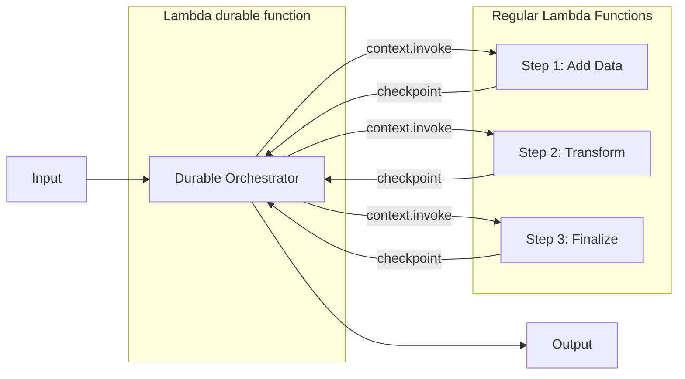

# Function chaining with AWS Lambda durable functions

This pattern demonstrates the **function chaining** workflow pattern using AWS Lambda durable functions. A durable orchestrator chains three Lambda functions sequentially, with automatic checkpointing after each step for fault tolerance.

Learn more about this pattern at Serverless Land Patterns: https://serverlessland.com/patterns/lambda-durable-function-chaining-sam

Important: this application uses various AWS services and there are costs associated with these services after the Free Tier usage - please see the [AWS Pricing page](https://aws.amazon.com/pricing/) for details. You are responsible for any AWS costs incurred. No warranty is implied in this example.

## Requirements

* [Create an AWS account](https://portal.aws.amazon.com/gp/aws/developer/registration/index.html) if you do not already have one and log in. The IAM user that you use must have sufficient permissions to make necessary AWS service calls and manage AWS resources.
* [AWS CLI](https://docs.aws.amazon.com/cli/latest/userguide/install-cliv2.html) installed and configured
* [Git Installed](https://git-scm.com/book/en/v2/Getting-Started-Installing-Git)
* [AWS SAM CLI](https://docs.aws.amazon.com/serverless-application-model/latest/developerguide/serverless-sam-cli-install.html) installed (version 1.141.0+ with DurableConfig support)
* Python 3.13+

## Deployment Instructions

1. Create a new directory, navigate to that directory in a terminal and clone the GitHub repository:
    ```bash
    git clone https://github.com/aws-samples/serverless-patterns
    ```
2. Change directory to the pattern directory:
    ```bash
    cd serverless-patterns/lambda-durable-function-chaining-sam
    ```
3. Build and deploy the application:
    ```bash
    sam build
    sam deploy --guided
    ```
4. During the prompts:
    * Enter a stack name
    * Enter your preferred AWS Region
    * Accept the defaults for remaining options

## How it works

This pattern implements the **function chaining** workflow pattern where a durable orchestrator invokes multiple Lambda functions in sequence, passing the output of each step as input to the next.

### Architecture



The orchestrator uses `context.invoke()` to chain 3 Lambda functions with automatic checkpointing.

### What are AWS Lambda durable functions?

Lambda durable functions enable you to build resilient, long-running workflows with automatic state management. Key capabilities:

- **Checkpoint/Replay**: Each `context.invoke()` creates a checkpoint. If the function fails, it replays from the beginning but skips completed steps using stored results.
- **Fault Tolerance**: Workflows automatically recover from failures without re-executing completed work.
- **Up to 1 Year Execution**: Durable functions can run for extended periods with waits that don't incur compute charges.

### Data Flow

```
Input:  {"id": "test-123", "name": "demo", "value": 5}

Step 1 (Add):       value = 5 + 10 = 15
Step 2 (Transform): value = 15 × 2 = 30, name = "DEMO"
Step 3 (Finalize):  value = 30 + 5 = 35, status = "COMPLETED"

Output: {"value": 35, "final_value": 40, "transformed_name": "DEMO", "status": "COMPLETED"}
```

### Fault Tolerance Example

If the orchestrator fails after Step 2 completes:
1. Lambda automatically retries the orchestrator
2. During replay, Steps 1 and 2 are **skipped** (results loaded from checkpoints)
3. Step 3 executes normally
4. Workflow completes successfully

## Testing

1. Get the orchestrator alias ARN from stack outputs:
    ```bash
    DURABLE_FUNCTION_ARN=$(aws cloudformation describe-stacks \
      --stack-name durable-function-chaining \
      --query 'Stacks[0].Outputs[?OutputKey==`OrchestratorAliasArn`].OutputValue' \
      --output text)
    ```

2. Invoke the workflow:
    ```bash
    aws lambda invoke \
      --function-name "$DURABLE_FUNCTION_ARN" \
      --payload '{"id": "test-123", "name": "demo", "value": 5}' \
      --cli-binary-format raw-in-base64-out \
      response.json

    cat response.json
    ```

3. Expected output:
    ```json
    {
      "workflow": "completed",
      "input": {"id": "test-123", "name": "demo", "value": 5},
      "output": {
        "id": "test-123",
        "name": "demo",
        "step1_completed": true,
        "value": 35,
        "step2_completed": true,
        "transformed_name": "DEMO",
        "step3_completed": true,
        "status": "COMPLETED",
        "final_value": 40
      }
    }
    ```

## Cleanup

```bash
sam delete --stack-name durable-function-chaining
```

## Resources

- [Lambda durable functions Documentation](https://docs.aws.amazon.com/lambda/latest/dg/durable-functions.html)
- [Durable Execution SDK for Python](https://github.com/aws/aws-durable-execution-sdk-python)
- [AWS Blog: Build multi-step applications with Lambda durable functions](https://aws.amazon.com/blogs/aws/build-multi-step-applications-and-ai-workflows-with-aws-lambda-durable-functions/)

----
Copyright 2026 Amazon.com, Inc. or its affiliates. All Rights Reserved.

SPDX-License-Identifier: MIT-0
