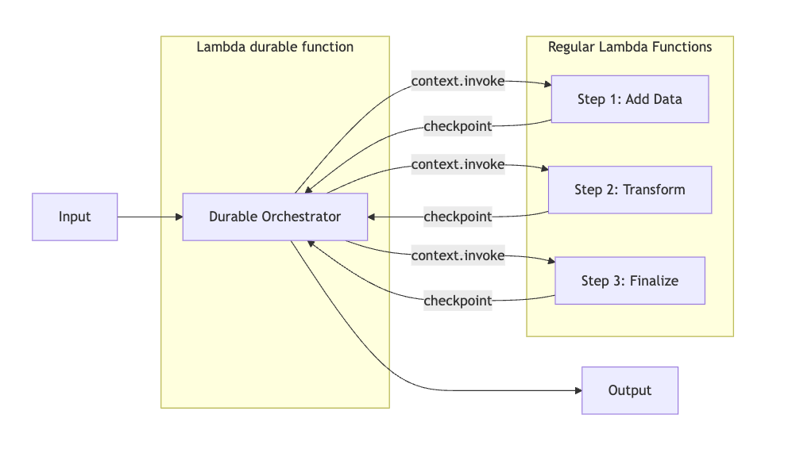

# Function chaining with AWS Lambda durable functions in Terraform

This Terraform pattern demonstrates function chaining using AWS Lambda durable functions. A durable orchestrator invokes three Lambda functions in sequence (add, transform and finalize). The output of each step is passed as the input to the next. The framework automatically checkpoints after every step, so if the orchestrator fails mid-workflow, it replays from the beginning and skips already-completed work. This ensures exactly-once execution without re-processing.

Learn more about this pattern at Serverless Land Patterns: https://serverlessland.com/patterns/lambda-durable-function-chaining-terraform

Important: this application uses various AWS services and there are costs associated with these services after the Free Tier usage - please see the [AWS Pricing page](https://aws.amazon.com/pricing/) for details. You are responsible for any AWS costs incurred. No warranty is implied in this example.

## Requirements

* [Create an AWS account](https://portal.aws.amazon.com/gp/aws/developer/registration/index.html) if you do not already have one and log in. The IAM user that you use must have sufficient permissions to make necessary AWS service calls and manage AWS resources.
* [AWS CLI](https://docs.aws.amazon.com/cli/latest/userguide/install-cliv2.html) installed and configured
* [Git Installed](https://git-scm.com/book/en/v2/Getting-Started-Installing-Git)
* [Terraform](https://learn.hashicorp.cxom/tutorials/terraform/install-cli?in=terraform/aws-get-started) installed

## Deployment Instructions

1. Create a new directory, navigate to that directory in a terminal and clone the GitHub repository:
    ``` 
    git clone https://github.com/aws-samples/serverless-patterns
    ```
1. Change directory to the pattern directory:
    ```
    cd lambda-durable-function-chaining-terraform
    ```
1. From the command line, initialize terraform to downloads and installs the providers defined in the configuration:
    ```
    terraform init
    ```
1. From the command line, apply the configuration in the main.tf file:
    ```
    terraform apply -auto-approve
    ```
1. During the prompts:
    #var.aws_region
    - Enter a value: {enter the region for deployment}

    #var.prefix
    - Enter a value: {enter any prefix to associate with resources}

1. Note the outputs from the Terraform deployment process. These contain the resource names and/or ARNs which are used for testing.

## How it works



This pattern uses a durable orchestrator to chain three Lambda functions in sequence. Each function receives the output of the previous step as its input, forming a pipeline: **Add → Transform → Finalize**.

At each `context.invoke()` call, the durable framework creates a checkpoint. If the orchestrator fails at any point, it automatically replays from the beginning but skips already-completed steps using stored results, ensuring no work is repeated. Workflows resume from the last successful checkpoint, recovering automatically without manual intervention.

Consider the following input,

```
Input:  {"id": "test-1", "name": "demo", "value": 10}

Step 1 (Add):       value = 10 + 10 = 20
Step 2 (Transform): value = 20 × 2 = 40, name = "DEMO"
Step 3 (Finalize):  value = 40 + 5 = 45, status = "COMPLETED"

Output: {"id": "test-123", "name": "demo", "step1_completed": true, "step1_value": 20, "step2_completed": true, "step2_value": 40, "transformed_name": "DEMO", "step3_completed": true, "status": "COMPLETED", "final_value": 45}
```

## Testing

1. You can invoke the Lambda function by using the following CLI command:
    ```
    aws lambda invoke --function-name "ORCHESTRATOR_ALIAS_ARN" --payload '{"id": "test-123", "name": "demo", "value": 10}' --cli-binary-format raw-in-base64-out response.json
    ```
    Note: Replace the `ORCHESTRATOR_ALIAS_ARN` with the generated `orchestrator_alias-arn` from Terraform (refer to the Terraform Outputs section)

1. Display the contents of response.json
    ```
    cat response.json
    ```

    Expected output
    ```
    {"id": "test-123", "name": "demo", "step1_completed": true, "step1_value": 20, "step2_completed": true, "step2_value": 40, "transformed_name": "DEMO", "step3_completed": true, "status": "COMPLETED", "final_value": 45}
    ```

## Cleanup

1. Change directory to the pattern directory:
    ```
    cd serverless-patterns/lambda-durable-function-chaining-terraform
    ```

1. Delete all created resources
    ```
    terraform destroy -auto-approve
    ```
    
1. During the prompts:
    ```
    Enter all details as entered during creation.
    ```

1. Confirm all created resources has been deleted
    ```
    terraform show
    ```
----
Copyright 2026 Amazon.com, Inc. or its affiliates. All Rights Reserved.

SPDX-License-Identifier: MIT-0