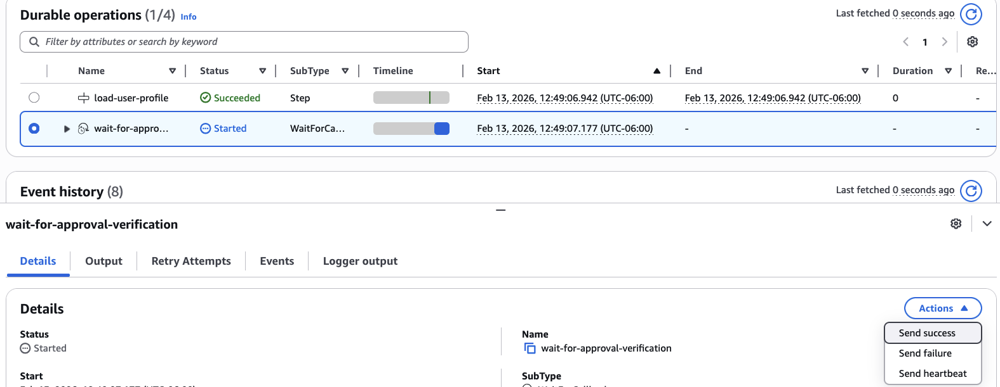
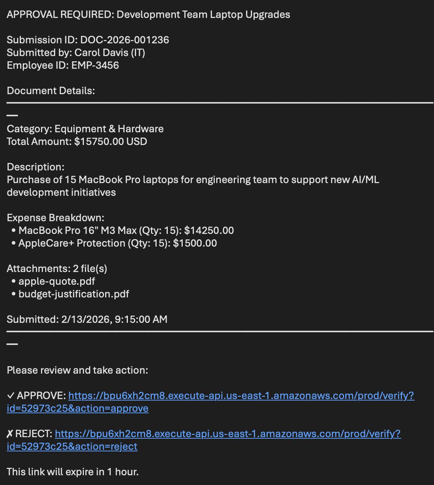
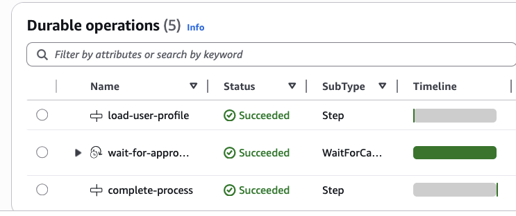
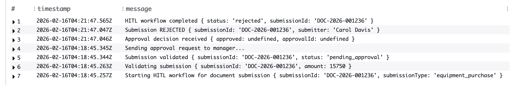

# Human in the Loop with Lambda Durable Functions

This pattern demonstrates how to integrate human review or approval processes into workflows using AWS Lambda Durable Functions. The workflow sends email notifications via Simple Notification Service (SNS) and waits for human approval through callback links, suspending execution until the decision is made.

**Important**: This application uses various AWS services and there are costs associated with these services after the Free Tier usage - please see the [AWS Pricing page](https://aws.amazon.com/pricing/) for details. You are responsible for any AWS costs incurred. No warranty is implied in this example.

## Requirements

- Create an AWS account if you do not already have one and log in. The IAM user that you use must have sufficient permissions to make necessary AWS service calls and manage AWS resources.
- [AWS CLI](https://docs.aws.amazon.com/cli/latest/userguide/install-cliv2.html) installed and configured
- [Git Installed](https://git-scm.com/book/en/v2/Getting-Started-Installing-Git)
- [Node.js and npm](https://nodejs.org/en/download/) installed
- [AWS CDK](https://docs.aws.amazon.com/cdk/latest/guide/getting_started.html) installed

## Deployment Instructions

1. Create a new directory, navigate to that directory in a terminal and clone the GitHub repository:
   ```bash
   git clone https://github.com/aws-samples/serverless-patterns
   ```

2. Change directory to the pattern directory:
   ```bash
   cd lambda-durable-functions-human-in-the-loop/hitl-lambda-durable-function-cdk
   ```

3. Install dependencies:
   ```bash
   npm install
   ```

4. Bootstrap your AWS environment (if you don't have a CDK environment setup):
   ```bash
   cdk bootstrap
   ```

5. Deploy the CDK stack with your email address:
   ```bash
   cdk deploy --context Email=your-email@example.com
   ```
   Replace `your-email@example.com` with the email address that should receive approval notifications.

6. **Confirm your SNS subscription**: After deployment, check your email inbox for a message with the subject **"AWS Notification - Subscription Confirmation"**. The email will look like this:
   
   ```
   You have chosen to subscribe to the topic:
   arn:aws:sns:<REGION>:<ACCOUNT_NUMBER>:hitl-approval-notifications
   
   To confirm this subscription, click or visit the link below 
   (If this was in error no action is necessary):
   Confirm subscription
   ```
   
   **Click the "Confirm subscription" link.** This step is required before you can receive approval emails.
   
   > **Note**: Check your spam/junk folder if you don't see the email within a few minutes.

7. Note the outputs from the CDK deployment process. These contain the resource names and/or ARNs which are used for testing:
   - `Hitl-ApiUrl`: The API Gateway URL for callbacks
   - `Hitl-Sns-TopicArn`: The SNS Topic ARN for approval notifications
   - `Hitl-Durable-Function-Name`: The name of the durable function

## How it works


1. **Document Submission**: An employee submits a document (e.g., expense report) that requires reviewer approval
2. **Validation**: The durable function validates the submission and extracts key details
3. **Token Storage**: The workflow generates a short approval ID (e.g., `a1b2c3d4`) and stores the callback token securely in DynamoDB
4. **Approval Request**: The workflow sends a formatted email via SNS to the manager with document details and approve/reject links
5. **Workflow Pause**: The workflow pauses using `waitForCallback()` - execution suspends without compute charges
6. **Manager Review**: The reviewer receives the email and reviews the document details
7. **Decision**: The reviewer clicks either the APPROVE or REJECT link
8. **API Gateway**: API Gateway receives the callback request with the approval ID and invokes the callback handler
9. **Token Lookup**: The callback handler looks up the actual callback token from DynamoDB using the approval ID
10. **Resume Execution**: The callback handler resumes the durable execution with the approval result
11. **Process Decision**: The workflow continues and processes the approval or rejection (e.g., initiates payment, notifies submitter)




### Email Notification

The email contains two clickable links with short approval IDs:



### Execution Monitoring

You can monitor the durable execution in the Lambda console, seeing each step's status.

## Testing

1. After deployment, you will receive an email titled "AWS Notification - Subscription Confirmation". Click on the link in the email to confirm your subscription. This will allow SNS to send you emails.

2. Navigate to the AWS Lambda console and select the `hitl-durable-function` function.

3. Create an asynchronous test event with the `hitl-lambda-durable-function-cdk/events/events-large-amount.json` payload

4. Invoke the function. The durable execution will start and send an approval email.

5. **Test via Email Links**
   
   Check your email for the approval request. The email will contain two links:
   
   
   - **APPROVE**: Click this to approve the request
   - **REJECT**: Click this to reject the request
   
   Click one of the links to complete the approval process.

6. Observe the execution in the Lambda console. The durable function will complete with the approval result:

   

7. Check the Durable Functions Logs for the durable function to see the workflow execution details. See the following rejection example:
  

## Cleanup

To delete the resources created by this template, use the following command:

```bash
cdk destroy -c Email=your-email@example.com
```

---

Copyright 2026 Amazon.com, Inc. or its affiliates. All Rights Reserved.

SPDX-License-Identifier: MIT-0
