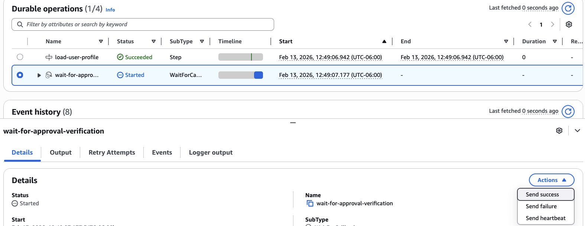
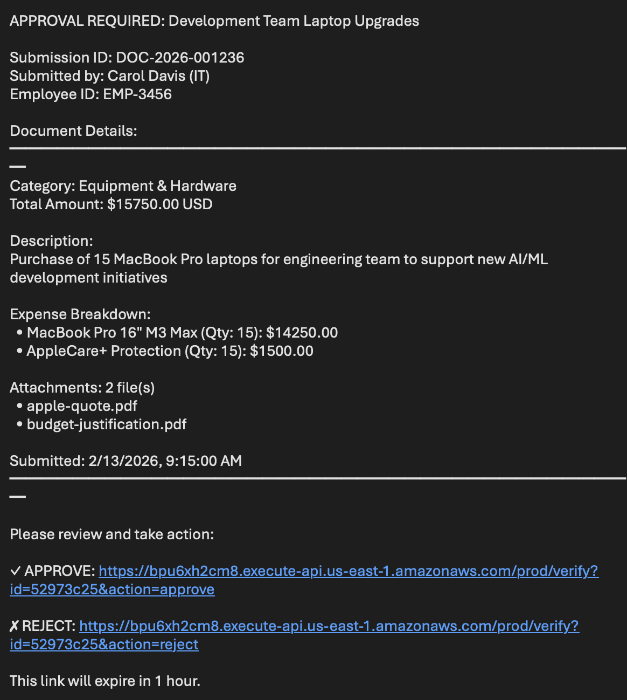
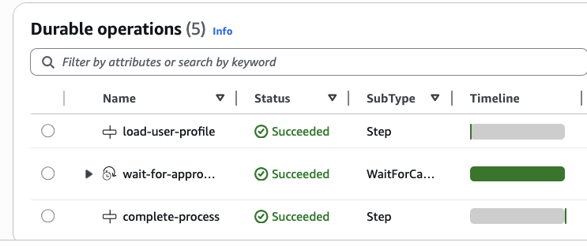
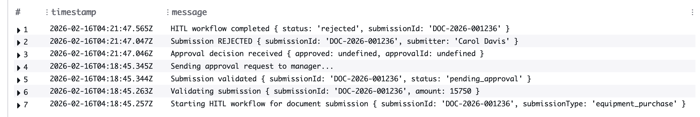

# Human in the Loop with AWS Lambda durable functions

This pattern demonstrates how to integrate human review and approval processes into workflows using AWS Lambda durable functions. The workflow sends email notifications via Amazon Simple Notification Service (Amazon SNS) and waits for human approval through callback links, suspending execution — without incurring compute charges — until the reviewer makes a decision.

Learn more about this pattern at Serverless Land Patterns: https://serverlessland.com/patterns/lambda-durable-functions-human-in-the-loop

**Important**: This application uses various AWS services and there are costs associated with these services after the Free Tier usage - please see the [AWS Pricing page](https://aws.amazon.com/pricing/) for details. You are responsible for any AWS costs incurred. No warranty is implied in this example.

## Requirements

* [Create an AWS account](https://portal.aws.amazon.com/gp/aws/developer/registration/index.html) if you do not already have one and log in. The IAM user that you use must have sufficient permissions to make necessary AWS service calls and manage AWS resources.
* [AWS CLI](https://docs.aws.amazon.com/cli/latest/userguide/install-cliv2.html) installed and configured
* [Git Installed](https://git-scm.com/book/en/v2/Getting-Started-Installing-Git)
* [Node.js 20+](https://nodejs.org/en/download/) and npm installed
* [AWS CDK](https://docs.aws.amazon.com/cdk/latest/guide/getting_started.html) installed globally: `npm install -g aws-cdk`

## Deployment Instructions

1. Create a new directory, navigate to that directory in a terminal and clone the GitHub repository:
    ```bash
    git clone https://github.com/aws-samples/serverless-patterns
    ```

2. Change directory to the pattern directory:
    ```bash
    cd serverless-patterns/lambda-durable-functions-human-in-the-loop/hitl-lambda-durable-function-cdk
    ```

3. Install dependencies:
    ```bash
    npm install
    ```

4. Bootstrap your AWS environment (first time only):
    ```bash
    cdk bootstrap
    ```

5. Deploy the CDK stack with your email address:
    ```bash
    cdk deploy --context Email=your-email@example.com
    ```
    Replace `your-email@example.com` with the address that should receive approval notifications.

6. **Confirm your Amazon SNS subscription**: After deployment, check your inbox for a message with the subject **"AWS Notification - Subscription Confirmation"**. Click the **"Confirm subscription"** link. This step is required before you can receive approval emails.

    > **Note**: Check your spam/junk folder if you don't see the email within a few minutes.

7. Note the outputs from the CDK deployment. These contain the resource identifiers used for testing:
    - `Hitl-ApiUrl` — Amazon API Gateway URL for callbacks
    - `Hitl-Sns-TopicArn` — Amazon SNS topic ARN for approval notifications
    - `Hitl-Durable-Function-Name` — AWS Lambda durable function name
    - `Hitl-Callback-Table-Name` — Amazon DynamoDB table for callback tokens

## How it works


1. **Document Submission**: A document (e.g., an expense report) is submitted to the AWS Lambda durable function for review.
2. **Validation**: The durable function validates the submission and extracts key details.
3. **Token Storage**: The workflow generates a stable approval ID derived from the SDK-provided callback ID and stores the callback token securely in Amazon DynamoDB with a 1-hour TTL.
4. **Approval Request**: The workflow sends a formatted email via Amazon SNS with document details and approve/reject links, then suspends using `waitForCallback()` — no compute charges are incurred while waiting.
5. **Manager Review**: The reviewer receives the email and clicks either the **APPROVE** or **REJECT** link.
6. **Confirmation Page**: Amazon API Gateway routes the GET request to the callback handler, which renders a confirmation page. This two-step design prevents email prefetchers (such as Outlook Safe Links) from silently triggering approvals.
7. **Decision**: The reviewer confirms their choice by submitting the form (POST). The callback handler enforces single-use by atomically marking the token as consumed in Amazon DynamoDB — subsequent clicks return a "already processed" response.
8. **Resume Execution**: The callback handler resumes the durable execution with the approval result via `SendDurableExecutionCallbackSuccess`.
9. **Process Decision**: The workflow continues and processes the approval or rejection (e.g., initiates payment, notifies submitter).



### Email Notification

The email contains approve and reject links that route through Amazon API Gateway:



## Testing

1. **Confirm your Amazon SNS subscription**: Check your email for "AWS Notification - Subscription Confirmation" and click the confirmation link.

2. Navigate to the AWS Lambda console and select the `hitl-durable-function` function.

3. Create an **asynchronous** test event using one of the payloads in the `hitl-lambda-durable-function-cdk/events/` folder:

    ```json
    {
      "submissionId": "DOC-2026-001234",
      "submissionType": "expense_report",
      "submitter": {
        "name": "Alice Johnson",
        "email": "alice.johnson@example.com",
        "department": "Engineering",
        "employeeId": "EMP-5678"
      },
      "document": {
        "title": "Q1 2026 Conference Travel Expenses",
        "amount": 2450.00,
        "currency": "USD",
        "category": "Travel & Entertainment",
        "description": "AWS re:Invent 2026 conference attendance",
        "items": [
          { "description": "Round-trip flight", "amount": 850.00, "date": "2026-11-28" },
          { "description": "Hotel (3 nights)", "amount": 1200.00, "date": "2026-11-28" },
          { "description": "Conference registration", "amount": 400.00, "date": "2026-10-01" }
        ],
        "attachments": ["s3://receipts/flight.pdf", "s3://receipts/hotel.pdf"]
      },
      "submittedAt": "2026-02-13T14:30:00Z"
    }
    ```

4. Invoke the function. The durable execution starts and sends an approval email.

5. **Check your email** for the approval request. The email contains two links — click either **APPROVE** or **REJECT**.

6. A confirmation page loads asking you to confirm your choice. Click the button to submit the decision.

7. Observe the execution completing in the Lambda console **Durable executions** tab:

    

8. Check the Amazon CloudWatch Logs for the durable function to see the workflow execution details. The following shows a rejection example:

    

## Cleanup

To delete all resources created by this pattern:

```bash
cdk destroy --context Email=your-email@example.com
```

---

Copyright 2026 Amazon.com, Inc. or its affiliates. All Rights Reserved.

SPDX-License-Identifier: MIT-0
