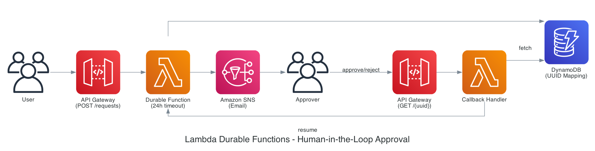

# Human-in-the-Loop Approval Workflow with AWS Lambda durable functions

This pattern demonstrates a human-in-the-loop approval workflow using AWS Lambda durable functions. The workflow pauses execution for up to 24 hours while waiting for human approval via email, automatically handling timeouts and resuming when decisions are received.

**Important:** Please check the [AWS documentation](https://docs.aws.amazon.com/lambda/latest/dg/durable-functions.html) for regions currently supported by AWS Lambda durable functions.

Learn more about this pattern at Serverless Land Patterns: https://serverlessland.com/patterns/lambda-durable-hitl-approval-sam

## Architecture



The pattern uses Lambda durable functions to implement a cost-effective approval workflow that can wait up to 24 hours without incurring compute charges during the wait period.

### Workflow Steps

1. **User submits approval request** via Amazon API Gateway
2. **Durable Function validates request** and creates a callback
3. **UUID mapping stored in Amazon DynamoDB** (callback ID → UUID)
4. **Email notification sent via SNS** with approve/reject links
5. **Function pauses execution** (no compute charges during wait)
6. **Approver clicks link** in email
7. **Callback Handler retrieves callback ID** from DynamoDB
8. **Callback sent to Lambda** using `SendDurableExecutionCallbackSuccess`
9. **Durable Function resumes** and processes the decision

## Key Features

- ✅ **24-Hour Wait Time** - Can wait up to 24 hours for approval
- ✅ **No Compute Charges During Wait** - Function suspended during wait period
- ✅ **Email Notifications** - Sends approval requests with clickable links
- ✅ **Short, Clean URLs** - Uses UUID instead of long callback IDs
- ✅ **DynamoDB Mapping** - Stores UUID → callback ID mapping with TTL
- ✅ **Automatic Timeout** - Auto-rejects after 24 hours
- ✅ **HTML Response Pages** - Beautiful approval/rejection confirmation pages

## Prerequisites

* [AWS CLI](https://docs.aws.amazon.com/cli/latest/userguide/install-cliv2.html) installed and configured
* [AWS SAM CLI](https://docs.aws.amazon.com/serverless-application-model/latest/developerguide/serverless-sam-cli-install.html) installed
* Python 3.14 runtime (automatically provided by Lambda)

## Deployment

1. Navigate to the pattern directory:
   ```bash
   cd lambda-durable-hitl-approval-sam
   ```

2. Build the SAM application:
   ```bash
   sam build
   ```

3. Deploy the application (must use us-east-2 region):
   ```bash
   sam deploy --guided --region us-east-2
   ```
   
   During the guided deployment, provide the required values:
   - **ApproverEmail**: Enter your email address to receive approval notifications
   - Allow SAM CLI to create IAM roles when prompted

4. **Confirm SNS subscription**: Check your email and click the confirmation link from Amazon SNS

5. Note the `ApiEndpoint` from the outputs

## Testing

### Submit an Approval Request

```bash
curl -X POST https://YOUR-API-ID.execute-api.us-east-2.amazonaws.com/prod/requests \
  -H "Content-Type: application/json" \
  -d '{
    "requestId": "REQ-001",
    "amount": 5000,
    "description": "New server purchase"
  }'
```

Response:
```json
{
  "message": "Request accepted"
}
```

### Check Your Email

You'll receive an email with:
- Request details (ID, amount, description)
- **APPROVE** link
- **REJECT** link
- Expiration time (24 hours)

### Click Approve or Reject

Click one of the links in the email. You'll see a confirmation page that displays a checkmark or X icon along with either a "Request Approved!" or "Request Rejected!" message. The page will also confirm that the workflow has been notified of your decision.


## How It Works

### Callback Creation

The durable function creates a callback and stores the mapping:

```python
from aws_durable_execution_sdk_python import DurableContext, durable_execution
from aws_durable_execution_sdk_python.config import CallbackConfig, Duration

@durable_execution
def lambda_handler(event, context: DurableContext):
    # Create callback with 24-hour timeout
    callback = context.create_callback(
        name='wait-for-approval',
        config=CallbackConfig(timeout=Duration.from_hours(24))
    )
    
    # Generate short UUID and store mapping in DynamoDB
    request_uuid = str(uuid.uuid4())
    table.put_item(Item={
        'uuid': request_uuid,
        'callbackId': callback.callback_id,
        'ttl': int(time.time()) + 86400  # 24 hours
    })
    
    # Send email with UUID-based URLs
    approve_url = f"{api_base_url}/approve/{request_uuid}"
    
    # Wait for callback result
    approval = callback.result()
```

### Callback Handler

When user clicks approve/reject:

```python
def lambda_handler(event, context):
    # Get UUID from URL path
    request_uuid = event['pathParameters']['uuid']
    
    # Fetch callback ID from DynamoDB
    response = table.get_item(Key={'uuid': request_uuid})
    callback_id = response['Item']['callbackId']
    
    # Send callback to durable function
    lambda_client.send_durable_execution_callback_success(
        CallbackId=callback_id,
        Result=json.dumps({'decision': 'approved'})
    )
```


## Configuration

### Adjust Timeout Duration

To change the timeout duration, you need to update both the Lambda function configuration and the callback configuration:

Modify in `template.yaml`:

```yaml
DurableConfig:
  ExecutionTimeout: 86400  # 24 hours in seconds
```

And in `src/lambda_function.py`:

```python
config=CallbackConfig(timeout=Duration.from_hours(24))
```

Both values must match: `ExecutionTimeout` sets the maximum runtime for the durable function, while `CallbackConfig.timeout` sets how long the callback will wait before timing out.

### Change Email Address

Update during deployment or redeploy with new email:

```bash
sam deploy --parameter-overrides ApproverEmail=new-email@example.com
```

## Use Cases

- **Expense Approvals** - Wait for manager approval on spending requests
- **Document Reviews** - Pause workflow while documents are reviewed
- **Deployment Approvals** - Require human approval before production deployments
- **Access Requests** - Pause while security team reviews access requests
- **Contract Approvals** - Wait for legal team approval on contracts

## Monitoring

### CloudWatch Logs

Monitor the durable function:
```bash
aws logs tail /aws/lambda/lambda-durable-hitl-approval-ApprovalFunction-XXXXX \
  --region us-east-2 \
  --follow
```

Monitor the callback handler:
```bash
aws logs tail /aws/lambda/lambda-durable-hitl-approv-CallbackHandlerFunction-XXXXX \
  --region us-east-2 \
  --follow
```


## Cleanup

```bash
sam delete --stack-name lambda-durable-hitl-approval --region us-east-2
```


## Learn More

- [Lambda durable functions Documentation](https://docs.aws.amazon.com/lambda/latest/dg/durable-functions.html)
- [Durable Execution SDK (Python)](https://github.com/aws/aws-durable-execution-sdk-python)
- [Callback Operations](https://docs.aws.amazon.com/lambda/latest/dg/durable-callback.html)
- [SendDurableExecutionCallbackSuccess API](https://boto3.amazonaws.com/v1/documentation/api/latest/reference/services/lambda/client/send_durable_execution_callback_success.html)

---

Copyright 2025 Amazon.com, Inc. or its affiliates. All Rights Reserved.

SPDX-License-Identifier: MIT-0
