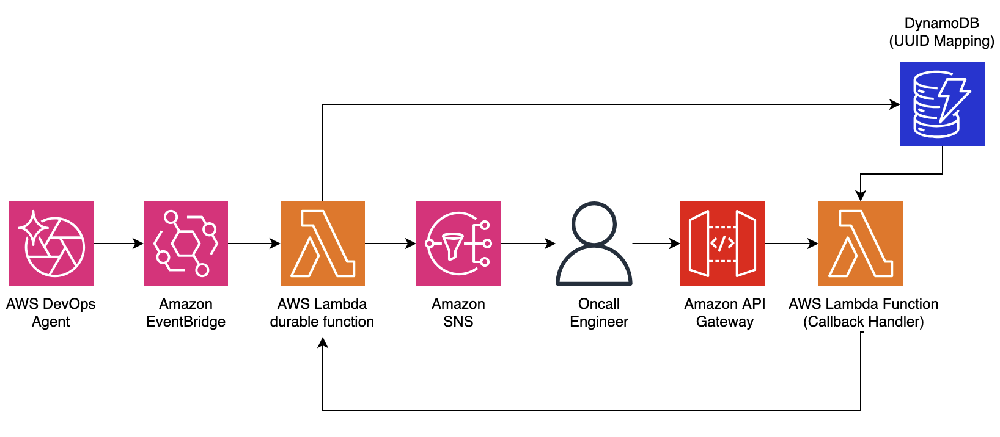

# AWS DevOps Agent → EventBridge → Lambda durable functions escalation workflow

This pattern demonstrates an event-driven escalation workflow that automatically triggers when an AWS DevOps Agent investigation fails or times out. An EventBridge rule captures the failure events and routes them to a Lambda durable function that orchestrates the escalation: creating an incident record, paging on-call personnel, and waiting for human acknowledgment — all without compute charges during the wait.

**Important:** Please check the [AWS documentation](https://docs.aws.amazon.com/lambda/latest/dg/durable-functions.html) for regions currently supported by AWS Lambda durable functions.

Learn more about this pattern at Serverless Land Patterns: https://serverlessland.com/patterns/lambda-durable-investigation-escalation

## Architecture



The pattern deploys the following resources:

- **EventBridge Rule** — Captures `Investigation Failed` and `Investigation Timed Out` events from AWS DevOps Agent (source: `aws.aidevops`) on the default event bus and invokes the Escalation Function.
- **Escalation Function** (Lambda durable function) — Orchestrates the workflow: parses the DevOps Agent event, gathers context, creates an incident, pages on-call personnel, and tracks resolution. The workflow pauses execution (no compute charges) while waiting for acknowledgment.
- **Callback Handler** (Lambda function [standard]) — Receives acknowledgment clicks via API Gateway and sends durable execution callbacks to resume the paused Escalation Function.
- **Incident Table** (DynamoDB) — Stores incident records with failure context and resolution status.
- **Callback Table** (DynamoDB) — Maps short UUIDs to durable function callback IDs for clean acknowledgment URLs.
- **Notification Topic** (SNS) — Sends escalation email notifications to on-call personnel.
- **Escalation API** (API Gateway) — Provides the `GET /{uuid}` acknowledgment endpoint.

### Workflow Steps

1. **DevOps Agent Event** — AWS DevOps Agent emits an `Investigation Failed` or `Investigation Timed Out` event to the EventBridge default event bus.
2. **EventBridge Routing** — The EventBridge rule matches the event pattern (`source: aws.aidevops`, filtered by detail-type) and invokes the Escalation Function.
3. **gather-context** — The Escalation Function parses the EventBridge event, extracting the task ID, execution ID, agent space ID, priority, and failure status.
4. **create-incident** — Writes an incident record to the Incident Table with status `open`. *(Integration Point)*
5. **notify-oncall** — Creates a durable callback with a configurable timeout, stores the UUID-to-callback mapping, and publishes a notification via SNS with an acknowledgment link. The function then pauses, incurring no compute charges while waiting. *(Integration Point)*
6. **resolve-incident** — When an on-call responder clicks the acknowledgment link, the Callback Handler sends a durable callback, resuming the function. The incident is updated to `acknowledged`. *(Integration Point)*
7. **resolve-unacknowledged** — If the timeout expires without acknowledgment, the incident is updated to `unacknowledged` and the workflow completes. *(Integration Point)*

### DevOps Agent Event Format

The EventBridge rule matches events with this structure:

```json
{
  "source": "aws.aidevops",
  "detail-type": "Investigation Failed",
  "account": "123456789012",
  "region": "us-east-1",
  "time": "2026-03-12T18:10:00Z",
  "resources": [
    "arn:aws:aidevops:us-east-1:123456789012:agentspace/your-agent-space-id"
  ],
  "detail": {
    "version": "1.0.0",
    "metadata": {
      "agent_space_id": "your-agent-space-id",
      "task_id": "a1b2c3d4-5678-90ab-cdef-example11111",
      "execution_id": "b2c3d4e5-6789-01ab-cdef-example22222"
    },
    "data": {
      "task_type": "INVESTIGATION",
      "priority": "CRITICAL",
      "status": "FAILED",
      "created_at": "2026-03-12T18:00:00Z",
      "updated_at": "2026-03-12T18:10:00Z"
    }
  }
}
```

## Key Features

- ✅ **Fully Event-Driven** — Automatically triggered by DevOps Agent events via EventBridge; no manual invocation required
- ✅ **No Compute Charges During Wait** — Function is suspended while waiting for a human response
- ✅ **Configurable Timeout** — Acknowledgment timeout duration configurable via SAM template parameter
- ✅ **Agent Space Filtering** — Optionally filter events to a specific DevOps Agent space
- ✅ **Extensible Integration Points** — Incident ticket and notification operations are isolated as helper functions that can be replaced with calls to Jira, ServiceNow, PagerDuty, Opsgenie, or other ITSM tools

## Prerequisites

* [AWS CLI](https://docs.aws.amazon.com/cli/latest/userguide/install-cliv2.html) installed and configured
* [AWS SAM CLI](https://docs.aws.amazon.com/serverless-application-model/latest/developerguide/serverless-sam-cli-install.html) >= 1.150.0 (required for `DurableConfig` support)
* Python 3.14 runtime (automatically provided by Lambda)
* An active [AWS DevOps Agent](https://docs.aws.amazon.com/devopsagent/latest/userguide/) agent space with investigations configured

## Deployment

1. Navigate to the pattern directory:
   ```bash
   cd lambda-durable-investigation-escalation
   ```

2. Build the SAM application:
   ```bash
   sam build
   ```

3. Deploy the application:
   ```bash
   sam deploy --guided --region us-east-1
   ```

   During the guided deployment, provide the required values:
   - **OncallEmail**: Email address to receive escalation notifications
   - **AckTimeout**: Timeout in seconds to wait for acknowledgment (default: 900)
   - **AgentSpaceId**: (Optional) Restrict to a specific DevOps Agent space ID
   - Allow SAM CLI to create IAM roles when prompted

4. **Confirm SNS subscription**: Check your email and click the confirmation link from Amazon SNS.

5. Note the outputs: `ApiEndpoint`, `EscalationFunctionArn`, `IncidentTableName`, and `EventBridgeRuleName`

## Testing

### Option 1: Wait for a Real DevOps Agent Investigation Failure

If you have a DevOps Agent space with active investigations, the escalation will trigger automatically when an investigation fails or times out. No manual action is needed.

### Option 2: Simulate with a Test EventBridge Event

The `aws.aidevops` source prefix is reserved for AWS services, so you cannot use `aws events put-events` with that source directly. Instead, invoke the Escalation Function directly with a simulated event payload:

```bash
aws lambda invoke \
  --function-name <stack-name>-EscalationFunction \
  --qualifier live \
  --region us-east-1 \
  --invocation-type Event \
  --cli-binary-format raw-in-base64-out \
  --payload '{
    "source": "aws.aidevops",
    "detail-type": "Investigation Failed",
    "account": "123456789012",
    "region": "us-east-1",
    "time": "2026-01-15T10:30:00Z",
    "detail": {
      "version": "1.0.0",
      "metadata": {
        "agent_space_id": "test-space-123",
        "task_id": "task-abc-001",
        "execution_id": "exec-xyz-002"
      },
      "data": {
        "task_type": "INVESTIGATION",
        "priority": "CRITICAL",
        "status": "FAILED",
        "created_at": "2026-01-15T10:00:00Z",
        "updated_at": "2026-01-15T10:30:00Z"
      }
    }
  }' response.json
```

You can also test with a timeout event:

```bash
aws lambda invoke \
  --function-name <stack-name>-EscalationFunction \
  --qualifier live \
  --region us-east-1 \
  --invocation-type Event \
  --cli-binary-format raw-in-base64-out \
  --payload '{
    "source": "aws.aidevops",
    "detail-type": "Investigation Timed Out",
    "account": "123456789012",
    "region": "us-east-1",
    "time": "2026-01-15T11:45:00Z",
    "detail": {
      "version": "1.0.0",
      "metadata": {
        "agent_space_id": "test-space-123",
        "task_id": "task-abc-002",
        "execution_id": "exec-xyz-003"
      },
      "data": {
        "task_type": "INVESTIGATION",
        "priority": "HIGH",
        "status": "TIMED_OUT",
        "created_at": "2026-01-15T11:00:00Z",
        "updated_at": "2026-01-15T11:45:00Z"
      }
    }
  }' response.json
```

### Check Your Email

You will receive an escalation notification email containing:
- Incident ID and investigation task details
- Execution ID and Agent Space
- Failure type, priority, and region
- An **acknowledgment link**

### Acknowledge the Incident

Click the acknowledgment link in the email. You will see an HTML confirmation page indicating the incident has been acknowledged. The Escalation Function resumes and updates the incident record to `acknowledged`.

If you do not click the link within the timeout (default 15 minutes), the incident is marked `unacknowledged`.

### Verify in DynamoDB

Use the `IncidentTableName` from the stack deployment output:

```bash
aws dynamodb scan --table-name <IncidentTableName-from-output> --region us-east-1
```

### Verify EventBridge Rule

Use the `EventBridgeRuleName` from the stack deployment output:

```bash
aws events describe-rule \
  --name <EventBridgeRuleName-from-output> \
  --region us-east-1
```

## Configuration

| Parameter | Default | Description |
|---|---|---|
| `OncallEmail` | — | Email address subscribed to the SNS notification topic |
| `AckTimeout` | 900 (15 min) | Seconds to wait for on-call acknowledgment before marking unacknowledged |
| `AgentSpaceId` | (empty) | Optional. Restrict the EventBridge rule to events from a specific DevOps Agent space |

To change values after deployment:

```bash
sam deploy --parameter-overrides AckTimeout=600 OncallEmail=oncall@example.com --region us-east-1
```

The timeout must be less than the overall `DurableConfig.ExecutionTimeout` of 3600 seconds (1 hour) defined in the SAM template.

## Extensibility and Integration Points

The incident ticket and notification operations are isolated into dedicated helper functions in `src/helpers.py`. You can replace any of these functions with calls to external ITSM and alerting services without modifying the core orchestration logic in `lambda_function.py`.

### Helper Functions

| Function | Default Behavior | Replacement Example |
|---|---|---|
| `create_incident_ticket(incident)` | DynamoDB `put_item` to Incident Table | Jira, ServiceNow, Zendesk, or any ITSM platform with a REST API |
| `resolve_incident(incident_id, status, details)` | DynamoDB `update_item` on Incident Table | Jira issue transition, ServiceNow resolve, or Zendesk ticket update |
| `send_escalation_notification(topic_arn, message)` | SNS `publish` to Notification Topic | PagerDuty Events API v2, Opsgenie Alert API, Slack, or Microsoft Teams webhook |
| `store_callback_mapping(uuid, callback_id, incident_id, tier, ttl)` | DynamoDB `put_item` to Callback Table | Typically not replaced |

## Monitoring

### CloudWatch Logs

```bash
aws logs tail /aws/lambda/<stack-name>-EscalationFunction \
  --region us-east-1 --follow

aws logs tail /aws/lambda/<stack-name>-CallbackHandlerFunction \
  --region us-east-1 --follow
```

### EventBridge Metrics

Monitor the rule invocations in CloudWatch:
- `Invocations` — Number of times the rule matched an event
- `FailedInvocations` — Failed target invocations

## Cleanup

```bash
sam delete --stack-name <your-stack-name> --region us-east-1
```

## Learn More

- [AWS DevOps Agent EventBridge Integration](https://docs.aws.amazon.com/devopsagent/latest/userguide/configuring-integrations-and-knowledge-integrating-devops-agent-into-event-driven-applications-using-amazon-eventbridge-index.html)
- [AWS DevOps Agent Events Detail Reference](https://docs.aws.amazon.com/devopsagent/latest/userguide/integrating-devops-agent-into-event-driven-applications-using-amazon-eventbridge-devops-agent-events-detail-reference.html)
- [Lambda durable functions Documentation](https://docs.aws.amazon.com/lambda/latest/dg/durable-functions.html)
- [Durable Execution SDK (Python)](https://github.com/aws/aws-durable-execution-sdk-python)
- [Callback Operations](https://docs.aws.amazon.com/lambda/latest/dg/durable-callback.html)

---

Copyright 2025 Amazon.com, Inc. or its affiliates. All Rights Reserved.

SPDX-License-Identifier: MIT-0
