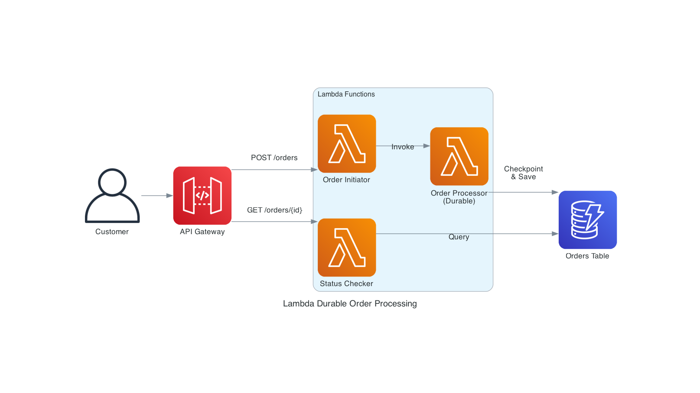

# Order Processing Workflow with Lambda Durable Functions

This pattern demonstrates a multi-step order processing workflow using AWS Lambda Durable Functions. The workflow handles order validation, payment processing, inventory checking, and shipping arrangement with automatic checkpointing and state persistence across long-running operations.

**Important:** Lambda Durable Functions are currently available in the **us-east-2 (Ohio)** region only.

## Architecture



The solution uses a dual-function architecture:
- **Durable Function**: Handles async order processing with 17 steps and automatic checkpointing
- **Status Function**: Provides real-time order status via synchronous API calls

### Order Processing Workflow (17 Steps)

The workflow consists of 17 steps organized into 5 phases:

**Phase 1: Validation (Steps 1-3)**
1. Validate Order - Check order data and customer information
2. Check Inventory - Verify item availability
3. Process Payment - Process payment transaction

**Phase 2: Risk Assessment (Steps 4-6)**
4. Reserve Inventory - Lock inventory for order
5. Fraud Check - Run fraud detection
6. Credit Check - Verify credit (for orders > $1000)

**Phase 3: Invoice (Step 7)**
7. Generate Invoice - Create customer invoice

**Phase 4: Fulfillment (Steps 8-12)**
- *Wait 5 minutes for warehouse processing (no compute cost)*
8. Pick Items - Warehouse picks items
9. Quality Check - Inspect items
10. Package Order - Package for shipping
11. Generate Shipping Label - Create shipping label

**Phase 5: Shipping & Completion (Steps 13-17)**
- *Wait 3 minutes for carrier pickup (no compute cost)*
12. Ship Order - Hand off to carrier
13. Send Notifications - Email/SMS to customer
14. Update Loyalty Points - Award loyalty points
15. Complete Order - Mark order as complete

Each step is automatically checkpointed, allowing the workflow to resume from the last successful step if interrupted.

## Key Features

- ✅ **Automatic Checkpointing** - Each step is checkpointed automatically
- ✅ **Failure Recovery** - Resumes from last checkpoint on failure
- ✅ **Compensation Logic** - Rolls back on errors
- ✅ **Wait States** - Efficient waiting without compute charges
- ✅ **State Persistence** - Order status stored in DynamoDB
- ✅ **API Integration** - REST API for order submission and status checking

## Prerequisites

* [AWS CLI](https://docs.aws.amazon.com/cli/latest/userguide/install-cliv2.html) installed and configured
* [AWS SAM CLI](https://docs.aws.amazon.com/serverless-application-model/latest/developerguide/serverless-sam-cli-install.html) installed
* [Node.js 18+](https://nodejs.org/) installed

## Deployment

1. Navigate to the pattern directory:
   ```bash
   cd lambda-durable-order-processing-sam
   ```

2. Install dependencies:
   ```bash
   cd src && npm install && cd ..
   ```

3. Build the SAM application:
   ```bash
   sam build
   ```

4. Deploy the application (must use us-east-2 region):
   ```bash
   sam deploy --guided --region us-east-2
   ```
   
   During the guided deployment:
   - Stack Name: `lambda-durable-order-processing`
   - AWS Region: `us-east-2`
   - Confirm changes: `N`
   - Allow SAM CLI IAM role creation: `Y`
   - Disable rollback: `N`
   - Save arguments to config file: `Y`

5. Note the `OrderApiEndpoint` from the outputs.

## Testing

### Step 1: Get Your API Endpoint

Retrieve your API endpoint from the CloudFormation stack:

```bash
API_ENDPOINT=$(aws cloudformation describe-stacks \
  --stack-name lambda-durable-order-processing \
  --region us-east-2 \
  --query 'Stacks[0].Outputs[?OutputKey==`OrderApiEndpoint`].OutputValue' \
  --output text)

echo "API Endpoint: $API_ENDPOINT"
```

### Step 2: Create Test Orders

**Test 1: Low-value order (< $1000)**
```bash
curl -X POST ${API_ENDPOINT}/orders \
  -H "Content-Type: application/json" \
  -d '{
    "customerId": "CUST-001",
    "customerEmail": "customer1@example.com",
    "items": [
      {"productId": "BOOK-001", "name": "Programming Book", "quantity": 2, "price": 45.99}
    ]
  }'
```

Expected response:
```json
{
  "message": "Order processing initiated",
  "orderId": "order-1764821208592"
}
```

**Test 2: High-value order (> $1000, triggers credit check)**
```bash
curl -X POST ${API_ENDPOINT}/orders \
  -H "Content-Type: application/json" \
  -d '{
    "customerId": "CUST-002",
    "customerEmail": "customer2@example.com",
    "items": [
      {"productId": "SERVER-001", "name": "Enterprise Server", "quantity": 1, "price": 3500.00}
    ]
  }'
```

**Test 3: Multiple items order**
```bash
curl -X POST ${API_ENDPOINT}/orders \
  -H "Content-Type: application/json" \
  -d '{
    "customerId": "CUST-003",
    "customerEmail": "customer3@example.com",
    "items": [
      {"productId": "LAPTOP-001", "name": "Gaming Laptop", "quantity": 1, "price": 1299.99},
      {"productId": "MOUSE-001", "name": "Wireless Mouse", "quantity": 2, "price": 29.99},
      {"productId": "KEYBOARD-001", "name": "Mechanical Keyboard", "quantity": 1, "price": 149.99}
    ]
  }'
```

**Test 4: Edge case - Empty items (should fail validation)**
```bash
curl -X POST ${API_ENDPOINT}/orders \
  -H "Content-Type: application/json" \
  -d '{
    "customerId": "CUST-004",
    "customerEmail": "customer4@example.com",
    "items": []
  }'
```

### Step 3: Check Order Status

Wait 10 seconds, then check the order status using the order ID from the response:

```bash
ORDER_ID="order-1764821208592"  # Replace with your order ID
curl ${API_ENDPOINT}/orders/${ORDER_ID} | jq '.'
```

Expected response:
```json
{
  "orderId": "order-1764821208592",
  "status": "awaiting-warehouse",
  "customerId": "CUST-001",
  "customerEmail": "customer1@example.com",
  "total": 91.98,
  "items": [
    {
      "name": "Programming Book",
      "quantity": 2,
      "productId": "BOOK-001",
      "price": 45.99
    }
  ],
  "createdAt": "2025-12-04T04:06:48.964Z",
  "lastUpdated": "2025-12-04T04:06:50.621Z"
}
```

### Step 4: Track Status Progression

Poll the order status to see it progress through the workflow:

```bash
# Check status every 30 seconds
for i in {1..10}; do
  echo "=== Check $i at $(date +%H:%M:%S) ==="
  curl -s ${API_ENDPOINT}/orders/${ORDER_ID} | jq '{status, lastUpdated}'
  sleep 30
done
```

You'll see the status progress through:
- `validated` → `inventory-checked` → `payment-processed` → `inventory-reserved` → `fraud-checked` → `invoice-generated` → `awaiting-warehouse` (5 min wait) → `items-picked` → `quality-checked` → `packaged` → `awaiting-pickup` (3 min wait) → `shipped` → `completed`

### Step 5: Monitor Lambda Logs

View real-time Lambda execution logs:

```bash
# Get function name
FUNCTION_NAME=$(aws cloudformation describe-stack-resources \
  --stack-name lambda-durable-order-processing \
  --region us-east-2 \
  --query 'StackResources[?LogicalResourceId==`OrderProcessingFunction`].PhysicalResourceId' \
  --output text)

# Tail logs
aws logs tail /aws/lambda/${FUNCTION_NAME} \
  --follow \
  --format short \
  --region us-east-2
```

Look for checkpoint and step execution messages:
```
Starting order processing { orderId: 'order-1764821208592' }
Validating order { orderId: 'order-1764821208592' }
Checking inventory { orderId: 'order-1764821208592' }
Processing payment { orderId: 'order-1764821208592', amount: 91.98 }
Waiting for warehouse processing { orderId: 'order-1764821208592' }
```

### Step 6: Verify DynamoDB Storage

Check orders stored in DynamoDB:

```bash
TABLE_NAME=$(aws cloudformation describe-stacks \
  --stack-name lambda-durable-order-processing \
  --region us-east-2 \
  --query 'Stacks[0].Outputs[?OutputKey==`OrdersTableName`].OutputValue' \
  --output text)

# Scan all orders
aws dynamodb scan \
  --table-name ${TABLE_NAME} \
  --region us-east-2 \
  --max-items 5 | jq '.Items[] | {orderId: .orderId.S, status: .status.S, total: .total.N}'
```

### Step 7: Test Concurrent Orders

Create multiple orders simultaneously to test concurrency:

```bash
for i in {1..5}; do
  curl -X POST ${API_ENDPOINT}/orders \
    -H "Content-Type: application/json" \
    -d "{
      \"customerId\": \"CONCURRENT-$i\",
      \"customerEmail\": \"concurrent$i@example.com\",
      \"items\": [{\"productId\": \"PROD-$i\", \"name\": \"Product $i\", \"quantity\": 1, \"price\": $((100 + i * 10))}]
    }" &
done
wait
echo "All 5 orders submitted concurrently"
```

### Expected Test Results

- ✅ **Low-value orders**: Complete all 17 steps (no credit check)
- ✅ **High-value orders**: Include credit check step (Step 6)
- ✅ **Multi-item orders**: Calculate total correctly
- ✅ **Invalid orders**: Fail validation and mark as failed
- ✅ **Status API**: Returns real-time order status
- ✅ **Concurrent orders**: All process independently
- ✅ **Wait periods**: 8 minutes total (5 min + 3 min) with no compute cost


## How It Works

### Durable Execution

The order processing function uses the `@aws/durable-execution-sdk-js` to create checkpoints at each step:

```javascript
import { withDurableExecution } from '@aws/durable-execution-sdk-js';

export const handler = withDurableExecution(async (event, context) => {
  // Each step is automatically checkpointed
  await context.step('validate-order', async () => {
    console.log('Validating order');
    // Validation logic
  });

  // Wait 5 seconds (simulating external API call)
  await context.wait({ seconds: 5 });

  await context.step('process-payment', async () => {
    console.log('Processing payment');
    // Payment logic
  });

  // More steps...
});
```

### Checkpoint Behavior

When a durable function executes:
1. Each `context.step()` creates a checkpoint before execution
2. If the function is interrupted, Lambda saves the checkpoint state
3. On retry, the function replays from the beginning
4. Completed steps are skipped using stored checkpoint results
5. Execution continues from the last incomplete step

You'll see the same order ID appear multiple times in logs - this is the durable execution resuming from checkpoints!

### State Persistence

Final order state is saved to DynamoDB after all steps complete:

```javascript
await context.step('save-order', async () => {
  await dynamodb.putItem({
    TableName: process.env.ORDERS_TABLE,
    Item: { orderId, status: 'completed', ... }
  });
});
```

## Configuration

### Durable Execution Settings

The durable function must be created with durable configuration (cannot be added to existing functions):

```bash
aws lambda create-function \
  --function-name my-durable-function \
  --runtime nodejs22.x \
  --durable-config '{"ExecutionTimeout":86400,"RetentionPeriodInDays":7}' \
  ...
```

- **ExecutionTimeout**: 86400 seconds (24 hours)
- **RetentionPeriodInDays**: 7 days

### IAM Permissions

The function requires these permissions:

```yaml
Policies:
  - Statement:
    - Effect: Allow
      Action:
        - lambda:CheckpointDurableExecution
        - lambda:GetDurableExecutionState
      Resource: !Sub 'arn:aws:lambda:${AWS::Region}:${AWS::AccountId}:function:${FunctionName}:*/durable-execution/*'
  - DynamoDBCrudPolicy:
      TableName: !Ref OrdersTable
```

## Customization

### Adjust Wait Time

Modify the wait duration in `src/index.js`:

```javascript
await context.wait({ seconds: 3600 }); // Wait 1 hour
```

### Add More Steps

Add additional processing steps:

```javascript
await context.step('send-notification', async () => {
  console.log('Sending notification');
  // Send email/SMS notification
});
```

### Integrate Real Services

Replace simulation code with actual service calls:

```javascript
await context.step('process-payment', async () => {
  const stripe = require('stripe')(process.env.STRIPE_KEY);
  return await stripe.charges.create({
    amount: order.total * 100,
    currency: 'usd',
    customer: order.customerId
  });
});
```

### Modify Execution Timeout

Update the durable configuration when creating the function:

```yaml
DurableConfig:
  ExecutionTimeout: 172800  # 48 hours
  RetentionPeriodInDays: 14
```

## Monitoring

### CloudWatch Metrics

Monitor durable execution metrics:
- `DurableExecutionStarted`
- `DurableExecutionCompleted`
- `DurableExecutionFailed`
- `DurableExecutionCheckpointCreated`

### CloudWatch Logs

Look for log entries with `[DURABLE_EXECUTION]` prefix to track:
- Checkpoint creation
- Replay events
- Step execution

### X-Ray Tracing

Enable X-Ray tracing in the SAM template:

```yaml
Tracing: Active
```

## Cleanup

Delete the stack:

```bash
sam delete --region us-east-2
```

Or via AWS CLI:

```bash
aws cloudformation delete-stack --stack-name lambda-durable-order-processing --region us-east-2
```

## Cost Considerations

- **Lambda**: Pay per invocation and execution time
- **DynamoDB**: Pay-per-request pricing
- **API Gateway**: Pay per API call
- **Durable Execution**: Checkpoint storage costs (minimal)
- **Wait States**: No compute charges during waits

## Learn More

- [Lambda Durable Functions Documentation](https://docs.aws.amazon.com/lambda/latest/dg/durable-functions.html)
- [Durable Execution SDK (JavaScript)](https://github.com/aws/aws-durable-execution-sdk-js)
- [AWS SAM Documentation](https://docs.aws.amazon.com/serverless-application-model/)

---

Copyright 2025 Amazon.com, Inc. or its affiliates. All Rights Reserved.

SPDX-License-Identifier: MIT-0
