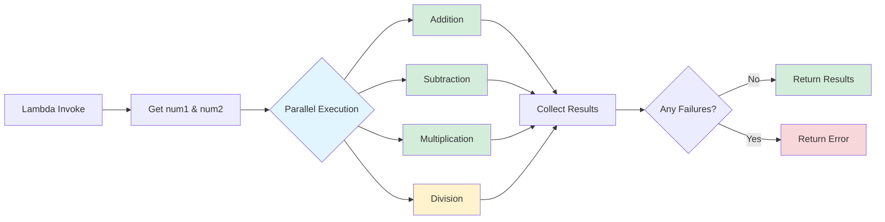

# Parallel Execution of Math Operations with AWS Lambda durable functions

This pattern demonstrates parallel execution of mathematical operations using AWS Lambda durable functions. The workflow executes addition, subtraction, multiplication, and division operations concurrently, showcasing the power of parallel execution in durable functions.

## Architecture

The pattern uses AWS Lambda durable functions to execute multiple mathematical operations in parallel, collecting all results before returning the final response. The durable function uses `context.parallel()` to execute multiple operations concurrently.



### Workflow Steps

1. **User invokes Lambda function** with two numbers (num1 and num2)
2. **Lambda durable functions parses input**, defaulting to 0 for missing values
3. **Four operations execute in parallel**:
   - Addition: num1 + num2
   - Subtraction: num1 - num2
   - Multiplication: num1 * num2
   - Division: num1 / num2
4. **Results collected** from all parallel operations
5. **Response returned** with all calculation results

## Key Features

- ✅ **Parallel Execution** - All four operations run concurrently
- ✅ **Error Handling** - Division by zero protection with custom retry strategy
- ✅ **Batch Results** - Collects all results before returning
- ✅ **Failure Detection** - Identifies if any operation failed
- ✅ **Configurable Retries** - Per-step retry configuration (division has no retries)
- ✅ **Structured Logging** - Detailed logging for each operation

## Prerequisites

* [AWS CLI](https://docs.aws.amazon.com/cli/latest/userguide/install-cliv2.html) installed and configured
* [AWS SAM CLI](https://docs.aws.amazon.com/serverless-application-model/latest/developerguide/serverless-sam-cli-install.html) installed

## Deployment

1. Navigate to the pattern directory:
   ```bash
   cd lambda-durable-parallel-execution-python-sam
   ```

2. Build the SAM application:
   ```bash
   sam build
   ```

3. Deploy the application:
   ```bash
   sam deploy --guided
   ```
   
   During the guided deployment:
   - Accept default values or customize as needed
   - Allow SAM CLI to create IAM roles when prompted

4. Note the `MathFunction` name from the outputs

## Testing

### Invoke with Valid Numbers

```bash
aws lambda invoke \
  --function-name <MathFunction Name>:live \
  --payload '{"num1": 10, "num2": 5}' \
  --cli-binary-format raw-in-base64-out \
  response.json

cat response.json
```

Response:
```json
{
  "Add": 15,
  "Subtract": 5,
  "Multiply": 50,
  "Division": 2.0
}
```

### Test Division by Zero

```bash
aws lambda invoke \
  --function-name <MathFunction Name>:live \
  --payload '{"num1": 10, "num2": 0}' \
  --cli-binary-format raw-in-base64-out \
  response.json

cat response.json
```

Response:
```json
{
  "error_details": "One or more operations failed"
}
```

### Test with Default Values

```bash
aws lambda invoke \
  --function-name <MathFunction Name>:live \
  --payload '{}' \
  --cli-binary-format raw-in-base64-out \
  response.json
```

Response (both numbers default to 0):
```json
{
  "error_details": "One or more operations failed"
}
```

## Use Cases

- **Parallel Data Processing** - Execute multiple transformations concurrently
- **Multi-Service Calls** - Call multiple APIs in parallel and aggregate results
- **Batch Calculations** - Perform multiple calculations simultaneously
- **Validation Workflows** - Run multiple validation checks in parallel
- **Data Enrichment** - Enrich data from multiple sources concurrently

## Cleanup

```bash
sam delete --stack-name <stack-name>
```

## Learn More

- [AWS Lambda durable functions documentation](https://docs.aws.amazon.com/lambda/latest/dg/durable-functions.html)
- [Durable Execution SDK (Python)](https://github.com/aws/aws-durable-execution-sdk-python)
- [Parallel Execution](https://github.com/aws/aws-durable-execution-sdk-python/blob/main/docs/core/parallel.md)
- [Retry Strategies](https://github.com/aws/aws-durable-execution-sdk-python/blob/main/docs/advanced/error-handling.md#retry-strategies)

---

Copyright 2026 Amazon.com, Inc. or its affiliates. All Rights Reserved.

SPDX-License-Identifier: MIT-0
