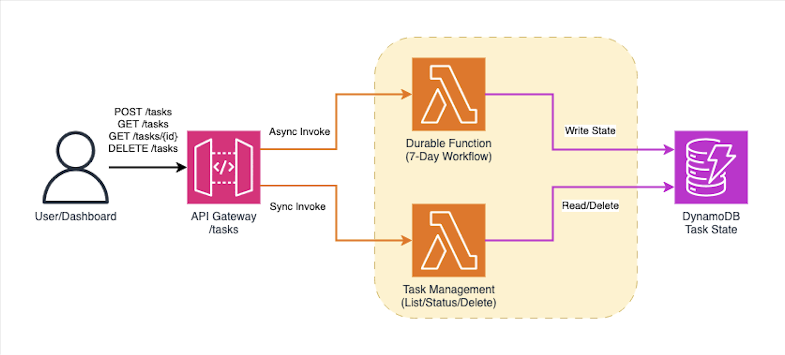

# Multi-Day Scheduled Task Orchestration with Lambda Durable Functions

This pattern demonstrates a 7-day workflow with scheduled checkpoints using AWS Lambda Durable Functions. The workflow handles daily data collection, batch processing, report generation, and notifications with automatic checkpointing and state persistence across long-running operations.

**Important:** Lambda Durable Functions are currently available in the **us-east-2 (Ohio)** region only.

## Architecture



The solution uses a streamlined architecture:
- **Durable Function**: Handles async scheduled task orchestration with 7-day workflow and automatic checkpointing
- **Task Management Function**: Unified function providing task listing, status queries, and deletion operations
- **DynamoDB**: Stores task state and progress for real-time monitoring
- **API Gateway**: RESTful API for task creation, status queries, and management

### Scheduled Task Workflow (7 Days)

The workflow consists of multiple steps organized across 7 days:

**Day 1: Data Collection**
- Initialize task and configuration
- Collect data from multiple sources (database, API, files)
- Store initial dataset metadata

**Days 2-6: Daily Batch Processing**
- Process daily batches of records
- Track errors and processing metrics
- Update progress after each day
- *Wait 24 hours between each day (no compute cost during waits)*

**Day 7: Report Generation & Completion**
- Generate comprehensive final report
- Calculate summary statistics
- Send notification email
- Perform cleanup operations

Each step is automatically checkpointed, allowing the workflow to resume from the last successful step if interrupted.

## Key Features

- ✅ **Long-Running Execution** - 7-day workflow with zero compute cost during waits
- ✅ **Automatic Checkpointing** - Each step is checkpointed automatically
- ✅ **Failure Recovery** - Resumes from last checkpoint on failure
- ✅ **Progress Tracking** - Real-time progress monitoring via API
- ✅ **State Persistence** - Task status stored in DynamoDB
- ✅ **Scheduled Waits** - 24-hour waits between days with no charges

## Use Cases

This pattern is ideal for:
- **Weekly/Monthly Report Generation** - Automated periodic reporting
- **Multi-Day Data Processing** - Large dataset processing with daily batches
- **Scheduled Backups** - Daily backup orchestration with verification
- **Compliance Workflows** - Multi-day audit and compliance checks
- **ETL Pipelines** - Extract, transform, load operations with scheduled intervals

## Prerequisites

* [AWS CLI](https://docs.aws.amazon.com/cli/latest/userguide/install-cliv2.html) installed and configured
* [AWS SAM CLI](https://docs.aws.amazon.com/serverless-application-model/latest/developerguide/serverless-sam-cli-install.html) installed
* [Node.js 18+](https://nodejs.org/) installed

## Deployment

1. Navigate to the pattern directory:
   ```bash
   cd lambda-durable-scheduled-tasks-sam
   ```

2. Install dependencies:
   ```bash
   cd src && npm install && cd ..
   ```

3. Build the SAM application:
   ```bash
   sam build
   ```

4. Deploy the application (must use us-east-2 region):
   ```bash
   sam deploy --guided --region us-east-2
   ```
   
   During the guided deployment:
   - Stack Name: `lambda-durable-scheduled-tasks`
   - AWS Region: `us-east-2`
   - Confirm changes: `N`
   - Allow SAM CLI IAM role creation: `Y`
   - Disable rollback: `N`
   - Save arguments to config file: `Y`

5. Note the `TaskApiEndpoint` from the outputs.

## Testing

### Step 1: Get Your API Endpoint

Retrieve your API endpoint from the CloudFormation stack:

```bash
aws cloudformation describe-stacks \
  --stack-name lambda-durable-scheduled-tasks \
  --region us-east-2 \
  --query 'Stacks[0].Outputs[?OutputKey==`TaskApiEndpoint`].OutputValue' \
  --output text
```

### Step 2: Start a Scheduled Task

Create a new scheduled task with custom configuration:

```bash
API_ENDPOINT=$(aws cloudformation describe-stacks \
  --stack-name lambda-durable-scheduled-tasks \
  --region us-east-2 \
  --query 'Stacks[0].Outputs[?OutputKey==`TaskApiEndpoint`].OutputValue' \
  --output text)

curl -X POST ${API_ENDPOINT}/tasks \
  -H "Content-Type: application/json" \
  -d '{
    "config": {
      "reportType": "weekly",
      "dataSource": "analytics",
      "notifyEmail": "admin@example.com"
    }
  }'
```

Response:
```json
{
  "taskId": "TASK-1733328000000",
  "status": "INITIALIZED",
  "message": "Task started successfully"
}
```

### Step 3: Check Task Status

Query the task status to see progress:

```bash
TASK_ID="TASK-1733328000000"  # Use your actual task ID

curl ${API_ENDPOINT}/tasks/${TASK_ID}
```

Response:
```json
{
  "taskId": "TASK-1733328000000",
  "status": "DAY_3_COMPLETE",
  "currentDay": 3,
  "progress": {
    "percentage": 43,
    "completedDays": 3,
    "totalDays": 7,
    "steps": [
      {
        "day": 1,
        "action": "Data Collection",
        "result": {
          "records": 7543,
          "sources": ["database", "api", "files"]
        },
        "completedAt": "2024-12-04T10:00:00.000Z"
      },
      {
        "day": 2,
        "action": "Batch Processing",
        "result": {
          "recordsProcessed": 1823,
          "errors": 3
        },
        "completedAt": "2024-12-05T10:00:00.000Z"
      }
    ]
  },
  "config": {
    "reportType": "weekly",
    "dataSource": "analytics",
    "notifyEmail": "admin@example.com"
  },
  "startTime": "2024-12-04T10:00:00.000Z"
}
```

### Step 4: List All Tasks

View all tasks in the system:

```bash
curl ${API_ENDPOINT}/tasks
```

Response:
```json
{
  "tasks": [
    {
      "taskId": "TASK-1733328000000",
      "status": "DAY_3_COMPLETE",
      "currentDay": 3,
      "progress": {...}
    }
  ],
  "count": 1
}
```

### Step 5: Testing with Shorter Waits (Development)

For testing purposes, the default wait times are set to 1 minute. To test with real 24-hour intervals, modify the wait times in `src/index.js`:

```javascript
// Change from 1 minute to 24 hours for real intervals
await context.wait({ hours: 24 });  // Instead of { minutes: 1 }
```

This allows you to test the complete 7-day workflow in just 7 minutes during development.

### Step 6: Monitor Execution

View CloudWatch logs for detailed execution information:

```bash
aws logs tail /aws/lambda/lambda-durable-scheduled-tasks-ScheduledTask \
  --region us-east-2 \
  --follow
```

### Step 7: View Final Report

Once the task completes (status: `COMPLETED`), retrieve the final report:

```bash
curl ${API_ENDPOINT}/tasks/${TASK_ID}
```

The response will include a `finalReport` field with comprehensive statistics:

```json
{
  "taskId": "TASK-1733328000000",
  "status": "COMPLETED",
  "finalReport": {
    "taskId": "TASK-1733328000000",
    "reportType": "weekly",
    "summary": {
      "totalDays": 7,
      "totalRecordsProcessed": 17543,
      "totalErrors": 23,
      "successRate": "99.87%"
    },
    "dailyBreakdown": [
      { "day": 1, "type": "collection", "records": 7543 },
      { "day": 2, "type": "processing", "records": 1823, "errors": 3 },
      { "day": 3, "type": "processing", "records": 1654, "errors": 5 }
    ],
    "generatedAt": "2024-12-11T10:00:00.000Z"
  }
}
```

## API Reference

### POST /tasks
Start a new scheduled task

**Request Body:**
```json
{
  "config": {
    "reportType": "weekly",
    "dataSource": "analytics",
    "notifyEmail": "admin@example.com"
  }
}
```

**Response:**
```json
{
  "taskId": "TASK-1733328000000",
  "status": "INITIALIZED",
  "message": "Task started successfully"
}
```

### GET /tasks
List all tasks

**Response:**
```json
{
  "tasks": [
    {
      "taskId": "TASK-1733328000000",
      "status": "DAY_3_COMPLETE",
      "currentDay": 3,
      "progress": {
        "percentage": 43,
        "completedDays": 3,
        "totalDays": 7,
        "steps": [...]
      },
      "config": {...},
      "startTime": "2024-12-04T10:00:00.000Z"
    }
  ],
  "count": 1
}
```

### GET /tasks/{taskId}
Get task status and progress

**Response:**
```json
{
  "taskId": "TASK-1733328000000",
  "status": "DAY_3_COMPLETE",
  "currentDay": 3,
  "progress": {
    "percentage": 43,
    "completedDays": 3,
    "totalDays": 7,
    "steps": [...]
  }
}
```

### DELETE /tasks
Delete all tasks from DynamoDB

**Response:**
```json
{
  "message": "All tasks deleted successfully",
  "deletedCount": 5
}
```

## Task Status Values

- `INITIALIZED` - Task created and initialized
- `DAY_1_COMPLETE` - Data collection completed
- `DAY_2_COMPLETE` through `DAY_6_COMPLETE` - Daily batch processing completed
- `REPORT_GENERATED` - Final report generated
- `NOTIFICATION_SENT` - Notification email sent
- `COMPLETED` - Task fully completed
- `FAILED` - Task failed with error

## Dashboard

A web-based dashboard is included for monitoring tasks in real-time:

1. Open `dashboard.html` in your browser
2. Enter your API endpoint
3. View all tasks with progress tracking
4. Monitor daily workflow progression
5. Delete all tasks when needed

Features:
- Real-time task monitoring
- Progress visualization
- Auto-refresh every 30 seconds
- Task statistics and metrics
- Delete all tasks functionality

## Cost Optimization

This pattern demonstrates significant cost savings:

**Traditional Approach (Polling):**
- 7 days × 24 hours × 60 minutes = 10,080 Lambda invocations
- Each invocation: ~100ms at 128MB = $0.0000002083 per invocation
- Total cost: ~$2.10 per task

**Durable Functions Approach:**
- ~10 Lambda invocations (one per step)
- Wait states: $0 (no compute charges)
- Total cost: ~$0.002 per task

**Savings: 99.9% cost reduction**

## Cleanup

Delete the CloudFormation stack:

```bash
sam delete --stack-name lambda-durable-scheduled-tasks --region us-east-2
```

## Learn More

- [Lambda Durable Functions Documentation](https://docs.aws.amazon.com/lambda/latest/dg/durable-functions.html)
- [JavaScript/TypeScript SDK](https://github.com/aws/aws-durable-execution-sdk-js)
- [AWS Blog Post](https://aws.amazon.com/blogs/aws/build-multi-step-applications-and-ai-workflows-with-aws-lambda-durable-functions/)

## Security

See [CONTRIBUTING](../../../CONTRIBUTING.md#security-issue-notifications) for more information.

## License

This library is licensed under the MIT-0 License. See the LICENSE file.
