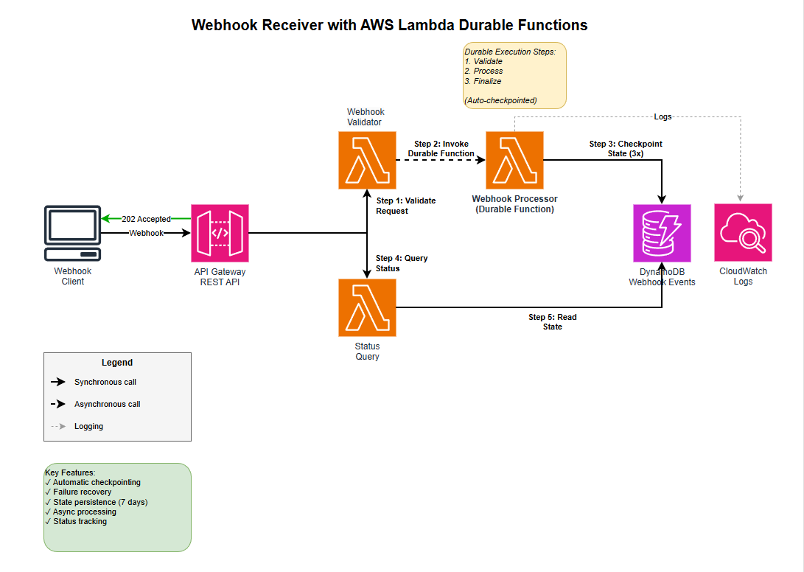

# Webhook Receiver with AWS Lambda durable functions - NodeJS

This serverless pattern demonstrates a serverless webhook receiver using AWS Lambda durable functions with NodeJS. The pattern receives webhook events via API Gateway, processes them durably with automatic checkpointing, and provides status query capabilities.

Learn more about this pattern at Serverless Land Patterns: https://serverlessland.com/testing/patterns/lambda-durable-webhook-sam-nodejs 

To Learn more about Lambda durable functions:
- [AWS Lambda durable functions Documentation](https://docs.aws.amazon.com/lambda/latest/dg/durable-functions.html)
- [Lambda durable functions Best Practices](https://docs.aws.amazon.com/lambda/latest/dg/durable-functions-best-practices.html)

Important: this application uses various AWS services and there are costs associated with these services after the Free Tier usage - please see the [AWS Pricing page](https://aws.amazon.com/pricing/) for details. You are responsible for any AWS costs incurred. No warranty is implied in this example.

## Requirements

* [Create an AWS account](https://portal.aws.amazon.com/gp/aws/developer/registration/index.html) if you do not already have one and log in. The IAM user that you use must have sufficient permissions to make necessary AWS service calls and manage AWS resources.
* [AWS CLI](https://docs.aws.amazon.com/cli/latest/userguide/install-cliv2.html) installed and configured
* [Git Installed](https://git-scm.com/book/en/v2/Getting-Started-Installing-Git)
* [AWS Serverless Application Model](https://docs.aws.amazon.com/serverless-application-model/latest/developerguide/serverless-sam-cli-install.html) (AWS SAM) installed

## Architecture



## How It Works

This pattern demonstrates a serverless webhook receiver using AWS Lambda durable functions. The pattern receives webhook events via API Gateway, processes them durably with automatic checkpointing, and provides status query capabilities. The durable function processes webhooks in 3 checkpointed steps:

1. **Validate** - Verify webhook payload and structure
2. **Process** - Execute business logic on webhook data  
3. **Finalize** - Complete processing and update final status

This pattern acheives the following key features:

- **Automatic Checkpointing** - Each processing step is checkpointed automatically
- **Failure Recovery** - Resumes from last checkpoint on failure
- **Asynchronous Processing** - Immediate 202 response, processing in background
- **State Persistence** - Execution state stored in DynamoDB with TTL
- **Status Query API** - Real-time status tracking via REST API

**Note:** Each step writes status updates to DynamoDB before its main work. These writes are idempotent, so retries are safe. During replay, the DynamoDB status reflects the last successfully written state—not the current replay position. Status queries should treat intermediate states as "in progress."

## Important

**Important:** Please check the [AWS documentation](https://docs.aws.amazon.com/lambda/latest/dg/durable-functions.html) for regions currently supported by AWS Lambda durable functions.

## Deployment

1. **Build the application**:
   ```bash
   sam build
   ```

2. **Deploy to AWS**:
Plese enter required `WebhookSecret`

```bash
   sam deploy --guided
   ```
   
   Note the outputs after deployment:
   - `WebhookApiUrl`: Use this for sending webhook POST requests
   - `StatusQueryApiUrl`: Use this for querying execution status

## Testing
To test the set-up, utilize the below curl command by replacing the WebhookApiUrl copied from the above step:

   ```bash
   # Send a test webhook
   curl -X POST <WebhookApiUrl> \
     -H "Content-Type: application/json" \
     -d '{
       "type": "order", 
       "orderId": "123456",
       "data": {"amount": 100}
     }'
   ```

Once the Webhook is submitted, to query the status of webhook, use the following curl command by replacing the StatusQueryApiUrl:

   ```bash
   # Get execution status (use executionToken from webhook response)
   curl <StatusQueryApiUrl>
   ```
   
   **Success indicators:**
   - Webhook returns 202 with `executionToken`
   - Status query shows progression: `STARTED` → `VALIDATING` → `PROCESSING` → `COMPLETED`
   - Execution state persists in DynamoDB with TTL

To simulate a validation failure, send an invalid payload (empty or missing required fields):

   ```bash
   # Send an invalid webhook (empty payload triggers validation failure)
   curl -X POST <WebhookApiUrl> \
     -H "Content-Type: application/json" \
     -d '{}'
   ```

Query the status to see the failure:

   ```bash
   curl <StatusQueryApiUrl>
   ```

   **Failure indicators:**
   - Status query shows `FAILED` status
   - Error message indicates validation failure reason
   - Execution state persists in DynamoDB for debugging

## Cleanup

```bash
sam delete
```
----
Copyright 2026 Amazon.com, Inc. or its affiliates. All Rights Reserved.

SPDX-License-Identifier: MIT-0
