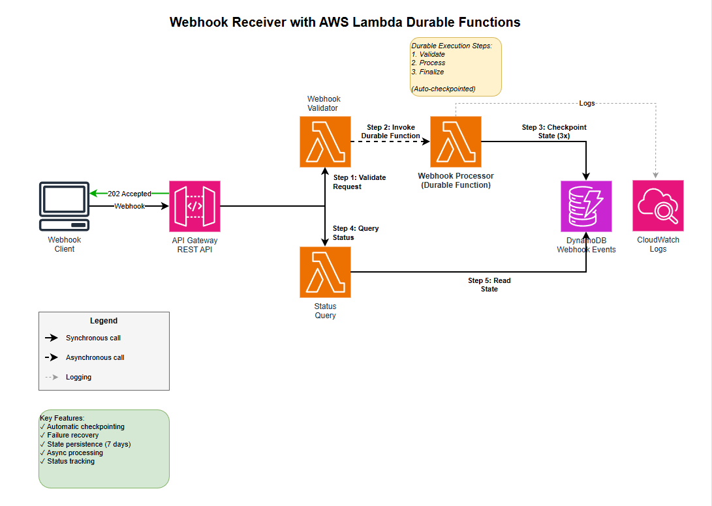

# Webhook Receiver with AWS Lambda Durable Functions (Python)

This pattern demonstrates a serverless webhook receiver using AWS Lambda Durable Functions with Python. The pattern receives webhook events via API Gateway, processes them durably with automatic checkpointing, and provides status query capabilities.

**Important:** Please check the [AWS documentation](https://docs.aws.amazon.com/lambda/latest/dg/durable-functions.html) for regions currently supported by AWS Lambda durable functions.

Learn more about this pattern at Serverless Land Patterns: https://serverlessland.com/patterns/lambda-durable-webhook-sam-python

## Architecture



The solution uses a three-function architecture:
- **Webhook Validator**: Receives webhook POST requests and validates them
- **Webhook Processor (Durable)**: Processes webhooks with 3 checkpointed steps
- **Status Query**: Provides real-time execution status via GET API

### Webhook Processing Workflow (3 Steps)

The durable function processes webhooks in 3 checkpointed steps:

1. **Validate** - Verify webhook payload and structure
2. **Process** - Execute business logic on webhook data
3. **Finalize** - Complete processing and update final status

Each step is automatically checkpointed, allowing the workflow to resume from the last successful step if interrupted.

## Key Features

- ✅ **Automatic Checkpointing** - Each processing step is checkpointed automatically
- ✅ **Failure Recovery** - Resumes from last checkpoint on failure
- ✅ **Asynchronous Processing** - Immediate 202 response, processing in background
- ✅ **State Persistence** - Execution state stored in DynamoDB with TTL
- ✅ **Status Query API** - Real-time status tracking via REST API
- ✅ **HMAC Validation** - Optional webhook signature verification (configurable)

## Prerequisites

* [AWS CLI](https://docs.aws.amazon.com/cli/latest/userguide/install-cliv2.html) installed and configured
* [AWS SAM CLI](https://docs.aws.amazon.com/serverless-application-model/latest/developerguide/serverless-sam-cli-install.html) installed
* [Python 3.13](https://www.python.org/downloads/) (for local development)
* [Docker](https://docs.docker.com/get-docker/) (for containerized builds)

### Required IAM Permissions

Your AWS CLI user/role needs the following permissions for deployment and testing:
- **CloudFormation**: `cloudformation:DescribeStacks`, `cloudformation:DeleteStack`
- **Lambda**: `lambda:CreateFunction`, `lambda:InvokeFunction`, `lambda:GetFunction`
- **DynamoDB**: `dynamodb:Scan`, `dynamodb:GetItem`, `dynamodb:PutItem`
- **CloudWatch Logs**: `logs:DescribeLogGroups`, `logs:FilterLogEvents`, `logs:GetLogEvents`, `logs:TailLogEvents`
- **API Gateway**: `apigateway:GET`
- **IAM**: `iam:CreateRole`, `iam:AttachRolePolicy`, `iam:PassRole`

## Deployment

1. Navigate to the pattern directory:
   ```bash
   cd lambda-durable-webhook-sam-python
   ```

2. Build the application using containerized build (required for Python 3.13):
   ```bash
   sam build --use-container
   ```

3. Deploy to AWS:
   ```bash
   sam deploy --guided
   ```

   During the guided deployment, provide:
   - **Stack Name**: `lambda-durable-webhook` (or your preferred name)
   - **AWS Region**: Choose a region that supports durable functions (e.g., `us-east-1`)
   - **WebhookSecret**: (Optional) Leave empty or provide a secret for HMAC validation
   - **Confirm changes**: Y
   - **Allow SAM CLI IAM role creation**: Y
   - **Save arguments to configuration file**: Y

4. Note the API endpoints from the outputs:
   ```
   WebhookEndpoint: https://xxxxx.execute-api.region.amazonaws.com/prod/webhook
   StatusEndpoint: https://xxxxx.execute-api.region.amazonaws.com/prod/status
   ```

## Testing

### Step 1: Get Your API Endpoint

After deployment, get the webhook endpoint:
```bash
aws cloudformation describe-stacks \
  --stack-name lambda-durable-webhook \
  --query 'Stacks[0].Outputs[?OutputKey==`WebhookEndpoint`].OutputValue' \
  --output text
```

### Step 2: Submit a Webhook

Send a test webhook:
```bash
curl -X POST https://YOUR_API_ENDPOINT/webhook \
  -H "Content-Type: application/json" \
  -d '{
    "type": "test.event",
    "data": "Hello from webhook",
    "timestamp": "'$(date -u +%Y-%m-%dT%H:%M:%SZ)'"
  }'
```

Expected response (202 Accepted):
```json
{
  "message": "Webhook accepted for processing",
  "requestId": "uuid-here"
}
```

### Step 3: Check Execution Status

Wait a few seconds, then query the status. First, get the execution token from DynamoDB:
```bash
aws dynamodb scan \
  --table-name lambda-durable-webhook-webhook-events \
  --limit 1 \
  --query 'Items[0].executionToken.S' \
  --output text
```

Then query the status endpoint:
```bash
curl https://YOUR_API_ENDPOINT/status/EXECUTION_TOKEN
```

Expected response:
```json
{
  "executionToken": "1234567890123",
  "status": "completed",
  "currentStep": "finalize",
  "createdAt": "2026-02-07T22:00:00.000000",
  "lastUpdated": "2026-02-07T22:00:01.000000",
  "webhookSummary": {
    "type": "test.event",
    "source": "unknown",
    "keys": ["type", "data", "timestamp"]
  }
}
```

### Step 4: Monitor Lambda Logs

View the durable function execution logs:
```bash
# Get function name
FUNCTION_NAME=$(aws cloudformation describe-stack-resources \
  --stack-name lambda-durable-webhook \
  --query 'StackResources[?LogicalResourceId==`WebhookProcessorFunction`].PhysicalResourceId' \
  --output text)

# Tail logs
aws logs tail /aws/lambda/$FUNCTION_NAME --follow
```

You should see the 3 checkpointed steps:
```
Step 1: Validating 1234567890123
Step 2: Processing 1234567890123
Step 3: Finalizing 1234567890123
Stored event: 1234567890123, status: completed
```

## How It Works

### Durable Execution

The webhook processor uses AWS Lambda Durable Functions to:
1. **Checkpoint automatically** after each step
2. **Persist state** to DynamoDB
3. **Resume from last checkpoint** on failure
4. **Maintain execution context** across invocations

### State Management

Execution state is stored in DynamoDB with:
- **executionToken**: Unique identifier for tracking
- **status**: Current execution status (validated, processing, completed)
- **currentStep**: Last completed step
- **webhookPayload**: Original webhook data
- **ttl**: Automatic cleanup after 7 days

### Status Query

The status endpoint provides real-time execution tracking:
- Returns current execution state
- Shows progress through workflow steps
- Provides webhook payload summary
- Returns 404 for invalid tokens

## Configuration

### Adjust Timeout Duration

Modify the durable function timeout in `template.yaml`:
```yaml
WebhookProcessorFunction:
  Type: AWS::Serverless::Function
  Properties:
    DurableConfig:
      ExecutionTimeout: 3600  # Change to desired seconds (max 86400)
      RetentionPeriodInDays: 7  # Change retention period
```

### Enable HMAC Validation

To enable webhook signature validation:

1. Deploy with a webhook secret:
   ```bash
   sam deploy --parameter-overrides WebhookSecret=your-secret-key
   ```

2. Send webhooks with HMAC signature:
   ```bash
   SIGNATURE=$(echo -n "$PAYLOAD" | openssl dgst -sha256 -hmac "your-secret-key" | cut -d' ' -f2)
   curl -X POST https://YOUR_API_ENDPOINT/webhook \
     -H "Content-Type: application/json" \
     -H "X-Webhook-Signature: sha256=$SIGNATURE" \
     -d "$PAYLOAD"
   ```

## Running Tests

The pattern includes unit tests for the Lambda functions.

### Install Test Dependencies

```bash
cd tests
pip install -r requirements.txt
cd ..
```

### Run All Tests

```bash
python -m pytest tests/ -v
```

### Run Specific Test File

```bash
# Test webhook processor
python -m pytest tests/test_webhook_processor.py -v

# Test status query
python -m pytest tests/test_status_query.py -v
```

### Run Tests with Coverage

```bash
python -m pytest tests/ --cov=src --cov-report=html
```

## Cleanup

To completely remove the stack and all resources:

### Option 1: Using SAM CLI (Recommended)

```bash
sam delete --stack-name lambda-durable-webhook --region us-east-1
```

When prompted:
- **Delete the stack**: Y
- **Delete ECR repository**: Y (if using container images)
- **Delete S3 bucket**: Y

### Option 2: Using AWS CLI

```bash
# Delete the CloudFormation stack
aws cloudformation delete-stack \
  --stack-name lambda-durable-webhook \
  --region us-east-1

# Wait for deletion to complete
aws cloudformation wait stack-delete-complete \
  --stack-name lambda-durable-webhook \
  --region us-east-1
```

### Verify Cleanup

Confirm all resources are deleted:

```bash
# Check stack status (should return error if deleted)
aws cloudformation describe-stacks \
  --stack-name lambda-durable-webhook \
  --region us-east-1
```

### Clean Local Build Artifacts

```bash
# Remove SAM build artifacts
rm -rf .aws-sam

# Remove Python cache
find . -type d -name "__pycache__" -exec rm -rf {} +
find . -type f -name "*.pyc" -delete
```

## Redeployment

After cleanup, you can redeploy the pattern by following the deployment steps again:

```bash
# 1. Build
sam build --use-container

# 2. Deploy
sam deploy --guided
```

Or use the saved configuration:

```bash
sam deploy
```

**Note**: The `samconfig.toml` file stores your deployment configuration, making redeployment faster.

## 🔒 Security

**⚠️ Important Security Notice**

This pattern is designed for **demonstration and learning purposes**. Before deploying to production, implement these security controls:

### Required for Production:
1. **Authentication** - Add API Gateway API keys or IAM authorization
2. **HMAC Validation** - Enable webhook signature verification
3. **Rate Limiting** - Configure API Gateway throttling and usage plans
4. **WAF Protection** - Attach AWS WAF to API Gateway
5. **Encryption** - Enable DynamoDB encryption with customer-managed KMS keys
6. **Input Validation** - Add request body size limits and schema validation
7. **Monitoring** - Set up CloudWatch alarms and anomaly detection

See [SECURITY.md](SECURITY.md) for detailed security recommendations.

## Learn More

- [AWS Lambda Durable Functions Documentation](https://docs.aws.amazon.com/lambda/latest/dg/durable-functions.html)
- [AWS SAM Documentation](https://docs.aws.amazon.com/serverless-application-model/)
- [Serverless Land Patterns](https://serverlessland.com/patterns)

## License

This pattern is licensed under the MIT-0 License. See the LICENSE file.
