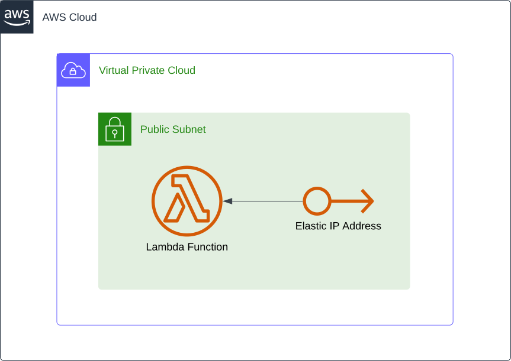

# Lambda Elastic IP without NAT Gateway

This project contains a sample AWS Cloud Development Kit (AWS CDK) template for deploying a Lambda function with a public elastic IP without the need to provision a NAT gateway.



Learn more about this pattern at Serverless Land Patterns: https://serverlessland.com/patterns/lambda-elastic-ip-no-nat-gateway-cdk.

Important: This application uses various AWS services and there are costs associated with these services after the Free Tier usage - please see the [AWS Pricing page](https://aws.amazon.com/pricing/) for details. You are responsible for any AWS costs incurred. No warranty is implied in this example.

## Requirements

- [Create an AWS account](https://portal.aws.amazon.com/gp/aws/developer/registration/index.html) if you do not already have one and log in. The IAM user that you use must have sufficient permissions to make necessary AWS service calls and manage AWS resources.
- [AWS CLI](https://docs.aws.amazon.com/cli/latest/userguide/install-cliv2.html) installed and configured
- [Git Installed](https://git-scm.com/book/en/v2/Getting-Started-Installing-Git)
- [AWS CDK](https://docs.aws.amazon.com/cdk/latest/guide/cli.html) installed and configured

## Deployment Instructions

1. Create a new directory, navigate to that directory in a terminal, and clone the GitHub repository:
   ```bash
   git clone https://github.com/aws-samples/serverless-patterns
   ```
2. Change the directory to the pattern directory:
   ```bash
   cd serverless-patterns/lambda-elastic-ip-no-nat-gateway-cdk/cdk
   ```
3. Install dependencies:
   ```bash
   npm install
   ```

```typescript
#!/usr/bin/env node
const app = new cdk.App();
.
.
.

const patternStack = new LambdaElasticIpStack(app, 'LambdaElasticIpStack', {
  env: {
    region: process.env.CDK_DEFAULT_REGION,
    account: process.env.CDK_DEFAULT_ACCOUNT,
  },
});

app.synth();

```

4. From the command line, configure AWS CDK:
   ```bash
   cdk bootstrap ACCOUNT-NUMBER/REGION # e.g.
   cdk bootstrap 9999999999/us-east-1
   cdk bootstrap --profile test 9999999999/us-east-1
   ```
5. From the command line, use AWS CDK to deploy the AWS resources for the pattern as specified in the `lib/cdk-stack.ts` file:
   ```bash
   cdk deploy
   ```
6. Note: The AWS CDK deployment process will output the DynamoDB table name, the API endpoint, and the IoT Core Topic name used for testing this project

## How it works

This pattern allows you to assign your lambda function a static public IP address that you can use to interact with APIs that require whitelisted IPs without the need to provision a NAT Gateway. Therefore, this pattern will save almost $33/month in NAT Gateway costs.


The following resources will be provisioned:

- A Lambda function to test the pattern
- An Elastic IP to associate with the Lambda function
- A public subnet in the default VPC with `us-east-1e` as an AZ
- A custom resource with Lambda function to associate the Elastic IP with the test lambda's ENI

Since AWS manages the provisioning of any Lambda ENI, we cannot access that ENI in CDK code. Therefore, to automate the process, we have to associate the Elastic IP with the ENI in a custom resource after the deployment occurs.

**_Disclaimer:_** This pattern is best suited for non-production environments, since it is not multi-AZ nor highly scalable.

## Testing

To test this pattern, you must use both the AWS Console and the AWS CLI.

### AWS Console Part

1. Open the AWS Lambda Console
2. Navigate to `vin-api-lambda`
3. Test the lambda with any payload
4. A random vin should be returned and logged.


## Cleanup

1. Delete the stack
   ```bash
   cdk destroy
   ```

## Resources

1. [Lambda in a VPC](https://docs.aws.amazon.com/prescriptive-guidance/latest/patterns/generate-a-static-outbound-ip-address-using-a-lambda-function-amazon-vpc-and-a-serverless-architecture.html)

---

Copyright 2023 Amazon.com, Inc. or its affiliates. All Rights Reserved.

SPDX-License-Identifier: MIT-0
