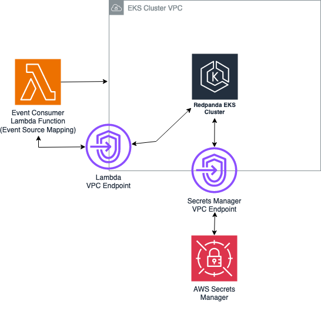

# Redpanda Integration with AWS Lambda

## Introduction

Redpanda is a simple, powerful, and cost-efficient streaming data platform that is compatible with Kafka APIs, and is used by many enterprise organizations across industries.

Customers have looked to us for guidance on using Redpanda as a Kafka alternative in AWS, and integrating it with various AWS services.

This guide shows how to deploy a basic Redpanda cluster in Amazon EKS using the free Community Edition of Redpanda, and then how to integrate it with AWS Lambda using the existing Apache Kafka API trigger, which enables Lambda functions to easily be configured as consumers of the streaming data.

## Solution Overview

The integration consists of an EKS cluster running the Redpanda deployment, as well as a Lambda function using the Apache Kafka trigger configured to receive data streaming events from Redpanda.

SASL SCRAM 256 is used for secure authentication between Lambda and Redpanda, and TLS is used for encryption in transit. AWS Secrets Manager securely stores the credentials and the self signed certificate used for TLS communications. 

Finally, we use Amazon Route 53 for private DNS in our EKS VPC to resolve our cluster node names.

We will walk through the steps to set up and deploy the EKS cluster and Redpanda, and then use AWS SAM to deploy the remaining architecture.



 **** 
## Deployment Instructions

We will use an AWS Cloud9 instance as the working environment in the steps provided in this guide, however the included steps can also be used with Linux and MacOS.

In order to deploy a Cloud9 instance:

1. Log in to the AWS Console and navigate to the Cloud9 service.  
2. Click on “Create environment”.
3. Give the instance a name such as “RPLambdaIntergationWorkspace”.
4. Optionally specify a VPC and subnet for the instance to run in.
5. Accept the other defaults and click on “Create”.
6. The environment will take a few minutes to be created.  Once it has succeeded, click on “Open” to access the environment.

Once you have accessed your Cloud9 environment, we recommend clicking on the “+” next to the “Welcome” tab and choosing “New Terminal”.  This terminal gives you a larger window than the terminal automatically launched at the bottom of the screen, and will be used to run the commands in the following steps.

Depending on your account configuration, you may also need to export your AWS credentials in this terminal, such as AWS_ACCESS_KEY_ID, AWS_SECRET_ACCESS_KEY, and AWS_DEFAULT_REGION. “us-east-1” is used as the default region for these steps.

## Prerequisites

The following prerequisites must be installed and configured in your working environment.

* [Create an AWS account](https://portal.aws.amazon.com/gp/aws/developer/registration/index.html) if you do not already have one and log in. The IAM user that you use must have sufficient permissions to make necessary AWS service calls and manage AWS resources.
* [AWS Serverless Application Model](https://docs.aws.amazon.com/serverless-application-model/latest/developerguide/serverless-sam-cli-install.html) (AWS SAM) installed
* [AWS CLI](https://docs.aws.amazon.com/cli/latest/userguide/install-cliv2.html) installed and configured
* [Git installed](https://git-scm.com/book/en/v2/Getting-Started-Installing-Git)

## Setting up the Redpanda Cluster

If you do not already have a Redpanda deployment in AWS, you can find instructions on setting up and deploying Redpanda in EKS here:

[Setting up a Redpanda Cluster in EKS](Redpandasetup.md)

## Collecting Information Before Using SAM
 
We need to collect a few pieces of information before deploying our template. This includes the following:

* The AWS region in which Redpanda is deployed.  For example, 'us-east-1' is used in our examples.
* The VPC ID in which Redpanda is deployed.
* The two public subnet IDs for your Redpanda cluster. 
* The domain name used by your Redpanda cluster.  For example, 'customredpandadomain.local'.
* The internal IP addresses for your three nodes
* The username that Lambda will use to authenticate with Redpanda
* The password that Lambda will use to authenticate with Redpanda
* The ARN of the secrets manager secret that contains the certificate for TLS communications with Redpanda.

Make sure that you have this information handy before proceeding.

## AWS SAM

The AWS SAM CLI is a serverless tool for building and testing Lambda applications. It uses Docker to locally test your functions in an Amazon Linux environment that resembles the Lambda execution environment. It can also emulate your application's build environment and API.
To use the AWS SAM CLI, you need the following tools.

* AWS SAM CLI - [Install the AWS SAM CLI](https://docs.aws.amazon.com/serverless-application-model/latest/developerguide/serverless-sam-cli-install.html)

During the deployment, you will be prompted to enter the information that we collected during the previous steps. We will use the SAM template to create the following:


* Private Route 53 Hosted Zone with A name records for the Redpanda nodes.
* A Lambda function to receive the published messages from our Redpanda topic, along with a role granting the Lambda function the necessary permissions. 
* VPC Endpoints for Lambda, STS, and Secretsmanager, to enable secure communications to these services from our EKS cluster.
* A Secrets Manager secret with the credentials needed for the Lambda function to receive events from Redpanda.

Make sure that you are in the working directory with the template.yaml file cloned from the repository, and then run the following command:

```
sam deploy -t template.yaml --guided --capabilities CAPABILITY_NAMED_IAM
```

During the guided deployment, you will be prompted to enter the parameters we have collected while setting up our Redpanda deployment. You will also need to specify a parameter prefix, which is a name that will be prepended on your Lambda function. Your input should look similar to the following:

```
Setting default arguments for 'sam deploy'
=========================================
Stack Name [sam-app]: pandastack
AWS Region [us-east-1]: 
Parameter Prefix []: lambdapanda
Parameter VPC []: vpc-02bd59e133e36991d
Parameter PublicSubnetIDs []: subnet-01fa06aac679a7648,subnet-0d7fed3e19322e837
Parameter DomainName []: customredpandadomain.local
Parameter InternalIPnode0 []: 192.168.49.207
Parameter InternalIPnode1 []: 192.168.12.190
Parameter InternalIPnode2 []: 192.168.48.119
Parameter UserName []: redpanda-twitch-account
Parameter Password []: changethispassword
Parameter TLSCertificateARN []: arn:aws:secretsmanager:us-east-1:808511450715:secret:redpandarootcert-xeFNgp
#Shows you resources changes to be deployed and require a 'Y' to initiate deploy
Confirm changes before deploy [y/N]: y
#SAM needs permission to be able to create roles to connect to the resources in your template
Allow SAM CLI IAM role creation [Y/n]: 
#Preserves the state of previously provisioned resources when an operation fails
Disable rollback [y/N]: 
Save arguments to configuration file [Y/n]: 
SAM configuration file [samconfig.toml]: 
SAM configuration environment [default]: 
```

After specifying the required parameter values, accept the defaults on the remaining questions and proceed to deploy the changeset.

## Setting up the Trigger

Now that our template is deployed successfully, we are ready to configure the trigger that will call the Lambda function when messages are published to our Redpanda topic. 

Steps:

1. Navigate to Lambda in the AWS Console.
2. Click on the function name created by our SAM template, it will have “Redpanda-Event-Processor” in the name.
3. Click on “Add trigger” found under the Function overview.
4. Choose “Apache Kafka” from the list of available triggers.
5. Click on “Add” under “Boostrap servers”.  Here we will specify “redpanda-0.customredpandadomain.local:31092”, as this is the hostname and port for external Kafka API access to our Redpanda cluster.  The domain in your hostname may vary depending on the domain you used in earlier steps.
6. Repeat the previous step and twice and specify "redpanda-1.customredpandadomain.local:31092" and "redpanda-2.customredpandadomain.local:31092" as the bootstrap servers. This may be an optional step depending on the number of nodes configured in your deployment.
7. Specify the “Topic name” that you wish to receive events for.
8. Under VPC, choose the VPC that contains the Redpanda deployment.
9. Under VPC subnets, choose the public subnets from the VPC that contains the Redpanda deployment.
10. Under VPC security groups, choose the default VPC security group (or a suitable security group that allows incoming traffic from your VPC to your nodes on port 31092).
11. Under Authentication, choose “SASL_SCRAM_256_AUTH”.
12. Under Secrets Manager key, choose the secret name “pandacredentials”.
13. Under Encryption, choose the secret name used to store the certificate exported from the Redpanda cluster.
14. Click on “Add”.

The trigger will take some time to be created.  Click on the refresh arrow to refresh the status.  Once you see a status of “Enabled”, you are ready to test receiving an event.

## Testing

To test receiving an event, simply publish any data to the topic that the trigger was configured for. If you used the instructions in this guide for setting up the Redpanda deployment, return to your Cloud9 console or local console that was used for creating the cluster. Re-run the following command that was used to produce a message to our topic:

```
internal-rpk topic produce twitch-chat
```

Enter some text, press enter, and repeat this several times to produce a few messages to your topic. Now return to the browser tab in which you configured your Lambda function, and click on “Monitor”.  Then click on “View Cloudwatch logs”, and click on the most recent log stream under “Log streams”.  You should see events representing your Lambda function being called, and the debug output containing the contents of the events.

## Cleaning Up

To clean up the resources created during this guide, take the following steps:

1. Navigate to the Lambda service in the AWS console, click on “Functions”. Next, click on the name of our Lambda function and then click on the “Apache Kafka” trigger. Tick the box next to the trigger and then click on “Delete”.
2. Return to the terminal you have used during the deployment and issue the command “sam delete”.
3. If you used eksctl to create an EKS cluster using this guide, navigate to the AWS CloudFormation console. Delete the stacks with the name “eksctl-<cluster name>” that were automatically created when using eksctl to create the cluster.
4. If you used Cloud9 as the working environment, you can also delete the Cloud9 stack that was built when creating the Cloud9 environment. Alternatively, navigate to the Cloud9 service in the AWS console and delete the environment from there.

## Conclusion

In this guide, you have learned how to deploy and configure a Redpanda cluster in AWS EKS, and to enable integration with Lambda event triggering via the Kafka API interface. This allows you to easily use Lambda to consume data streams from your topics in Redpanda.

For more serverless learning resources, visit [Serverless Land](https://serverlessland.com/).

Find the Community Edition of Redpanda on Github here:
https://github.com/redpanda-data/redpanda

* * *
* * *

Copyright 2024 Amazon.com, Inc. or its affiliates. All Rights Reserved.

SPDX-License-Identifier: MIT-0
