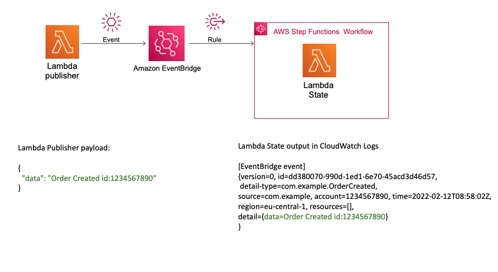

## Description
## Lambda - EventBridge - Step Functions

This pattern creates two Lambda functions, an EventBridge custom event bus and event Rule, 
and a Step Functions Workflow using AWS SAM and Java 11.

Important: this application uses various AWS services and there are costs associated with these services after the Free Tier usage - please see the AWS Pricing page for details. You are responsible for any AWS costs incurred.


## Language:
####This is a Maven project which uses Java 11 and AWS SDK

## Framework

The framework used to deploy the infrastructure is SAM

## Services used

The AWS services used in this pattern are
#### AWS Lambda - EventBridge - Step Functions

Topology




## Description
The SAM template contains all the information to deploy AWS resources(the Lambda functions, the EventBridge and the Step Functions workflow)
and also the permission required by these service to communicate.

You will be able to create and delete the CloudFormation stack using the CLI commands.

The OrderPublisher Lambda function will be invoked with an JSON payload which will send the message to the EventBridge custom event bus.
The event will match a custom event pattern Rule which will send the event to the Step Functions Workflow.
The SFN workflow will start and invoke the OrderState Lambda function which will return a message and display the EventBridge 
message in CloudWatch Logs.

This is fully functional example implemented in Java 11.


## Deployment commands

````
mvn clean package

# create an S3 bucket where the source code will be stored:
aws s3 mb s3://awwdmd993kkdla02kk

# copy the source code located in the target folder:
aws s3 cp target/sourceCode.zip s3://awwdmd993kkdla02kk

# SAM will deploy the CloudFormation stack described in the template.yml file:
sam deploy --s3-bucket awwdmd993kkdla02kk --stack-name orders-stack --capabilities CAPABILITY_IAM

````

## Testing

To test the endpoint first send data using the following command. Be sure to update the endpoint with endpoint of your stack.

```
## Invoke the OrderPublisher lambda function
aws lambda invoke --function-name OrderPublisher --cli-binary-format raw-in-base64-out --payload '{"data": "Order Created id:1234567890"}' response.json


## CloudWatch Logs Log Groups of the OrderState lambda will display the event  
i.e.

[EventBridge event] {version=0, id=eab524b5-5432-21ed-84bf-7a3a39d57f76, detail-type=com.example.OrderCreated, source=com.example, account=1234567890, time=2022-02-12T09:44:47Z, region=eu-central-1, resources=[], detail={data=Order Created id:1234567890}}

```

## Cleanup

Run the given command to delete the resources that were created. It might take some time for the CloudFormation stack to get deleted.
```
aws cloudformation delete-stack --stack-name orders-stack

aws s3 rm s3://awwdmd993kkdla02kk --recursive

aws s3 rb s3://awwdmd993kkdla02kk
```

## Requirements

* [Create an AWS account](https://portal.aws.amazon.com/gp/aws/developer/registration/index.html) if you do not already have one and log in. The IAM user that you use must have sufficient permissions to make necessary AWS service calls and manage AWS resources.
* [AWS CLI](https://docs.aws.amazon.com/cli/latest/userguide/install-cliv2.html) installed and configured
* [Git Installed](https://git-scm.com/book/en/v2/Getting-Started-Installing-Git)
* [AWS Serverless Application Model](https://docs.aws.amazon.com/serverless-application-model/latest/developerguide/serverless-sam-cli-install.html) (AWS SAM) installed


## Author bio
Name: Razvan Minciuna
Linkedin: https://www.linkedin.com/in/razvanminciuna/
Description: Software Architect