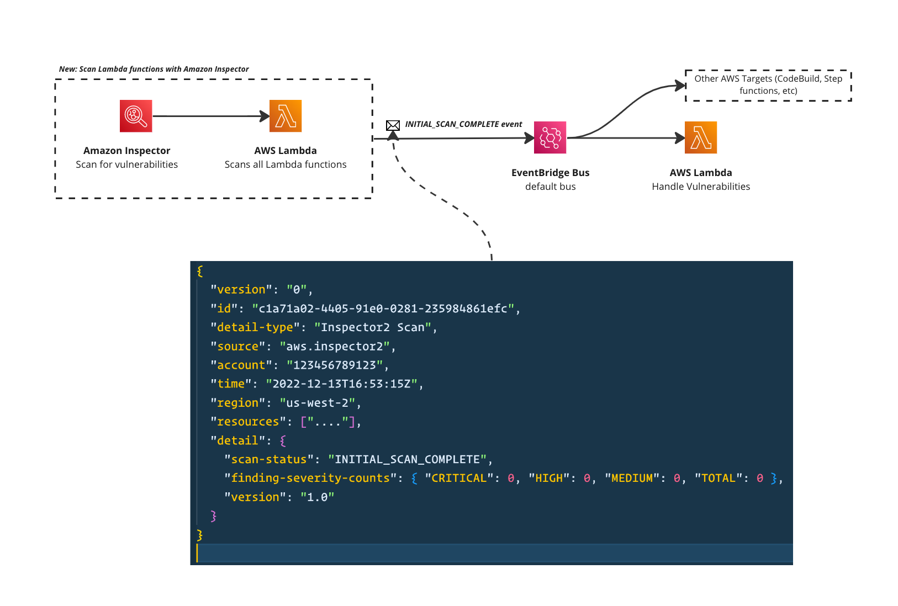

# Amazon Inspector events to EventBridge and Lambda



This pattern demonstrates listening to Amazon Inspector events of Lambda functions to trigger automation tasks, in this example a downstream Lambda consumer is triggered every time a scan is complete. The downstream consumers could check how many vulnerabilities are found and process them.

Learn more about this pattern at Serverless Land Patterns: https://serverlessland.com/patterns/lambda-inspector-scans

To enable the Events onto EventBridge you will need to use Amazon Inspector and [turn on scanning for Lambda functions](https://aws.amazon.com/blogs/aws/amazon-inspector-now-scans-aws-lambda-functions-for-vulnerabilities/).

Important: this application uses various AWS services and there are costs associated with these services after the Free Tier usage - please see the [AWS Pricing page](https://aws.amazon.com/pricing/) for details. You are responsible for any AWS costs incurred. No warranty is implied in this example.

## Requirements

- [Create an AWS account](https://portal.aws.amazon.com/gp/aws/developer/registration/index.html) if you do not already have one and log in. The IAM user that you use must have sufficient permissions to make necessary AWS service calls and manage AWS resources.
- [AWS CLI](https://docs.aws.amazon.com/cli/latest/userguide/install-cliv2.html) installed and configured
- [Git Installed](https://git-scm.com/book/en/v2/Getting-Started-Installing-Git)
- [AWS Serverless Application Model](https://docs.aws.amazon.com/serverless-application-model/latest/developerguide/serverless-sam-cli-install.html) (AWS SAM) installed

## Deployment Instructions

1. Create a new directory, navigate to that directory in a terminal and clone the GitHub repository:
   ```
   git clone https://github.com/aws-samples/serverless-patterns
   ```
1. Change directory to the pattern directory:
   ```
   cd lambda-inspector-scans
   ```
1. From the command line, use AWS SAM to deploy the AWS resources for the pattern as specified in the template.yml file:
   ```
   sam deploy --guided
   ```
1. During the prompts:

   - Enter a stack name
   - Enter the desired AWS Region
   - Allow SAM CLI to create IAM roles with the required permissions.

   Once you have run `sam deploy -guided` mode once and saved arguments to a configuration file (samconfig.toml), you can use `sam deploy` in future to use these defaults.

1. Note the outputs from the SAM deployment process. These contain the resource names and/or ARNs which are used for testing.

## How it works

Amazon Inspector will run scans against your Lambda functions. Once the scan is complete an event (by AWS) is raised to your default event bus. This EventBridge rule will listen to the SCAN complete event and trigger downstream consumers.

## Delete stack

```bash
sam delete
```

---

Copyright 2022 Amazon.com, Inc. or its affiliates. All Rights Reserved.

SPDX-License-Identifier: MIT-0
