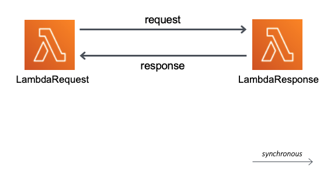

## Description
## Lambda - Lambda

This pattern creates two lambda functions using SAM.

Important: this application uses various AWS services and there are costs associated with these services after the
Free Tier usage - please see the AWS Pricing page for details. You are responsible for any AWS costs incurred.

## Language:
#### This is a Maven project which uses Java 11 and AWS SDK

## Framework

The framework used to deploy the infrastructure is SAM

## Services used

The AWS services used in this pattern are Lambda functions




## Description
In this pattern SAM will deploy two lambda functions, LambdaRequest and LambdaResponse.
The LambdaRequest will call the LambdaResponse synchronously, and will wait for the response from the LambdaResponse function.
The LambdaResponse will return an JSON payload.

The SAM template contains all the information to deploy AWS resources
and also the permission required by these service to communicate.

You will be able to create and delete the CloudFormation stack using the CLI commands.

This is fully functional example developed in Java 11.

## Deployment commands

````
mvn clean package

aws s3 mb s3://bcjidvb9q384sakfnosadif

aws s3 cp target/sourceCode.zip s3://bcjidvb9q384sakfnosadif

sam deploy --s3-bucket bcjidvb9q384sakfnosadif --stack-name lambdas-pattern --capabilities CAPABILITY_IAM

````

## Testing

Invoke the LambdaRequest function
```
aws lambda invoke --function-name LambdaRequest --cli-binary-format raw-in-base64-out --payload '{"message":"How are you?"}' response.json
```

Display the response stored in the response.json file

````
cat response.json
````

## Cleanup

Run the given command to delete the resources that were created. It might take some time for the CloudFormation stack to get deleted.
```
aws cloudformation delete-stack --stack-name lambdas-pattern

aws s3 rm s3://bcjidvb9q384sakfnosadif --recursive

aws s3 rb s3://bcjidvb9q384sakfnosadif
```

## Requirements

* [Create an AWS account](https://portal.aws.amazon.com/gp/aws/developer/registration/index.html) if you do not already have one and log in. The IAM user that you use must have sufficient permissions to make necessary AWS service calls and manage AWS resources.
* [AWS CLI](https://docs.aws.amazon.com/cli/latest/userguide/install-cliv2.html) installed and configured
* [AWS Serverless Application Model](https://docs.aws.amazon.com/serverless-application-model/latest/developerguide/serverless-sam-cli-install.html) (AWS SAM) installed

## Author bio
Razvan Minciuna
https://www.linkedin.com/in/razvanminciuna/
Software Architect