# AWS Lambda Layer Terraform - Import packages from a layer

This pattern shows how to deploy a Lambda Function that has a layer added to it.

This demo deploys two Lambda functions using Terraform. Both Lambda functions attempt to import the `mysql-connector-python` package. However, only one of the Lambda functions has the layer which allows it to import the package successfully. This pattern tests both Lambda functions to illustrate the difference when there is a layer added to a Lambda function. For more information on Lambda Layers, please refer to [AWS Lambda Developer Guide: Creating and sharing Lambda layers](https://docs.aws.amazon.com/lambda/latest/dg/configuration-layers.html). In addition, the Lambda function with the layer lists all files in the `/opt` directory which allows us to view the files that were uploaded by the layer. From the same documentation reference above, it mentions: `Lambda extracts the layer contents into the /opt directory when setting up the execution environment for the function.` This is useful if you want to add a certificate that allows SSL connections to the Layer. The Lambda function can then fetch the certificate by specifying the path to it. The certificate can then be used by the Lambda functions to establish SSL connections to resources like Database instances. For this specific use case, you can find the downloadable certificates at the [AWS Amazon Relational Database Service (RDS) User Guide: Using SSL/TLS to encrypt a connection to a DB instance](https://docs.aws.amazon.com/AmazonRDS/latest/UserGuide/UsingWithRDS.SSL.html).

Learn more about this pattern at Serverless Land Patterns: https://serverlessland.com/patterns/lambda-layer-terraform

Important: this application uses various AWS services and there are costs associated with these services after the Free Tier usage - please see the [AWS Pricing page](https://aws.amazon.com/pricing/) for details. You are responsible for any AWS costs incurred. No warranty is implied in this example.

## Requirements

* [Create an AWS account](https://portal.aws.amazon.com/gp/aws/developer/registration/index.html) if you do not already have one and log in. The IAM user that you use must have sufficient permissions to make necessary AWS service calls and manage AWS resources.
* [AWS CLI](https://docs.aws.amazon.com/cli/latest/userguide/install-cliv2.html) installed and configured
* [Git Installed](https://git-scm.com/book/en/v2/Getting-Started-Installing-Git)
* [Terraform Installed](https://learn.hashicorp.com/tutorials/terraform/install-cli?in=terraform/aws-get-started)
* [Python Installed](https://www.python.org/downloads/)

## Deployment Instructions

1. Create a new directory, navigate to that directory in a terminal and clone the GitHub repository:

    ```bash
    git clone https://github.com/aws-samples/serverless-patterns
    ```
2. Change directory to the pattern directory:

    ```bash
    cd lambda-layer-terraform
    ```

3. To reduce the size of the files pushed to GitHub, this pattern does not include the `mysql-connector-python` package. Instead, install the package by changing your directory to the `./dependencies/mysql-connector-python` and install the package. Assuming you are in the demo directory after step 2, run the following commands:

    ```bash
    cd dependencies/mysql-connector-python
    pip3 install -r requirements.txt --target ./python
    ```

    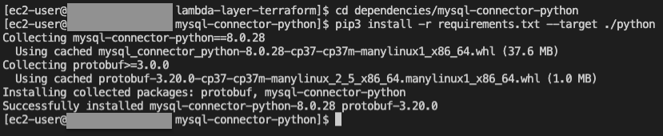

4. Go back to the demo directory where the `main.tf` file resides

   ```bash
   cd ../..
   ```

   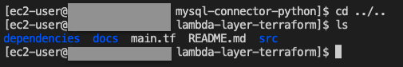

5. From the command line, initialize terraform to download and install the providers defined in the configuration:

    ```bash
    terraform init
    ```

    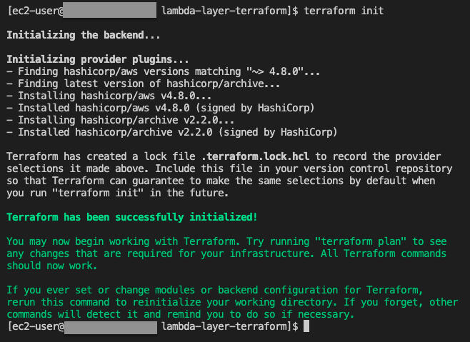

6. From the command line, apply the configuration in the main.tf file. 4 resources are created for this demo:

    ```bash
    terraform apply --auto-approve
    ```

    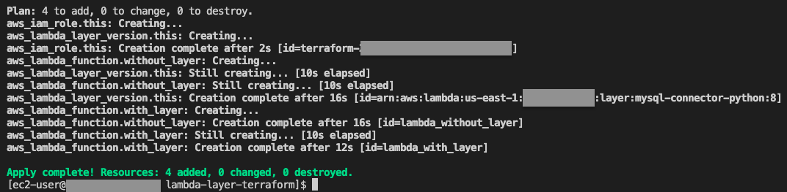

## How it works

The Terraform code deploys the following resources:

| Resource                                   | Type                     | Description                                                  |
| ------------------------------------------ | ------------------------ | ------------------------------------------------------------ |
| IAM Role for Lambda functions              | aws_iam_role             | Managed policy for AWSLambdaBasicExecutionRole               |
| mysql-connector-python package             | aws_lambda_layer_version | Reference: [pypi: mysql-connector-python](https://pypi.org/project/mysql-connector-python/) |
| Lambda Function with the Layer attached    | aws_lambda_function      | This Lambda has the layer attached and can successfully import the package |
| Lambda Function without the Layer attached | aws_lambda_function      | This Lambda does not have layer attached and does not successfully import the package |

==============================================

## Testing

Test the Lambda Function that has the layer - it executes successfully

1. Navigate to the Lambda console and select the `lambda_with_layer` function, then choose `Test` (next to the `Deploy` button)

    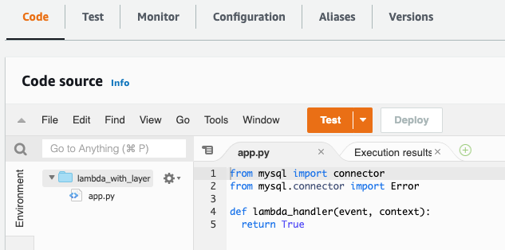


2. Give the test an `Event name` and choose `Save`

    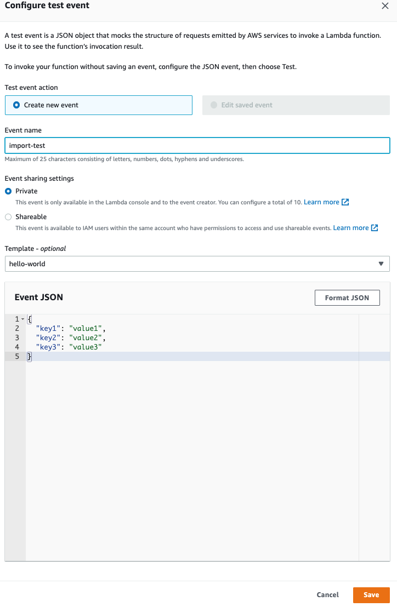

3. Then choose `Test` again from the console. The `Execution results` shows that the Lambda Function runs succesfully.

    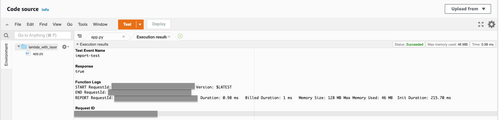

Test the Lambda Function that does not have the layer - it results in an error

1. Navigate to the Lambda console and select the `lambda_without_layer` function, then choose `Test` (next to the `Deploy` button)

    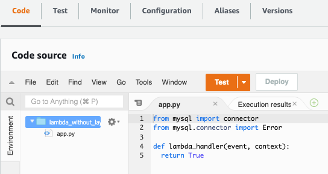

2. Give the test an `Event name` and choose `Save`

    

3. Then choose `Test` again from the console. The `Execution results` shows that there is an error of `Unable to import module 'app': No module named 'mysql'`. This is expected since this Lambda function does not have the layer with `mysql-connector-python`

    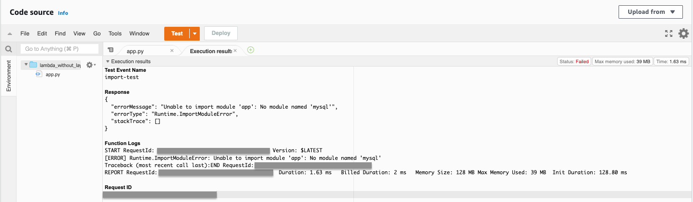

## Cleanup

1. Delete all created resources by terraform

    ```bash
    terraform destroy --auto-approve
    ```
    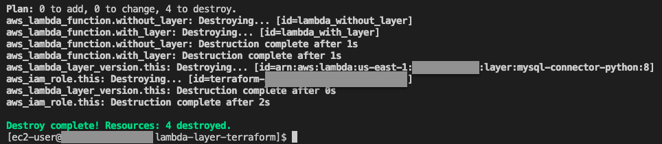

2. Confirm all created resources has been deleted

    ```bash
    terraform show
    ```

    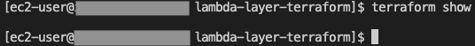

----
Copyright 2022 Amazon.com, Inc. or its affiliates. All Rights Reserved.

SPDX-License-Identifier: MIT-0
