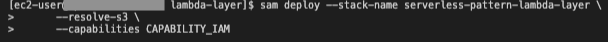
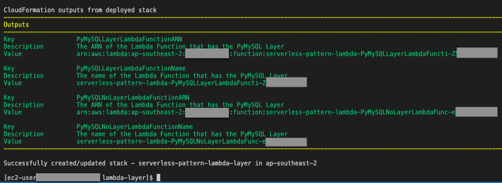
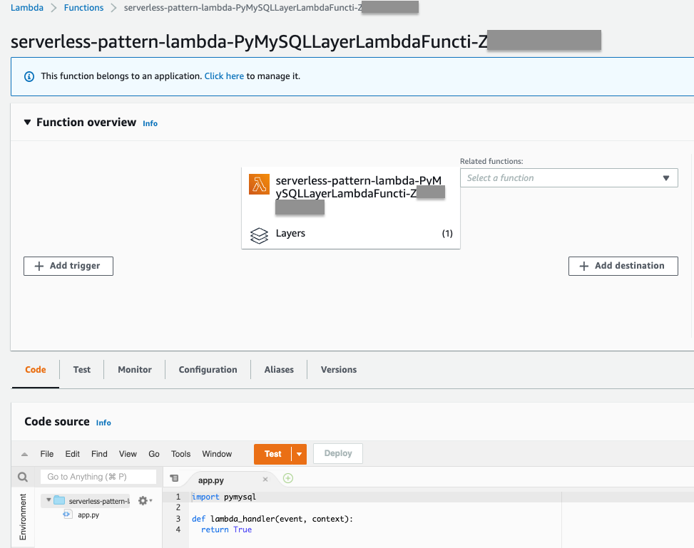
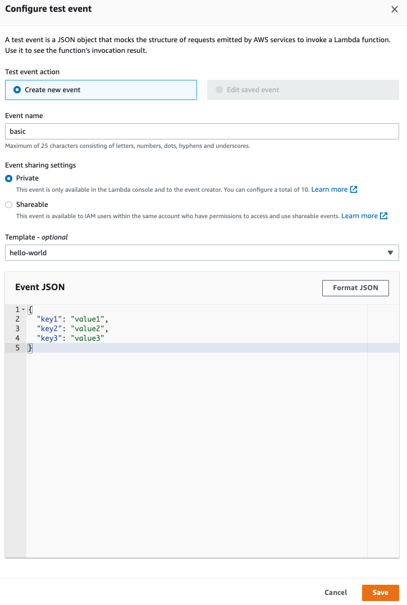
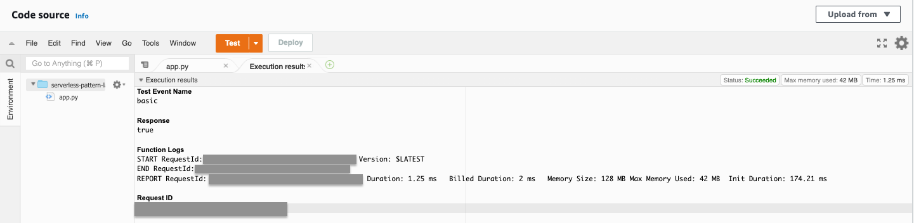
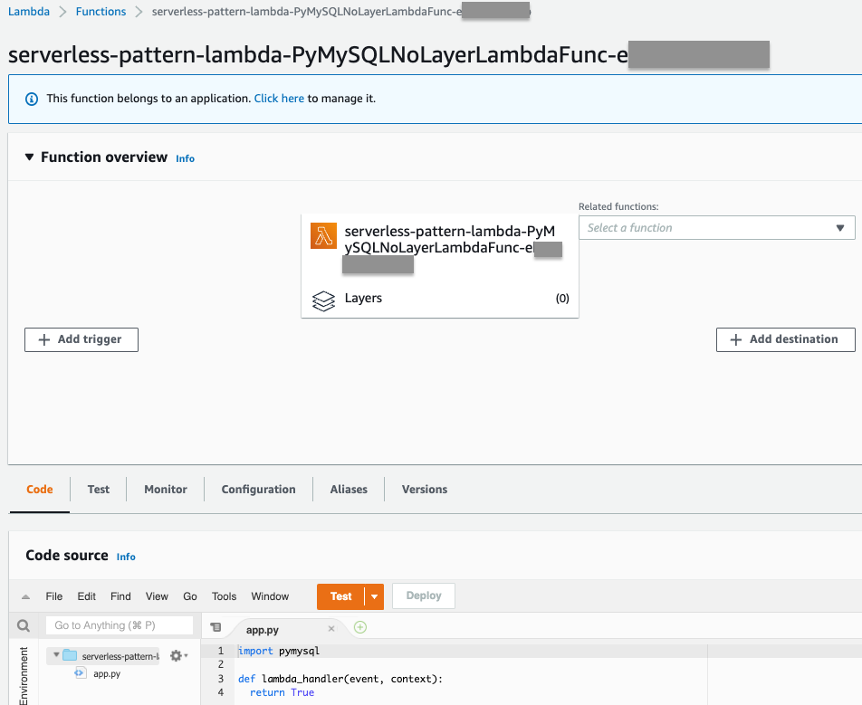
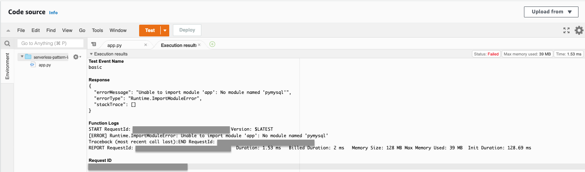
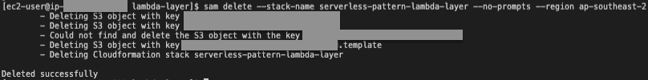
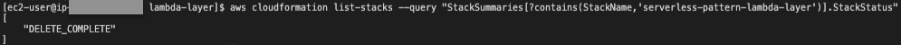

# AWS Lambda Layer - Import packages from a layer

This pattern shows how to deploy a Lambda Function that has a layer added to it.

The SAM template deploys two Lambda functions. Both Lambda functions attempt to import the `PyMySQL` package. However, only one of the Lambda functions has the layer which allows it to import the package successfully. This pattern tests both Lambda functions to illustrate the difference when there is a layer added to a Lambda function. For more information on Lambda Layers, please refer to [AWS Lambda Developer Guide: Creating and sharing Lambda layers](https://docs.aws.amazon.com/lambda/latest/dg/configuration-layers.html)

Learn more about this pattern at Serverless Land Patterns: https://serverlessland.com/patterns/lambda-layer

Important: this application uses various AWS services and there are costs associated with these services after the Free Tier usage - please see the [AWS Pricing page](https://aws.amazon.com/pricing/) for details. You are responsible for any AWS costs incurred. No warranty is implied in this example.

## Requirements

* [Create an AWS account](https://portal.aws.amazon.com/gp/aws/developer/registration/index.html) if you do not already have one and log in. The IAM user that you use must have sufficient permissions to make necessary AWS service calls and manage AWS resources.
* [AWS CLI](https://docs.aws.amazon.com/cli/latest/userguide/install-cliv2.html) installed and configured
* [Git Installed](https://git-scm.com/book/en/v2/Getting-Started-Installing-Git)
* [AWS Serverless Application Model](https://docs.aws.amazon.com/serverless-application-model/latest/developerguide/serverless-sam-cli-install.html) (AWS SAM) installed

## Deployment Instructions

1. Create a new directory, navigate to that directory in a terminal and clone the GitHub repository:
    ```bash
    git clone https://github.com/aws-samples/serverless-patterns
    ```
2. Change directory to the pattern directory:
    ```bash
    cd lambda-layer
    ```
3. From the command line, use AWS SAM to deploy the AWS resources for the pattern as specified in the template.yml file:

    **Option 1: Deploy via SAM's guided deployment:**

    ```bash
    sam deploy --guided
    ```

    During the prompts:

    * Enter a stack name
    * Enter the desired AWS Region
    * Allow SAM CLI to create IAM roles with the required permissions.

    Once you have run `sam deploy -guided` mode once and saved arguments to a configuration file (samconfig.toml), you can use `sam deploy` in future to use these defaults.

    **Option 2: Deploy by specifying parameters:**

    ```bash
    sam deploy --stack-name <STACK_NAME> \
      --resolve-s3 \
      --capabilities CAPABILITY_IAM
    # Example
    sam deploy --stack-name serverless-pattern-lambda-layer \
      --resolve-s3 \
      --capabilities CAPABILITY_IAM
    ```
    

    

## How it works

The AWS SAM template deploys the following resources:

| Logical ID                   | Type                      |
| ---------------------------- | ------------------------- |
| LambdaRole                   | AWS::IAM::Role            |
| PyMySQLLayer                 | AWS::Lambda::LayerVersion |
| PyMySQLLayerLambdaFunction   | AWS::Lambda::Function     |
| PyMySQLNoLayerLambdaFunction | AWS::Lambda::Function     |

- `PyMySQLLayerLambdaFunction` is a Lambda function that imports the `pymysql` package and also has `PyMySQLLayer` layer added.
- `PyMySQLNoLayerLambdaFunction` is a Lambda function that imports the `pymysql` package but does not have the `PyMySQLLayer` layer added.

==============================================

## Testing

Test the Lambda Function that has the layer - it executes successfully

1. Navigate to the Lambda console and select the `PyMySQLLayerLambdaFunction`, then choose `Test`

    


2. Give the test an `Event name` and choose `Save`

    

3. Then choose `Test` again from the console. The `Execution results` shows that the Lambda Function has run succesfully.

    

Test the Lambda Function that does not have the layer - it results in an error

1. Navigate to the Lambda console and select the `PyMySQLNoLayerLambdaFunction`, then choose `Test`

    


2. Give the test an `Event name` and choose `Save`

    

3. Then choose `Test` again from the console. The `Execution results` shows that there is an error of `Unable to import module 'app': No module named 'pymysql'`. This is expected since this Lambda function does not have the layer with `pymysql`

    

## Cleanup

1. Delete the stack. Replace `STACK_NAME` and `REGION` accordingly
    ```bash
    sam delete --stack-name <STACK_NAME> --no-prompts --region <REGION>
    # Example
    sam delete --stack-name serverless-pattern-lambda-layer --no-prompts --region ap-southeast-2
    ```

    

2. Confirm the stack has been deleted
    ```bash
    aws cloudformation list-stacks --query "StackSummaries[?contains(StackName,'STACK_NAME')].StackStatus"
    # Example
    aws cloudformation list-stacks --query "StackSummaries[?contains(StackName,'serverless-pattern-lambda-layer')].StackStatus"
    ```

    
----
Copyright 2022 Amazon.com, Inc. or its affiliates. All Rights Reserved.

SPDX-License-Identifier: MIT-0
