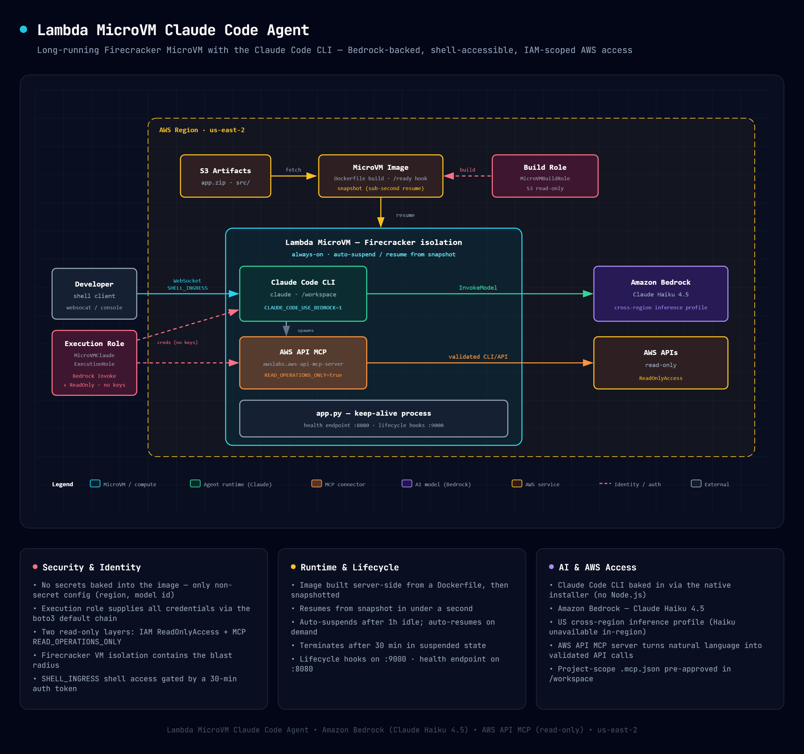

# AWS Lambda MicroVM Claude Code Agent

This pattern deploys a long-running Lambda MicroVM with the [Claude Code](https://code.claude.com) CLI baked into the image. The MicroVM is launched with the `SHELL_INGRESS` network connector, so you connect via an interactive shell and run `claude` directly inside the isolated Firecracker VM. Claude Code is preconfigured to use [Amazon Bedrock](https://aws.amazon.com/bedrock/) with Claude Haiku 4.5 — credentials are supplied at runtime by the MicroVM execution role, so no API key is ever stored in the image.

The image also bakes in the [AWS API MCP server](https://awslabs.github.io/mcp/servers/aws-api-mcp-server) (`awslabs.aws-api-mcp-server`), so Claude can run **live AWS API calls** from inside the VM — for example "list my S3 buckets" or "how many Lambda functions are in us-east-2?". The MCP server authenticates with the **same execution-role credentials** (the standard boto3 credential chain — no keys), and is configured **read-only** by default.

Learn more about this pattern at Serverless Land Patterns: https://serverlessland.com/patterns/lambda-microvm-claude-code-agent

Important: this application uses various AWS services and there are costs associated with these services after the Free Tier usage - please see the [AWS Pricing page](https://aws.amazon.com/pricing/) for details. You are responsible for any AWS costs incurred. No warranty is implied in this example.

## How it works



1. **Image Build**: Lambda downloads the zip, executes the Dockerfile (installs Git, the Claude Code CLI, `uv`, and the AWS API MCP server; bakes in the Bedrock environment variables and the project-scope MCP config), waits for `/ready`, and takes a snapshot.
2. **Run**: The MicroVM resumes from snapshot in under a second with the execution role and the `SHELL_INGRESS` connector attached.
3. **Connect**: You generate a shell auth token and open an interactive shell into the VM (AWS console "Connect" button or a WebSocket client). The shell lands in `/workspace`, where the MCP config lives.
4. **Use Claude**: Run `claude` inside the VM. It calls Bedrock using the execution role's credentials — no API key required. Ask it to query AWS and it spawns the AWS API MCP server, which uses the same execution-role credentials.
5. **Idle management**: After 1 hour of inactivity the MicroVM suspends. It auto-resumes when new requests arrive. Terminates after 30 minutes in suspended state.

## Requirements

- [AWS CLI v2](https://docs.aws.amazon.com/cli/latest/userguide/install-cliv2.html) configured
- [Git](https://git-scm.com/book/en/v2/Getting-Started-Installing-Git)
- Amazon Bedrock **model access for Anthropic Claude** enabled in your account (submit the use case form once from the Bedrock console). Claude Haiku 4.5 must be available via the US cross-region inference profile.
- [websocat](https://github.com/vi/websocat/releases) for interactive shell access

## Deployment Instructions

### Step 1: Set configuration

```bash
export ACCOUNT_ID="YOUR-ACCOUNT-ID"
export AWS_REGION="us-east-2"
export S3_BUCKET="microvm-artifacts-${ACCOUNT_ID}"
```

### Step 2: Create S3 bucket

The image build pulls the code artifact from S3.

```bash
aws s3 mb "s3://${S3_BUCKET}" --region "${AWS_REGION}"
```

### Step 3: Package and upload

Zip the `src/` directory (Dockerfile + app code + lifecycle hooks) and upload to S3. The Dockerfile installs Claude Code CLI, uv, and the AWS API MCP server.

```bash
cd src && zip -r /tmp/app.zip . && cd -
aws s3 cp /tmp/app.zip "s3://${S3_BUCKET}/deployments/claude-code-agent.zip" --region "${AWS_REGION}"
```

### Step 4: Deploy infrastructure (CloudFormation)

The template creates two IAM roles (build role + execution role with Bedrock and ReadOnlyAccess) and builds the MicroVM image. The image build takes 2–4 minutes (installs Claude Code CLI and MCP server).

```bash
aws cloudformation deploy \
  --template-file template.yaml \
  --stack-name microvm-claude-code-agent \
  --parameter-overrides \
      S3Bucket="${S3_BUCKET}" \
      S3Key="deployments/claude-code-agent.zip" \
      ImageName="claude-code-agent" \
  --capabilities CAPABILITY_NAMED_IAM \
  --region "${AWS_REGION}"
```

### Step 5: Run the MicroVM

Start the MicroVM with the `SHELL_INGRESS` connector for interactive shell access.

```bash
IMAGE_ARN=$(aws cloudformation describe-stacks \
  --stack-name microvm-claude-code-agent --region "${AWS_REGION}" \
  --query 'Stacks[0].Outputs[?OutputKey==`ImageArn`].OutputValue' --output text)

EXEC_ROLE_ARN=$(aws cloudformation describe-stacks \
  --stack-name microvm-claude-code-agent --region "${AWS_REGION}" \
  --query 'Stacks[0].Outputs[?OutputKey==`ExecutionRoleArn`].OutputValue' --output text)

aws lambda-microvms run-microvm \
  --image-identifier "${IMAGE_ARN}" \
  --execution-role-arn "${EXEC_ROLE_ARN}" \
  --ingress-network-connectors '["arn:aws:lambda:'"${AWS_REGION}"':aws:network-connector:aws-network-connector:SHELL_INGRESS"]' \
  --idle-policy '{"maxIdleDurationSeconds":3600,"suspendedDurationSeconds":1800,"autoResumeEnabled":true}' \
  --logging '{"cloudWatch":{"logGroup":"/aws/lambda-microvms/claude-code-agent"}}' \
  --region "${AWS_REGION}"
```

Note the `microvmId` from the output.

### Step 6: Connect

```bash
./connect.sh "${MICROVM_ID}"
```

## Using deploy.sh

`deploy.sh` automates steps 1–5 above:

```bash
export ACCOUNT_ID="YOUR-ACCOUNT-ID"
bash deploy.sh
```

Then connect with `./connect.sh <microvm-id>`.

## Why the cross-region inference profile?

Claude Haiku 4.5 is **not** available for in-region inference in `us-east-2`. The Dockerfile and the IAM policy therefore target the US cross-region inference profile `us.anthropic.claude-haiku-4-5-20251001-v1:0` (destination regions: us-east-1, us-east-2, us-west-2). The execution-role policy grants `bedrock:InvokeModel*` on both the inference profile and the underlying foundation model in each destination region.

## Key Design Decisions

- **CLI baked into the image**: `claude` is installed at build time via the native installer (no Node.js runtime needed).
- **No secrets in the image**: Bedrock and AWS API auth both use the execution role; only non-secret config (region, model id) is set as environment variables.
- **Shell-first**: `SHELL_INGRESS` provides an interactive shell. The port 8080 health endpoint is only for verifying the VM is up.
- **AWS access via IAM only**: the AWS API MCP server uses the execution role's credentials through the boto3 default chain. What Claude can do in AWS is controlled entirely by the role's IAM policy (read-only by default), not by any baked-in key.

## AWS API MCP server — AWS API access

The image bakes in the [AWS API MCP server](https://awslabs.github.io/mcp/servers/aws-api-mcp-server) so Claude can turn natural language into validated AWS CLI/API calls from inside the VM.

**How it authenticates (purely via IAM).** When `AWS_API_MCP_PROFILE_NAME` is unset, the server follows boto3's default credential chain — the exact mechanism `claude` already uses to reach Bedrock. The server is a subprocess spawned by `claude`, so it inherits the MicroVM **execution role** credentials automatically. There are no API keys or static credentials anywhere in the image. What Claude may do in your account is governed _only_ by the execution role's IAM policy.

**Read-only by default (two layers).**

1. **IAM**: The execution role has the AWS managed `ReadOnlyAccess` policy attached. No mutating call can succeed regardless of what Claude attempts.
2. **MCP**: the baked `/workspace/.mcp.json` sets `READ_OPERATIONS_ONLY=true`, so the server rejects non-read operations before they ever reach AWS.

The config (baked at build time, no manual setup):

```json
// /workspace/.mcp.json
{
  "mcpServers": {
    "awslabs.aws-api-mcp-server": {
      "command": "/root/.local/bin/awslabs.aws-api-mcp-server",
      "args": [],
      "env": { "AWS_REGION": "us-east-2", "READ_OPERATIONS_ONLY": "true" }
    }
  }
}
```

`/workspace/.claude/settings.json` lists the server under `enabledMcpjsonServers`, which pre-approves it so the interactive session doesn't block on the MCP trust prompt. The shell lands in `/workspace` automatically, so Claude picks up this project-scope config with no extra flags.

**Using it.** Start `claude` and ask AWS questions in natural language:

```bash
claude            # then, interactively:
#  > list my S3 buckets in us-east-2
#  > how many Lambda functions do I have? group by runtime
claude -p "use the AWS API tools to list my S3 buckets in us-east-2"
```

Run `/mcp` inside Claude (or `claude mcp list`) to confirm `awslabs.aws-api-mcp-server` is connected.

**Letting Claude make changes.** To allow mutations, replace `ReadOnlyAccess` with a broader or custom policy on the execution role and remove `READ_OPERATIONS_ONLY` from `.mcp.json`, then redeploy.

> **Security note**: `ReadOnlyAccess` is broad — it can read data across services (S3 object contents, DynamoDB items, etc.). For production, scope the execution role to a custom policy limited to the specific `Describe*`/`List*`/`Get*` actions and resources you actually want Claude to see. The MicroVM keeps blast radius contained, but the IAM policy is your real control plane.

## Connecting from your terminal

The VM is reachable via WebSocket (`SHELL_INGRESS`). The included `connect.sh` script handles token generation and launches an interactive shell using [websocat](https://github.com/vi/websocat) — giving you a raw terminal experience like SSH.

**Prerequisites**: install [websocat](https://github.com/vi/websocat/releases) (single static binary):

```bash
brew install websocat        # macOS
cargo install websocat       # any platform with Rust
scoop install websocat       # Windows
```

**Connect**:

```bash
./connect.sh "${MICROVM_ID}"
```

The script resolves the endpoint, generates a 30-minute shell token, and connects. You get a full interactive shell with colors, command editing, and tab completion.

On Windows, use `connect.bat` instead:

```cmd
connect.bat %MICROVM_ID%
```

Region and endpoint are hardcoded in the script. Edit directly to change them.

## Testing

1. Connect to the shell:

   ```bash
   ./connect.sh "${MICROVM_ID}"
   ```

2. Inside the shell, run Claude Code:

   ```bash
   claude --version
   claude -p "Say hello in one word"
   ```

   The `claude -p` call returns a completion generated by Claude Haiku 4.5 on Amazon Bedrock.

3. Exercise the AWS API MCP server (proves AWS access works through the execution role, no keys):

   ```bash
   claude mcp list                       # shows awslabs.aws-api-mcp-server: connected
   claude -p "use the AWS API tools to list my S3 buckets in us-east-2"
   ```

   Claude calls AWS using the execution role's credentials. With the read-only default, a mutating request (e.g. "create an S3 bucket called …") is refused by `READ_OPERATIONS_ONLY` and would be denied by IAM anyway.

### Using a different model

The model is set via environment variables in the [Dockerfile](src/Dockerfile). To use a different Claude model (for example Sonnet), change `ANTHROPIC_MODEL` to another inference profile id available in your account, update the Bedrock policy resources in `template.yaml` accordingly, and redeploy.

## Cleanup

```bash
# Terminate the MicroVM
aws lambda-microvms terminate-microvm \
  --microvm-identifier "${MICROVM_ID}" \
  --region "${AWS_REGION}"

# Delete the CloudFormation stack (removes IAM roles + image)
aws cloudformation delete-stack --stack-name microvm-claude-code-agent --region "${AWS_REGION}"

# Delete S3 artifacts
aws s3 rm "s3://${S3_BUCKET}/deployments/" --recursive
```

---

Copyright 2026 Amazon.com, Inc. or its affiliates. All Rights Reserved.

SPDX-License-Identifier: MIT-0
