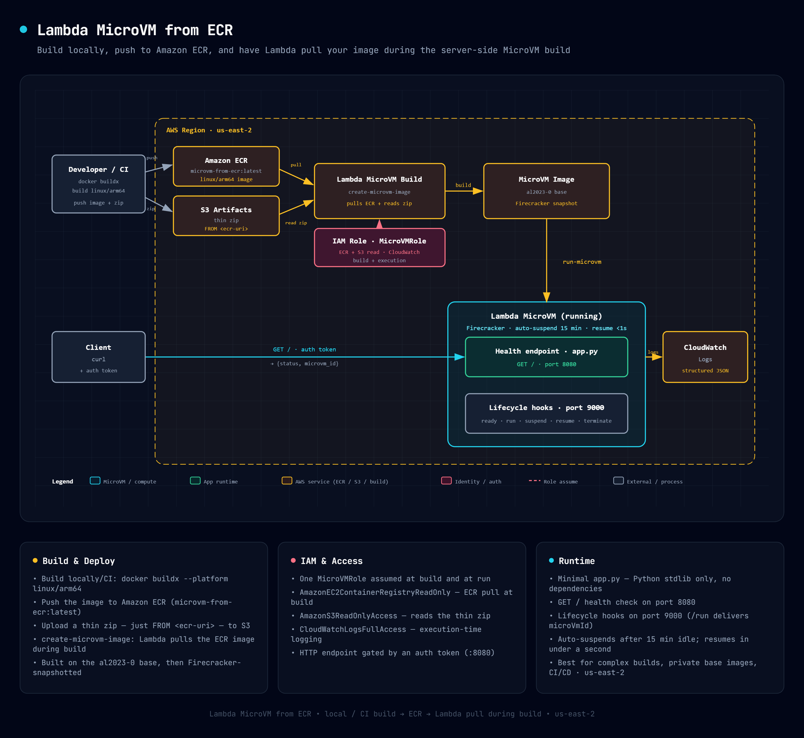

# AWS Lambda MicroVM from ECR

Deploy a Lambda MicroVM from a pre-built Docker image stored in Amazon ECR. You build and push your container image to ECR, and Lambda pulls it during the MicroVM image build.

Learn more about this pattern at Serverless Land Patterns: https://serverlessland.com/patterns/lambda-microvm-from-ecr

Important: this application uses various AWS services and there are costs associated with these services after the Free Tier usage - please see the [AWS Pricing page](https://aws.amazon.com/pricing/) for details. You are responsible for any AWS costs incurred. No warranty is implied in this example.

## How it works



1. You build your Docker image locally and push to ECR.
2. A thin zip containing only `FROM <ecr-uri>` is uploaded to S3.
3. CloudFormation creates the IAM role (with ECR pull permissions) and builds the MicroVM image — Lambda pulls your ECR image during the server-side build.
4. You run the MicroVM from the built image.

## How it differs from the zip pattern

|                    | From Zip                     | From ECR                                   |
| ------------------ | ---------------------------- | ------------------------------------------ |
| **Build location** | Server-side (Lambda)         | Local / CI pipeline                        |
| **Zip contents**   | Full Dockerfile + app        | Thin Dockerfile (`FROM <ecr-uri>`)         |
| **Use case**       | Simple apps, quick iteration | Complex builds, private base images, CI/CD |

## Requirements

- [Create an AWS account](https://portal.aws.amazon.com/gp/aws/developer/registration/index.html) if you do not already have one and log in. The IAM user that you use must have sufficient permissions to make necessary AWS service calls and manage AWS resources.
- [AWS CLI v2](https://docs.aws.amazon.com/cli/latest/userguide/install-cliv2.html) installed and configured
- [Git Installed](https://git-scm.com/book/en/v2/Getting-Started-Installing-Git)
- Docker with `buildx` (Docker Desktop includes it)

## Architecture note

The server-side builder currently uses ARM64. Public multi-arch images (like `python:3.14-slim`) resolve automatically. When pushing your own image to ECR, build for `linux/arm64`:

```bash
docker buildx build --platform linux/arm64 --push --provenance=false -t <ecr-uri> src/
```

## Deployment Instructions

### Step 1: Set configuration

```bash
export ACCOUNT_ID="YOUR-ACCOUNT-ID"
export AWS_REGION="us-east-2"
export S3_BUCKET="microvm-artifacts-${ACCOUNT_ID}"
export ECR_REPO="microvm-from-ecr"
export ECR_URI="${ACCOUNT_ID}.dkr.ecr.${AWS_REGION}.amazonaws.com/${ECR_REPO}"
```

### Step 2: Create S3 bucket and ECR repository

Create the S3 bucket for artifacts. If you don't already have an ECR repository, create one:

```bash
aws s3 mb "s3://${S3_BUCKET}" --region "${AWS_REGION}"

# Create ECR repository (skip if you already have one)
aws ecr create-repository --repository-name "${ECR_REPO}" --region "${AWS_REGION}"
```

### Step 3: Build and push Docker image to ECR

Build for ARM64 (required by the server-side builder) and push directly.

```bash
aws ecr get-login-password --region "${AWS_REGION}" | \
  docker login --username AWS --password-stdin "${ACCOUNT_ID}.dkr.ecr.${AWS_REGION}.amazonaws.com"

docker buildx build --platform linux/arm64 --push --provenance=false \
  -t "${ECR_URI}:latest" src/
```

### Step 4: Create and upload thin zip

The zip contains a single-line Dockerfile that references your ECR image. Lambda pulls the image during the server-side build.

```bash
TMPDIR=$(mktemp -d)
echo "FROM ${ECR_URI}:latest" > "${TMPDIR}/Dockerfile"
cd "${TMPDIR}" && zip /tmp/app.zip Dockerfile && cd -
aws s3 cp /tmp/app.zip "s3://${S3_BUCKET}/deployments/from-ecr.zip" --region "${AWS_REGION}"
```

### Step 5: Deploy infrastructure (CloudFormation)

The template creates the IAM role (with ECR pull permissions) and builds the MicroVM image.

```bash
aws cloudformation deploy \
  --template-file template.yaml \
  --stack-name microvm-from-ecr \
  --parameter-overrides \
      S3Bucket="${S3_BUCKET}" \
      S3Key="deployments/from-ecr.zip" \
      ImageName="from-ecr" \
  --capabilities CAPABILITY_NAMED_IAM \
  --region "${AWS_REGION}"
```

### Step 6: Run the MicroVM

```bash
IMAGE_ARN=$(aws cloudformation describe-stacks \
  --stack-name microvm-from-ecr --region "${AWS_REGION}" \
  --query 'Stacks[0].Outputs[?OutputKey==`ImageArn`].OutputValue' --output text)

ROLE_ARN=$(aws cloudformation describe-stacks \
  --stack-name microvm-from-ecr --region "${AWS_REGION}" \
  --query 'Stacks[0].Outputs[?OutputKey==`BuildRoleArn`].OutputValue' --output text)

aws lambda-microvms run-microvm \
  --image-identifier "${IMAGE_ARN}" \
  --execution-role-arn "${ROLE_ARN}" \
  --idle-policy '{"maxIdleDurationSeconds":900,"suspendedDurationSeconds":300,"autoResumeEnabled":true}' \
  --logging '{"cloudWatch":{"logGroup":"/aws/lambda-microvms/from-ecr"}}' \
  --region "${AWS_REGION}"
```

Note the `microvmId` and `endpoint` from the output.

## Using deploy.sh

`deploy.sh` automates all the steps above (including Docker build and ECR push):

```bash
export ACCOUNT_ID="YOUR-ACCOUNT-ID"
bash deploy.sh
```

## Testing

```bash
TOKEN=$(aws lambda-microvms create-microvm-auth-token \
  --microvm-identifier "${MICROVM_ID}" \
  --expiration-in-minutes 30 \
  --allowed-ports '[{"port":8080}]' \
  --region "${AWS_REGION}" \
  --query 'authToken."X-aws-proxy-auth"' --output text)

curl "https://${MICROVM_ENDPOINT}/" -H "X-aws-proxy-auth: ${TOKEN}"
```

Expected: `{"status": "ok", "microvm_id": "microvm-..."}`

## Cleanup

```bash
# Terminate the MicroVM
aws lambda-microvms terminate-microvm \
  --microvm-identifier "${MICROVM_ID}" \
  --region "${AWS_REGION}"

# Delete the CloudFormation stack (removes IAM role + image + ECR repo)
aws cloudformation delete-stack --stack-name microvm-from-ecr --region "${AWS_REGION}"
```

---

Copyright 2026 Amazon.com, Inc. or its affiliates. All Rights Reserved.

SPDX-License-Identifier: MIT-0
