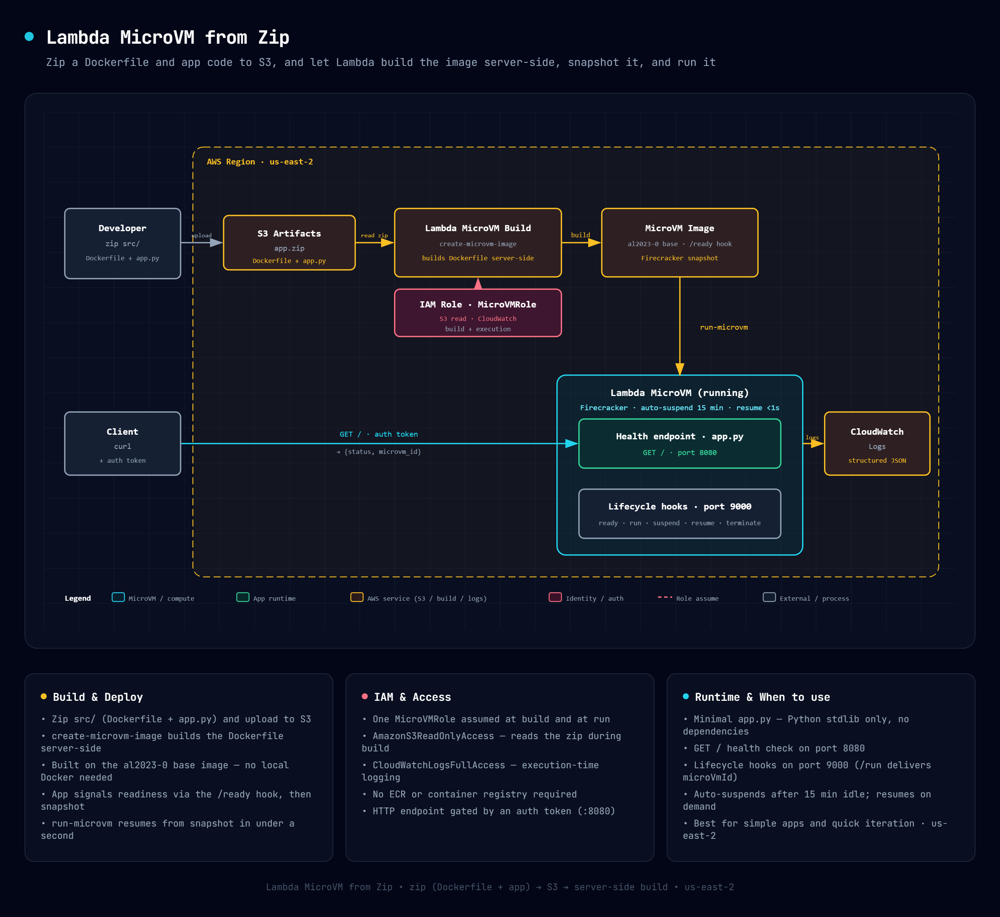

# AWS Lambda MicroVM from Zip

Deploy a Lambda MicroVM from a zip artifact containing a Dockerfile and application code, built server-side.

Learn more about this pattern at Serverless Land Patterns: https://serverlessland.com/patterns/lambda-microvm-from-zip

Important: this application uses various AWS services and there are costs associated with these services after the Free Tier usage - please see the [AWS Pricing page](https://aws.amazon.com/pricing/) for details. You are responsible for any AWS costs incurred. No warranty is implied in this example.

## How it works



1. You upload a zip (Dockerfile + app) to S3.
2. CloudFormation creates the IAM role and calls `CreateMicrovmImage` — Lambda builds the Dockerfile on top of the `al2023-1` base image, waits for the `/ready` lifecycle hook, and takes a Firecracker snapshot.
3. You run the MicroVM — it resumes from snapshot in under a second.

## What's in the zip

```
src/
├── Dockerfile    (FROM python:3.14-slim)
└── app.py        (health endpoint + lifecycle hooks, stdlib only)
```

## Requirements

- [Create an AWS account](https://portal.aws.amazon.com/gp/aws/developer/registration/index.html) if you do not already have one and log in. The IAM user that you use must have sufficient permissions to make necessary AWS service calls and manage AWS resources.
- [AWS CLI v2](https://docs.aws.amazon.com/cli/latest/userguide/install-cliv2.html) installed and configured
- [Git Installed](https://git-scm.com/book/en/v2/Getting-Started-Installing-Git)

## Deployment Instructions

### Step 1: Set configuration

Set your AWS account ID and region. All subsequent commands use these values.

```bash
export ACCOUNT_ID="YOUR-ACCOUNT-ID"
export AWS_REGION="us-east-2"
export S3_BUCKET="microvm-artifacts-${ACCOUNT_ID}"
```

### Step 2: Create S3 bucket

The image build pulls the code artifact from S3.

```bash
aws s3 mb "s3://${S3_BUCKET}" --region "${AWS_REGION}"
```

### Step 3: Package and upload

Zip the `src/` directory (Dockerfile + app code) and upload to S3.

```bash
cd src && zip -r /tmp/app.zip . && cd -
aws s3 cp /tmp/app.zip "s3://${S3_BUCKET}/deployments/from-zip.zip" --region "${AWS_REGION}"
```

### Step 4: Deploy infrastructure (CloudFormation)

The template creates the IAM role and builds the MicroVM image. The image build is asynchronous — CloudFormation waits for it to complete.

```bash
aws cloudformation deploy \
  --template-file template.yaml \
  --stack-name microvm-from-zip \
  --parameter-overrides \
      S3Bucket="${S3_BUCKET}" \
      S3Key="deployments/from-zip.zip" \
      ImageName="from-zip" \
  --capabilities CAPABILITY_NAMED_IAM \
  --region "${AWS_REGION}"
```

### Step 5: Run the MicroVM

Start the MicroVM from the built image. It resumes from the Firecracker snapshot in under a second.

```bash
IMAGE_ARN=$(aws cloudformation describe-stacks \
  --stack-name microvm-from-zip --region "${AWS_REGION}" \
  --query 'Stacks[0].Outputs[?OutputKey==`ImageArn`].OutputValue' --output text)

ROLE_ARN=$(aws cloudformation describe-stacks \
  --stack-name microvm-from-zip --region "${AWS_REGION}" \
  --query 'Stacks[0].Outputs[?OutputKey==`RoleArn`].OutputValue' --output text)

aws lambda-microvms run-microvm \
  --image-identifier "${IMAGE_ARN}" \
  --execution-role-arn "${ROLE_ARN}" \
  --idle-policy '{"maxIdleDurationSeconds":900,"suspendedDurationSeconds":300,"autoResumeEnabled":true}' \
  --logging '{"cloudWatch":{"logGroup":"/aws/lambda-microvms/from-zip"}}' \
  --region "${AWS_REGION}"
```

Note the `microvmId` and `endpoint` from the output.

## Using deploy.sh

`deploy.sh` automates all the steps above:

```bash
export ACCOUNT_ID="YOUR-ACCOUNT-ID"
bash deploy.sh
```

## Testing

Generate an auth token and call the health endpoint:

```bash
TOKEN=$(aws lambda-microvms create-microvm-auth-token \
  --microvm-identifier "${MICROVM_ID}" \
  --expiration-in-minutes 30 \
  --allowed-ports '[{"port":8080}]' \
  --region "${AWS_REGION}" \
  --query 'authToken."X-aws-proxy-auth"' --output text)

curl "https://${MICROVM_ENDPOINT}/" -H "X-aws-proxy-auth: ${TOKEN}"
```

Expected: `{"status": "ok", "microvm_id": "microvm-..."}`

## Cleanup

```bash
# Terminate the MicroVM
aws lambda-microvms terminate-microvm \
  --microvm-identifier "${MICROVM_ID}" \
  --region "${AWS_REGION}"

# Delete the CloudFormation stack (removes IAM role + image)
aws cloudformation delete-stack --stack-name microvm-from-zip --region "${AWS_REGION}"
```

---

Copyright 2026 Amazon.com, Inc. or its affiliates. All Rights Reserved.

SPDX-License-Identifier: MIT-0
