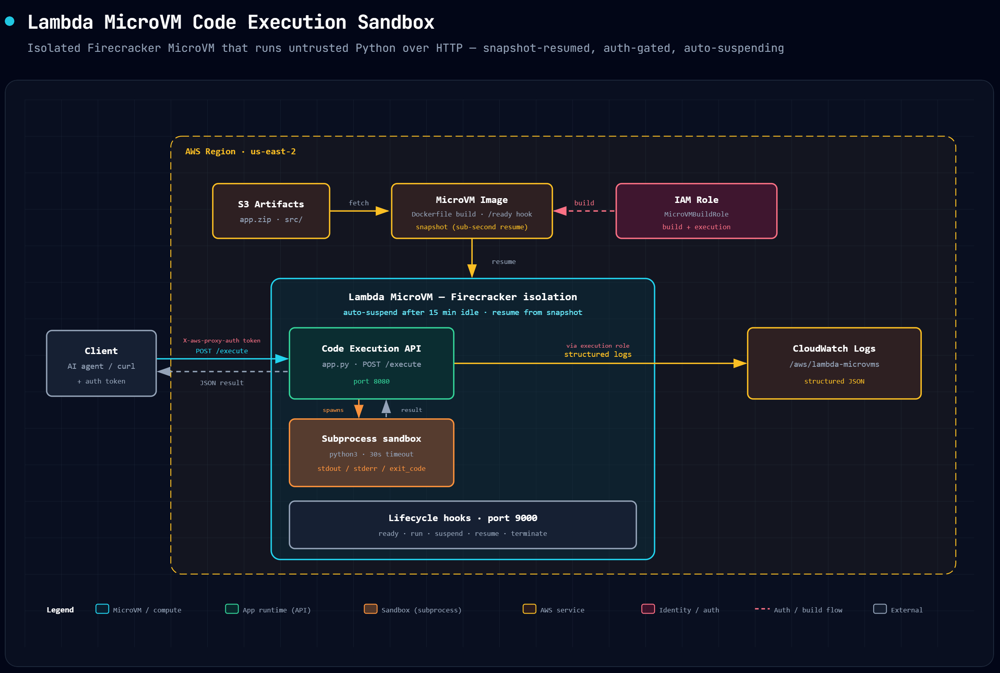

# Code Execution Sandbox on AWS Lambda MicroVMs

This pattern deploys an AWS Lambda MicroVM that accepts Python code via HTTP and executes it in an isolated VM. Each Lambda MicroVM provides hardware-level isolation, snapshot-based rapid startup, and automatic suspend/resume.

Learn more about this pattern at Serverless Land Patterns: https://serverlessland.com/patterns/lambda-microvms-code-execution-sandbox

Important: this application uses various AWS services and there are costs associated with these services after the Free Tier usage - please see the [AWS Pricing page](https://aws.amazon.com/pricing/) for details. You are responsible for any AWS costs incurred. No warranty is implied in this example.

## How it works



1. CloudFormation creates the IAM role and builds the MicroVM image (Dockerfile + Python app).
2. The Lambda MicroVM runs from the snapshot. It exposes an HTTP endpoint on port 8080.
3. Client sends Python code via `POST /execute` → the Lambda MicroVM executes it in a subprocess with a 30-second timeout → returns stdout/stderr/exit_code.
4. After 15 minutes of inactivity the Lambda MicroVM suspends. It auto-resumes on next request.

### Lifecycle Hooks

| Hook | When | Purpose |
|------|------|---------|
| `/ready` | During image build | Signals app is initialized (snapshot taken after this) |
| `/run` | After Lambda MicroVM starts from snapshot | Delivers `microvmId`, reset unique state |
| `/suspend` | Before suspend | Close connections, flush state |
| `/resume` | After resume | Re-establish connections |
| `/terminate` | Before termination | Final cleanup |

## Requirements

- Recent version of the [AWS CLI v2](https://docs.aws.amazon.com/cli/latest/userguide/install-cliv2.html) installed and configured
- [Git](https://git-scm.com/book/en/v2/Getting-Started-Installing-Git)

## Using deploy.sh

`deploy.sh` automates all the deployment steps below. It creates an S3 bucket, IAM role, and MicroVM image in your account.

```bash
export ACCOUNT_ID="YOUR-ACCOUNT-ID"
bash deploy.sh
```

## Deployment Instructions

### Step 1: Set configuration

```bash
export ACCOUNT_ID="YOUR-ACCOUNT-ID"
export AWS_REGION="us-east-2"
export S3_BUCKET="microvm-artifacts-${ACCOUNT_ID}"
```

### Step 2: Create S3 bucket

The image build pulls the code artifact from S3.

```bash
aws s3 mb "s3://${S3_BUCKET}" --region "${AWS_REGION}"
```

### Step 3: Package and upload

Zip the `src/` directory (Dockerfile + app code) and upload to S3.

```bash
cd src && zip -r /tmp/app.zip . && cd -
aws s3 cp /tmp/app.zip "s3://${S3_BUCKET}/deployments/code-execution-sandbox.zip" --region "${AWS_REGION}"
```

### Step 4: Deploy infrastructure (CloudFormation)

The template creates the IAM role and builds the MicroVM image. The image build is asynchronous — CloudFormation waits for it to complete.

```bash
aws cloudformation deploy \
  --template-file template.yaml \
  --stack-name microvm-code-execution-sandbox \
  --parameter-overrides \
      S3Bucket="${S3_BUCKET}" \
      S3Key="deployments/code-execution-sandbox.zip" \
      ImageName="code-execution-sandbox" \
  --capabilities CAPABILITY_NAMED_IAM \
  --region "${AWS_REGION}"
```

### Step 5: Run the MicroVM

```bash
IMAGE_ARN=$(aws cloudformation describe-stacks \
  --stack-name microvm-code-execution-sandbox --region "${AWS_REGION}" \
  --query 'Stacks[0].Outputs[?OutputKey==`ImageArn`].OutputValue' --output text)

ROLE_ARN=$(aws cloudformation describe-stacks \
  --stack-name microvm-code-execution-sandbox --region "${AWS_REGION}" \
  --query 'Stacks[0].Outputs[?OutputKey==`BuildRoleArn`].OutputValue' --output text)

aws lambda-microvms run-microvm \
  --image-identifier "${IMAGE_ARN}" \
  --execution-role-arn "${ROLE_ARN}" \
  --idle-policy '{"maxIdleDurationSeconds":900,"suspendedDurationSeconds":300,"autoResumeEnabled":true}' \
  --logging '{"cloudWatch":{"logGroup":"/aws/lambda-microvms/code-execution-sandbox"}}' \
  --region "${AWS_REGION}"
```

Note the `microvmId` and `endpoint` from the output.

## Testing

1. Generate an auth token:

   ```bash
   TOKEN=$(aws lambda-microvms create-microvm-auth-token \
     --microvm-identifier "${MICROVM_ID}" \
     --expiration-in-minutes 30 \
     --allowed-ports '[{"port":8080}]' \
     --region "${AWS_REGION}" \
     --query 'authToken."X-aws-proxy-auth"' --output text)
   ```

2. Check the service is running:

   ```bash
   curl "https://${MICROVM_ENDPOINT}/" -H "X-aws-proxy-auth: ${TOKEN}"
   ```

   Expected: `{"service": "code-execution-sandbox", "microvm_id": "...", "status": "ready"}`

3. Execute code:

   ```bash
   curl -X POST "https://${MICROVM_ENDPOINT}/execute" \
     -H "X-aws-proxy-auth: ${TOKEN}" \
     -H "Content-Type: application/json" \
     -d '{"code": "print(\"Hello from Lambda MicroVM!\")\nprint(2 + 2 * 10)"}'
   ```

   Expected:

   ```json
   {
     "stdout": "Hello from Lambda MicroVM!\n22\n",
     "stderr": "",
     "exit_code": 0,
     "success": true
   }
   ```

## Cleanup

```bash
# Terminate the MicroVM
aws lambda-microvms terminate-microvm \
  --microvm-identifier "${MICROVM_ID}" \
  --region "${AWS_REGION}"

# Delete the CloudFormation stack (removes IAM role + image)
aws cloudformation delete-stack --stack-name microvm-code-execution-sandbox --region "${AWS_REGION}"

# Delete S3 artifacts
aws s3 rm "s3://${S3_BUCKET}/deployments/" --recursive
```

---

Copyright 2026 Amazon.com, Inc. or its affiliates. All Rights Reserved.

SPDX-License-Identifier: MIT-0
