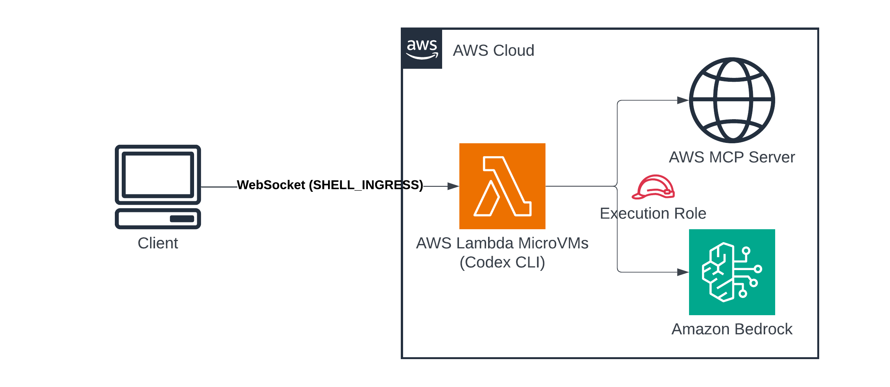

# Codex CLI Agent on AWS Lambda MicroVMs

This pattern deploys an AWS Lambda MicroVM with the [Codex CLI](https://developers.openai.com/codex/cli) baked into the image. The MicroVM is launched with the `SHELL_INGRESS` network connector, so you connect over an interactive shell and run `codex` directly inside the VM. Codex uses its built-in `amazon-bedrock` model provider, so inference runs on [Amazon Bedrock](https://aws.amazon.com/bedrock/) with credentials supplied at runtime by the MicroVM execution role. There is no ChatGPT sign-in, no `OPENAI_API_KEY`, and no Amazon Bedrock API key stored in the image.

Codex is also wired to the [AWS MCP Server](https://docs.aws.amazon.com/agent-toolkit/latest/userguide/mcp-server.html) from the [Agent Toolkit for AWS](https://github.com/aws/agent-toolkit-for-aws), so it can make live AWS API calls from inside the VM (for example "list my S3 buckets"), search AWS documentation, and retrieve AWS skills. The image installs the [MCP Proxy for AWS](https://github.com/aws/mcp-proxy-for-aws), which signs each request with SigV4 using the same execution-role credentials. Access is read-only, enforced by IAM.

Learn more about this pattern at Serverless Land Patterns: https://serverlessland.com/patterns/lambda-microvms-codex-agent

Important: this application uses various AWS services and there are costs associated with these services after the Free Tier usage. Please see the [AWS Pricing page](https://aws.amazon.com/pricing/) for details. You are responsible for any AWS costs incurred. No warranty is implied in this example.

## How it works



1. **Image build**: AWS Lambda downloads the zip and executes [src/Dockerfile](src/Dockerfile) server-side, installing Git, the Codex CLI, `uv`, and the MCP Proxy for AWS, and initialising `/workspace` as a Git repository. It waits for the `/ready` hook and takes a snapshot.
2. **Run**: The MicroVM resumes from the snapshot with the execution role, `SHELL_INGRESS`, and `INTERNET_EGRESS` attached.
3. **Configure**: [src/app.py](src/app.py) renders `~/.codex/config.toml` and `/etc/profile.d/codex-agent.sh` from the MicroVM environment (Region, model, MCP endpoint) at startup and on every `/run` and `/resume`, so the same image deploys unchanged into any supported Region.
4. **Connect**: You generate a shell auth token and open an interactive shell. The shell lands in `/workspace`.
5. **Use Codex**: Run `codex` inside the VM. It calls Amazon Bedrock using the execution role's credentials. Ask it about AWS and it spawns the MCP proxy, which signs requests to the AWS MCP Server with the same credentials.
6. **Lifecycle**: The idle policy suspends the MicroVM after 1 hour without traffic, resumes it on demand, and terminates it after 30 minutes suspended (`IDLE_SECONDS` and `SUSPENDED_SECONDS` in `deploy.sh`). Separately, every MicroVM has a hard maximum lifetime; see [MicroVM lifetime](#microvm-lifetime).

## Requirements

- [Create an AWS account](https://portal.aws.amazon.com/gp/aws/developer/registration/index.html) if you do not already have one and log in. The IAM user that you use must have sufficient permissions to make necessary AWS service calls and manage AWS resources.
- Recent version of the [AWS CLI v2](https://docs.aws.amazon.com/cli/latest/userguide/install-cliv2.html) installed and configured
- [Git](https://git-scm.com/book/en/v2/Getting-Started-Installing-Git)
- Amazon Bedrock model access for the model you select, enabled in the Region you deploy into (the template default is an OpenAI model)
- `zip` CLI utility (pre-installed on most Linux/macOS; on Windows run `scoop install zip` or `choco install zip`)
- [websocat](https://github.com/vi/websocat/releases) for interactive shell access (`brew install websocat`, `cargo install websocat`, or `scoop install websocat`)

Pick a Region where both [AWS Lambda MicroVMs](https://docs.aws.amazon.com/lambda/latest/dg/lambda-microvms.html) and the Amazon Bedrock model you intend to use are available. `us-east-2` appears in the commands below only as an example.

## Deployment Instructions

1. Create a new directory, navigate to that directory in a terminal and clone the GitHub repository:

   ```bash
   git clone https://github.com/aws-samples/serverless-patterns
   ```

2. Change directory to the pattern directory:

   ```bash
   cd serverless-patterns/lambda-microvms-codex-agent
   ```

3. Deploy. `deploy.sh` creates the Amazon S3 artifact bucket, uploads the source, deploys [template.yaml](template.yaml) (IAM roles, log group, MicroVM image), and runs a MicroVM:

   ```bash
   export AWS_REGION="us-east-2"
   ./deploy.sh
   ```

   The scripts (`deploy.sh`, `connect.sh`, `cleanup.sh`) ship with the executable bit set. If your checkout lost it (for example on Windows), either restore it with `chmod +x *.sh` or run each with `bash <script>`.

   The Region comes from `AWS_REGION` or your AWS CLI configuration, the account and partition from your current credentials. `MODEL_ID`, `MCP_ENDPOINT`, `MEMORY_MIB`, `MAX_DURATION`, `IDLE_SECONDS`, `SUSPENDED_SECONDS`, `S3_BUCKET`, and `IMAGE_NAME` can be overridden as environment variables; see the header of [deploy.sh](deploy.sh). The script prints the `connect.sh` and `cleanup.sh` commands to run next.

4. Connect:

   ```bash
   ./connect.sh <microvm-id> [region]
   ```

   `connect.sh` resolves the MicroVM endpoint, generates a 30-minute shell token (`TOKEN_TTL` overrides the minutes), and opens a raw interactive terminal over WebSocket. On Windows, `connect.bat` delegates to it through Git Bash.

   The WebSocket shell does not carry your terminal's window size, so the image applies a default (120x40) that keeps the interactive `codex` TUI usable. Resize it to match your own window for the best layout:

   ```bash
   stty cols 200 rows 50; export COLUMNS=200 LINES=50
   ```

   The headless `codex exec` mode used in Testing below is unaffected either way.

### Deploying step by step

If you prefer to run the steps yourself instead of `deploy.sh`:

```bash
export AWS_REGION="us-east-2"
export ACCOUNT_ID="$(aws sts get-caller-identity --query Account --output text)"
export AWS_PARTITION="$(aws sts get-caller-identity --query Arn --output text | cut -d: -f2)"   # aws, aws-us-gov, aws-cn
export IMAGE_NAME="codex-cli-agent"
export S3_BUCKET="microvm-artifacts-${ACCOUNT_ID}-${AWS_REGION}"
export S3_KEY="deployments/${IMAGE_NAME}.zip"

# 1. Artifact bucket and upload
aws s3 mb "s3://${S3_BUCKET}" --region "${AWS_REGION}"
(cd src && zip -qr /tmp/app.zip . -x '*__pycache__*' -x '*.pyc' -x '.DS_Store')
aws s3 cp /tmp/app.zip "s3://${S3_BUCKET}/${S3_KEY}" --region "${AWS_REGION}"

# 2. Roles, log group, and image build (takes a few minutes). Omit ModelId to use the template default.
aws cloudformation deploy \
  --template-file template.yaml \
  --stack-name "microvm-${IMAGE_NAME}" \
  --parameter-overrides S3Bucket="${S3_BUCKET}" S3Key="${S3_KEY}" ImageName="${IMAGE_NAME}" ModelId="<model-id>" \
  --capabilities CAPABILITY_IAM \
  --region "${AWS_REGION}"

# 3. Run the MicroVM
IMAGE_ARN=$(aws cloudformation describe-stacks --stack-name "microvm-${IMAGE_NAME}" --region "${AWS_REGION}" \
  --query 'Stacks[0].Outputs[?OutputKey==`ImageArn`].OutputValue' --output text)
EXEC_ROLE_ARN=$(aws cloudformation describe-stacks --stack-name "microvm-${IMAGE_NAME}" --region "${AWS_REGION}" \
  --query 'Stacks[0].Outputs[?OutputKey==`ExecutionRoleArn`].OutputValue' --output text)

export MICROVM_ID=$(aws lambda-microvms run-microvm \
  --image-identifier "${IMAGE_ARN}" \
  --execution-role-arn "${EXEC_ROLE_ARN}" \
  --ingress-network-connectors '["arn:'"${AWS_PARTITION}"':lambda:'"${AWS_REGION}"':aws:network-connector:aws-network-connector:SHELL_INGRESS"]' \
  --idle-policy '{"maxIdleDurationSeconds":3600,"suspendedDurationSeconds":1800,"autoResumeEnabled":true}' \
  --maximum-duration-in-seconds 28800 \
  --logging '{"cloudWatch":{"logGroup":"/aws/lambda-microvms/'"${IMAGE_NAME}"'"}}' \
  --region "${AWS_REGION}" \
  --query 'microvmId' --output text)

# 4. Connect
./connect.sh "${MICROVM_ID}" "${AWS_REGION}"
```

## Testing

Inside the shell opened by `connect.sh`:

1. Confirm Codex is installed and pointed at Amazon Bedrock. The config is rendered at runtime, so check that the model and Region are what you expect:

   ```bash
   codex --version
   cat ~/.codex/config.toml
   ```

2. Run a non-interactive completion:

   ```bash
   codex exec "Say hello in one word"
   ```

3. Exercise the AWS MCP Server. The documentation search needs no credentials and confirms the MCP path itself; the live API call reaches AWS with the execution role's credentials:

   ```bash
   codex mcp list
   codex exec "search the AWS documentation for Lambda MicroVMs idle policy"
   codex exec --approve-for-me "list my S3 buckets"
   ```

   `--approve-for-me` is needed for the live API call because it runs through the `aws___run_script` tool, which Codex treats as requiring approval; in a non-interactive `codex exec` run there is no prompt to answer, so without the flag Codex refuses with "approval policy is never". The documentation and Region-availability tools are marked read-only and run without it.

   Read-only holds two ways. Ask for something mutating ("create an S3 bucket called …") and the agent will usually decline up front, because `AGENTS.md` tells it the role is read-only. Independently of that, if a mutating call is actually attempted it is denied by IAM with `AccessDenied` from the target service, since the execution role carries only `ReadOnlyAccess`. The agent's restraint is convenience; IAM is the control.

   The AWS CLI is deliberately not installed in the image, so `aws` returns `command not found`: the proxy signs requests in-process, and leaving the CLI out means the only path to the AWS APIs is the one IAM can attribute to the agent.

4. From outside the VM, check the rendered configuration in the logs:

   ```bash
   aws logs tail "/aws/lambda-microvms/${IMAGE_NAME}" --region "${AWS_REGION}" --since 10m
   ```

   Look for the `Rendered Codex config` line, which reports the resolved Region, model, and MCP endpoint.

## Design notes

Each topic below is explained in full in the comments of the file that implements it; this section gives the summary and the pointer.

### Region and model handling

Nothing about the Region is baked into the image. The platform supplies `AWS_REGION`; the `ModelId` and `McpEndpoint` template parameters become the `CODEX_MODEL` and `AWS_MCP_ENDPOINT` image environment variables. [src/app.py](src/app.py) renders all three into the Codex config and the shell profile at startup and on every `/run` and `/resume`. A value that cannot be resolved is logged and its line is dropped rather than replaced with a default. Interactive shells do not inherit the image environment, which is why the profile is written to `/etc/profile.d/` (see [src/Dockerfile](src/Dockerfile)).

### How Codex reaches Amazon Bedrock

Codex's `amazon-bedrock` provider calls Amazon Bedrock's OpenAI-compatible [Responses API](https://docs.aws.amazon.com/bedrock/latest/userguide/bedrock-mantle.html) on the `bedrock-mantle` endpoint, which authorises under the `bedrock-mantle` IAM service rather than `bedrock:InvokeModel`. The execution role therefore carries the AWS-managed [`AmazonBedrockMantleInferenceAccess`](https://docs.aws.amazon.com/aws-managed-policy/latest/reference/AmazonBedrockMantleInferenceAccess.html) policy and no `bedrock:InvokeModel` grant. Which endpoint Codex targets is decided by the Codex release, not by this pattern; the `MicroVMExecutionRole` comments in [template.yaml](template.yaml) explain what the managed policy grants and what to change if a Codex upgrade moves to the `bedrock-runtime` endpoint.

Use the plain model ID with no cross-Region routing prefix (`us.`, `global.`), and note that the Responses API serves a different model set from `bedrock list-foundation-models`. Check the [API compatibility](https://docs.aws.amazon.com/bedrock/latest/userguide/models-api-compatibility.html) and [Regional availability](https://docs.aws.amazon.com/bedrock/latest/userguide/models-region-compatibility.html) tables, and the [Codex configuration reference](https://developers.openai.com/codex/config-reference) for which model families Codex's provider supports. To try a model from inside the VM, `codex exec -m <model-id> "hi"`; to switch permanently, `MODEL_ID="<model-id>" ./deploy.sh`.

### The AWS MCP Server

The server is AWS-managed and remote. The Codex config in [src/codex-config.toml.tmpl](src/codex-config.toml.tmpl) launches the MCP Proxy for AWS as a local stdio bridge that signs each request with SigV4 and forwards it to the `McpEndpoint`. Two Regions are involved: the endpoint's Region (a cross-Region dependency, derived by the proxy from the hostname) and the Region the agent operates on (the MicroVM's own, passed as metadata). The template comments and the TOML comments cover both, including why `--region` must not be passed to the proxy and why `enabled_tools` lists the AWS tools explicitly.

Read-only access is enforced by IAM alone: the server forwards each call under the caller's credentials and adds no permissions of its own. Forwarded requests carry the `aws:ViaAWSMCPService` and `aws:CalledViaAWSMCP` condition keys, which this role does not need but which let a broader role stay read-only for agent traffic while a human using the same role can still write; see [Identity-based policy examples](https://docs.aws.amazon.com/agent-toolkit/latest/userguide/security_iam_id-based-policy-examples.html). The AWS MCP Server's [quotas](https://docs.aws.amazon.com/agent-toolkit/latest/userguide/aws-mcp-limits.html) apply per account and Region.

If your own agent configurations use the AWS Labs `awslabs.aws-api-mcp-server`, AWS [recommends switching](https://docs.aws.amazon.com/agent-toolkit/latest/userguide/getting-started-aws-mcp-server.html) to the AWS MCP Server to avoid overlapping tools.

### Sandboxing

Two independent layers: the MicroVM (a Firecracker VM with a read-only execution role) and Codex's own `workspace-write` sandbox inside it, which limits writes to `/workspace`. `/workspace` is pre-trusted and initialised as a Git repository so an interactive session starts without prompts. The sandbox is backed by bubblewrap, which is why the template sets `AdditionalOsCapabilities: [ALL]`; the comment on that property in [template.yaml](template.yaml) states the exact requirements. To loosen the inner sandbox for one run: `codex exec --sandbox danger-full-access "<task>"`.

### MicroVM lifetime

A MicroVM has a hard maximum lifetime that is independent of the idle policy. When it expires the VM is terminated even if it is active (`stateReason: MicroVM exceeded maximum lifetime.`). `deploy.sh` passes `--maximum-duration-in-seconds 28800` (8 hours); override with `MAX_DURATION`. The service enforces its own default and maximum, so check the [AWS Lambda MicroVMs documentation](https://docs.aws.amazon.com/lambda/latest/dg/lambda-microvms.html) for the current limits. Nothing extends the limit once the VM is running, and `/workspace` does not survive termination, so treat these VMs as disposable and copy anything worth keeping out of the VM before it expires. The execution role is read-only, so the VM itself cannot write to Amazon S3.

## Cleanup

```bash
MICROVM_ID="${MICROVM_ID}" AWS_REGION="${AWS_REGION}" ./cleanup.sh
```

`cleanup.sh` terminates the MicroVMs first, then deletes the AWS CloudFormation stack (IAM roles, image, log group), then the Amazon S3 artifacts and bucket. It prints what it will delete and asks for confirmation; `FORCE=1` skips the prompt and `KEEP_BUCKET=1` retains the bucket. With `MICROVM_ID` unset it discovers and terminates every MicroVM running this image.

## Troubleshooting

**`403 ... not authorized to perform: bedrock-mantle:CreateInference`.** `AmazonBedrockMantleInferenceAccess` is not attached to the execution role, or a service control policy or permissions boundary removes it. See [How Codex reaches Amazon Bedrock](#how-codex-reaches-amazon-bedrock).

**`403 ... not authorized to perform: bedrock:InvokeModel`.** Codex's provider is calling the `bedrock-runtime` endpoint rather than `bedrock-mantle`. Attach `AmazonBedrockLimitedAccess` alongside the existing policy; see the `MicroVMExecutionRole` comments in [template.yaml](template.yaml).

**`404 The model ... does not exist or you do not have access to it.`** Either `ModelId` carries a routing prefix (`us.`, `global.`), which you should remove, or the model is not served on the Responses API even though `list-foundation-models` lists it.

**`400` naming chat-completions.** The model is exposed only through the Chat Completions API and has no Responses route, which Codex requires. Choose a model documented as supported on the Responses API.

**The VM vanished mid-session.** `aws lambda-microvms get-microvm --microvm-identifier <id>`; `stateReason: MicroVM exceeded maximum lifetime.` means the hard lifetime expired. See [MicroVM lifetime](#microvm-lifetime).

**Codex says it cannot access the AWS MCP tools** while `codex mcp list` shows the server healthy. The `enabled_tools` allow list in [src/codex-config.toml.tmpl](src/codex-config.toml.tmpl) is missing, or a tool named in it was renamed or retired; compare it with the [tool reference](https://docs.aws.amazon.com/agent-toolkit/latest/userguide/understanding-mcp-server-tools.html).

**`InvalidSignatureException` from the MCP proxy.** The signing Region does not match the endpoint. Nothing should pass `--region` to the proxy. Clock skew over 5 minutes produces the same error.

**`ExpiredTokenException` or `No AWS credentials found`.** Confirm the execution role was passed to `run-microvm`. If documentation-search questions (which need no credentials) also fail, look at the endpoint before the credentials.

**`AccessDenied` on an AWS call.** Expected for anything mutating: the execution role is `ReadOnlyAccess`.

**`429` from the MCP server.** The AWS MCP Server throttles per account and Region; see its [quotas](https://docs.aws.amazon.com/agent-toolkit/latest/userguide/aws-mcp-limits.html).

**Codex reports the wrong Region, or none.** Read `~/.codex/config.toml` in the VM and the `Rendered Codex config` log line. If the Region is absent, `AWS_REGION` was not present in the MicroVM environment.

**MCP server fails to start.** The first spawn after a cold resume is the slowest, and the config already raises `startup_timeout_sec`. Run `codex mcp list` again and check the Amazon CloudWatch logs.

**The interactive `codex` TUI renders as a single narrow column.** The WebSocket shell does not propagate your terminal's window size. The shell profile applies a 120x40 default to prevent the zero-width layout, but if you still see it (for example in a shell where the profile did not load), set the size manually; `codex --version` and `codex exec` are unaffected:

```bash
stty cols 120 rows 40 2>/dev/null; export COLUMNS=120 LINES=40 TERM=xterm-256color
```

**Codex refuses to run: not a Git repository.** You are outside `/workspace`. `cd /workspace`, or pass `--skip-git-repo-check`.

**`MCP tool call requires approval, but approval policy is never`** on a `codex exec` command that calls AWS. `codex exec` is non-interactive, so it cannot prompt for the approval that the `aws___run_script` tool requires. Pass `--approve-for-me` to grant it (safe here: IAM still enforces read-only). Documentation and Region-availability calls are marked read-only and do not need the flag.

**Sandbox errors on every shell command.** Check `AdditionalOsCapabilities` in [template.yaml](template.yaml) first; if it is no longer `ALL`, that is the likely cause. Otherwise retry with `--sandbox danger-full-access`, and if that fixes it, set `sandbox_mode = "danger-full-access"` in [src/codex-config.toml.tmpl](src/codex-config.toml.tmpl) and redeploy.

## Things to check for your own account

- **Model support** changes over time and differs between the Responses API and `bedrock list-foundation-models`; verify with a single `codex exec` before relying on a model.
- **`AmazonBedrockMantleInferenceAccess`** is AWS-maintained and grants more than inference; review the [policy document](https://docs.aws.amazon.com/aws-managed-policy/latest/reference/AmazonBedrockMantleInferenceAccess.html) if your account has stricter requirements. The `MicroVMExecutionRole` comments in [template.yaml](template.yaml) describe the narrower alternatives.
- **`AdditionalOsCapabilities: [ALL]`** grants elevated Linux capabilities inside the VM boundary ([what it enables](https://docs.aws.amazon.com/lambda/latest/dg/microvms-images.html#microvms-images-os-capabilities)). The property comment in [template.yaml](template.yaml) states what Codex's sandbox needs and when an empty list is sufficient.
- **`INTERNET_EGRESS`** is required for both inference and AWS access, because the AWS MCP Server is remote. Adjust in [template.yaml](template.yaml) if your account restricts egress connectors.
- **AWS MCP Server Regions and quotas.** `McpEndpoint` accepts any endpoint in the [documented form](https://docs.aws.amazon.com/general/latest/gr/aws-mcp.html); quotas are per account and Region, so several MicroVMs on one endpoint share them.
- **Pinned and floating versions.** The Codex CLI and MCP Proxy for AWS install at their latest releases on each build; pin them with the `CODEX_VERSION` and `MCP_PROXY_VERSION` defaults at the top of [src/Dockerfile](src/Dockerfile). The base images and CPU architecture are pinned in [template.yaml](template.yaml) and the Dockerfile.
- **Codex behaviour that this pattern depends on**: the `enabled_tools` requirement, the `bedrock-mantle` endpoint choice, and the set of hosted features unavailable on the Amazon Bedrock provider are all properties of the Codex release, not of this pattern. Re-check the [Codex configuration reference](https://developers.openai.com/codex/config-reference) and [Use ChatGPT Work and Codex with Amazon Bedrock](https://help.openai.com/en/articles/20001253-configure-codex-with-amazon-bedrock) after upgrading.

---

Copyright 2026 Amazon.com, Inc. or its affiliates. All Rights Reserved.

SPDX-License-Identifier: MIT-0
