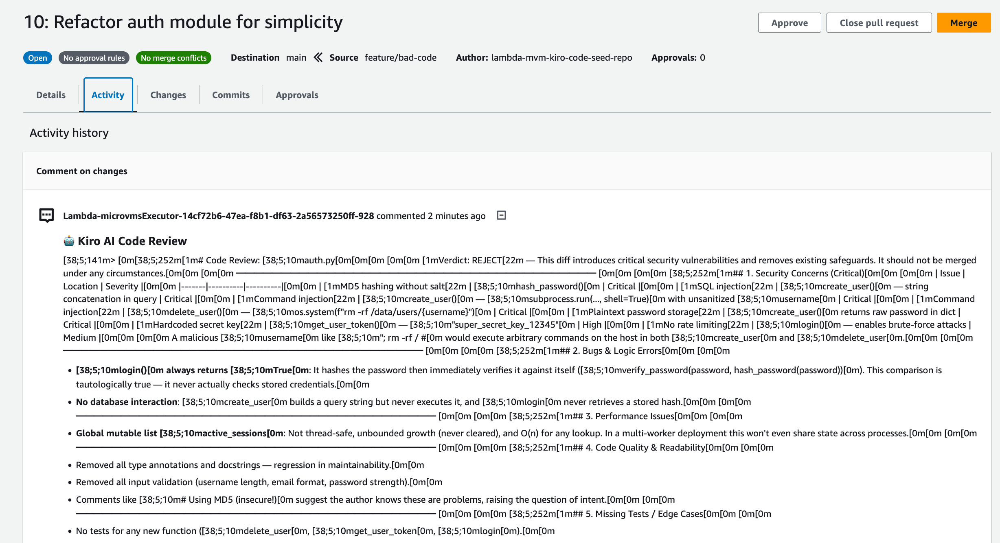

# Sandboxed AI Code Reviewer with Kiro on AWS Lambda MicroVMs

This sample deploys a **Kiro-powered AI code reviewer** running inside an AWS Lambda MicroVM. It uses Kiro in headless mode to review pull requests on CodeCommit, posting structured feedback directly as PR comments.


## Prerequisites

- Updated [AWS CLI v2](https://docs.aws.amazon.com/cli/latest/userguide/cli-chap-getting-started.html) (with `lambda-microvms` subcommand available)
- A **Kiro API Key** (from [kiro.dev](https://kiro.dev))

## Quick Start

### Step 1: Set your Kiro API Key

Export your Kiro API Key as an environment variable. The deploy script will store it securely in AWS Secrets Manager.

```bash
export KIRO_API_KEY="your-kiro-api-key-here"
export STACK_NAME="your-stack-name-here"
export REGION="you-region-here"
```

### Step 2: Deploy

Run the deploy script. It will:
1. Deploy the CloudFormation stack (IAM roles, CodeCommit repo with a sample PR, Secrets Manager, S3 bucket, log group)
2. Store the Kiro API Key in Secrets Manager
3. Package and upload the MicroVM app to S3
4. Create the MicroVM image and wait for it to become active

```bash
chmod +x scripts/deploy.sh
./scripts/deploy.sh ${STACK_NAME} ${REGION}
```

**Example:**

```bash
./scripts/deploy.sh kiro-reviewer us-west-2
```

The script exports all the stack outputs as environment variables when it completes. To re-export them in a new terminal session:

```bash
STACK_NAME="kiro-reviewer"
REGION="us-west-2"

export IMAGE_ARN=$(aws cloudformation describe-stacks --stack-name $STACK_NAME --region $REGION \
  --query 'Stacks[0].Outputs[?OutputKey==`MicroVMImageArn`].OutputValue' --output text 2>/dev/null)
# If IMAGE_ARN isn't a stack output, get it from the CLI:
export IMAGE_ARN=$(aws lambda-microvms list-microvm-images --name "${STACK_NAME}" --region $REGION --query 'imageArn' --output text)

export EXECUTION_ROLE_ARN=$(aws cloudformation describe-stacks --stack-name $STACK_NAME --region $REGION \
  --query 'Stacks[0].Outputs[?OutputKey==`MicroVMExecutionRoleArn`].OutputValue' --output text)
export REPO_NAME=$(aws cloudformation describe-stacks --stack-name $STACK_NAME --region $REGION \
  --query 'Stacks[0].Outputs[?OutputKey==`CodeReviewRepoName`].OutputValue' --output text)
export PR_ID=$(aws cloudformation describe-stacks --stack-name $STACK_NAME --region $REGION \
  --query 'Stacks[0].Outputs[?OutputKey==`PullRequestId`].OutputValue' --output text)
export SOURCE_COMMIT=$(aws cloudformation describe-stacks --stack-name $STACK_NAME --region $REGION \
  --query 'Stacks[0].Outputs[?OutputKey==`SourceCommitId`].OutputValue' --output text)
export DESTINATION_COMMIT=$(aws cloudformation describe-stacks --stack-name $STACK_NAME --region $REGION \
  --query 'Stacks[0].Outputs[?OutputKey==`DestinationCommitId`].OutputValue' --output text)
```

### Step 3: Run a MicroVM and test the reviewer

```bash
# 1. Start a MicroVM instance
RESPONSE=$(aws lambda-microvms run-microvm \
  --image-identifier "$IMAGE_ARN" \
  --image-version "1.0" \
  --execution-role-arn "$EXECUTION_ROLE_ARN" \
  --idle-policy '{"maxIdleDurationSeconds":900,"suspendedDurationSeconds":300,"autoResumeEnabled":true}' \
  --ingress-network-connectors "arn:aws:lambda:${REGION}:aws:network-connector:aws-network-connector:HTTP_INGRESS" \
  --egress-network-connectors "arn:aws:lambda:${REGION}:aws:network-connector:aws-network-connector:INTERNET_EGRESS" \
  --logging '{"cloudWatch":{"logGroup":"/aws/lambda-microvms/'"${STACK_NAME}"'"}}' \
  --region "$REGION")

MICROVM_ID=$(echo $RESPONSE | jq -r '.microvmId')
ENDPOINT=$(echo $RESPONSE | jq -r '.endpoint')

echo "MicroVM ID: $MICROVM_ID"
echo "Endpoint:   $ENDPOINT"

# 2. Get an auth token
TOKEN=$(aws lambda-microvms create-microvm-auth-token \
  --microvm-identifier "$MICROVM_ID" \
  --expiration-in-minutes 30 \
  --allowed-ports allPorts={} \
  --region "$REGION" \
  --query 'authToken."X-aws-proxy-auth"' --output text)

# 3. Trigger the Kiro code review on the sample PR, this step ca take several minutes.
curl -X POST "https://$ENDPOINT/review" \
  -H "Content-Type: application/json" \
  -H "X-aws-proxy-auth: $TOKEN" \
  -d "{
    \"repo_name\": \"$REPO_NAME\",
    \"pr_id\": \"$PR_ID\",
    \"source_commit\": \"$SOURCE_COMMIT\",
    \"destination_commit\": \"$DESTINATION_COMMIT\",
    \"region\": \"$REGION\"
  }"
```

**Expected response:**

```json
{
  "success": true,
  "message": "Review posted",
  "review": "## Security Issues\n\n1. **MD5 hashing** — insecure, use SHA-256 with salt...\n..."
}
```

The review is also posted as a comment on the CodeCommit pull request. Check it in the [AWS Console](https://us-east-2.console.aws.amazon.com/codesuite/codecommit/repositories) under CodeCommit > Repositories > kiro-reviewer-code-review > Pull Requests.



### Health Check

You can verify the MicroVM is running and the Kiro key is loaded:

```bash
curl "https://$ENDPOINT/health" \
  -H "X-aws-proxy-auth: $TOKEN"
```

## Project Structure

```
├── README.md                       # This file
├── template.yaml                   # CloudFormation template (IAM, CodeCommit, S3, Logs, Secrets)
├── scripts/
│   └── deploy.sh                   # Full deployment script
└── src/
    └── microvm-app/                # MicroVM guest application
        ├── Dockerfile              # Container image definition
        ├── app.py                  # Kiro review service + lifecycle hooks (port 8080)
        └── requirements.txt        # Python dependencies
```

## Cleanup

```bash
STACK_NAME="kiro-reviewer"
REGION="us-west-2"

# 1. Terminate any running MicroVMs
aws lambda-microvms terminate-microvm --microvm-identifier <microvm-id> --region $REGION

# 2. Delete the MicroVM image
aws lambda-microvms delete-microvm-image --name "${STACK_NAME}-kiro-reviewer" --region $REGION

# 3. Empty the S3 bucket
BUCKET=$(aws cloudformation describe-stacks --stack-name $STACK_NAME --region $REGION \
  --query 'Stacks[0].Outputs[?OutputKey==`ArtifactsBucketName`].OutputValue' --output text)
aws s3 rm "s3://$BUCKET" --recursive

# 4. Delete the CloudFormation stack
aws cloudformation delete-stack --stack-name $STACK_NAME --region $REGION
```

## License

This library is licensed under the MIT-0 License.

Copyright 2026 Amazon.com, Inc. or its affiliates. All Rights Reserved.

SPDX-License-Identifier: MIT-0
