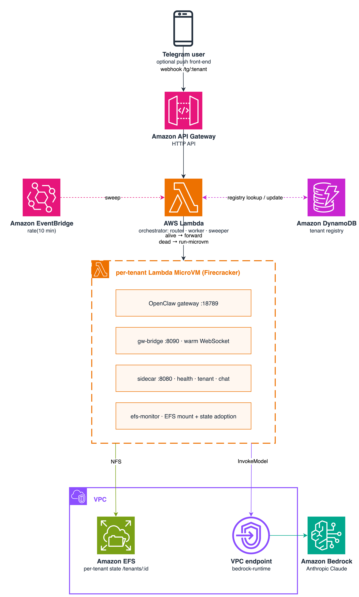

# Multi-tenant AI agents on AWS Lambda MicroVMs

This pattern runs a self-hosted AI agent ([OpenClaw](https://github.com/openclaw/openclaw)) **one isolated Lambda MicroVM per tenant**, with per-tenant state persisted on Amazon EFS, model calls served by Amazon Bedrock through a VPC endpoint, and an orchestrator Lambda behind Amazon API Gateway that cold-starts, resumes, and reaps tenant VMs on demand.

Most AI agents sit idle most of the time, yet an "always-on" deployment bills 24/7. Lambda MicroVMs flip that model: an idle tenant's VM auto-suspends (barely billed), a fully idle tenant is terminated with its state parked on EFS for ≈$0, and a returning tenant resumes from a Firecracker snapshot in seconds — memory intact. Each tenant gets a dedicated micro-VM, so isolation is a hard security boundary by design, and the workload obtains AWS credentials from the MicroVM's IMDSv2 execution role with no static keys.

Learn more about this pattern at Serverless Land Patterns: << Add the live URL here >>

Important: this application uses various AWS services and there are costs associated with these services after the Free Tier usage - please see the [AWS Pricing page](https://aws.amazon.com/pricing/) for details. You are responsible for any AWS costs incurred. No warranty is implied in this example.

## Requirements

* [Create an AWS account](https://portal.aws.amazon.com/gp/aws/developer/registration/index.html) if you do not already have one and log in. The IAM user that you use must have sufficient permissions to make necessary AWS service calls and manage AWS resources.
* [AWS CLI v2 >= 2.35](https://docs.aws.amazon.com/cli/latest/userguide/install-cliv2.html) installed and configured — must include the `lambda-microvms` and `lambda-core` subcommands (check with `aws lambda-microvms help`)
* [Git Installed](https://git-scm.com/book/en/v2/Getting-Started-Installing-Git)
* Python 3 and [uv](https://docs.astral.sh/uv/) (or a recent pip), plus the `zip` and `openssl` utilities
* A [Lambda MicroVMs launch region](https://docs.aws.amazon.com/lambda/latest/dg/lambda-microvms.html) (us-east-1, us-east-2, us-west-2, eu-west-1, ap-northeast-1)
* Amazon Bedrock **model access for Anthropic Claude** enabled in the target region

Docker is **not** required locally — the container image build runs on AWS as part of the `AWS::Lambda::MicrovmImage` resource.

## Deployment Instructions

1. Create a new directory, navigate to that directory in a terminal and clone the GitHub repository:
    ```
    git clone https://github.com/aws-samples/serverless-patterns
    ```
1. Change directory to the pattern directory:
    ```
    cd serverless-patterns/lambda-microvms-multi-tenant-ai-agents
    ```
1. Deploy the whole system with one command (takes ~10 minutes: CloudFormation stack + server-side MicroVM image build + VPC egress connector):
    ```
    ./deploy.sh <region> <stack-name>
    # e.g. ./deploy.sh us-east-1 openclaw-mt
    # Both arguments are optional and default to us-east-1 / openclaw-mt, so a bare
    # ./deploy.sh works; region is first because switching region is the common case.
    ```
    The script pre-flights the CLI and target region, uploads two zip artifacts to Amazon S3 (the MicroVM image source and the bundled orchestrator Lambda — both under content-hashed keys, so a code change always reaches AWS and an unchanged redeploy is a true no-op) and then runs a single `aws cloudformation deploy`. Everything else — VPC with NAT internet egress, EFS, Bedrock VPC endpoints (runtime + control plane), IAM roles, Amazon DynamoDB tenant registry, the MicroVM image (built server-side by CloudFormation via `AWS::Lambda::MicrovmImage`), the VPC egress connector, the orchestrator Lambda, Amazon API Gateway, and the Amazon EventBridge sweeper — is declared in `template.yaml`. A random per-checkout gateway token is minted into `.gateway-token` (override with `$GATEWAY_TOKEN`).
1. Register a tenant in the DynamoDB registry:
    ```
    ./add-tenant.sh <region> <stack-name> tenant1
    ```
1. Note the `ApiEndpoint` output printed at the end of the deploy. Tenant webhook URLs take the form `<ApiEndpoint>/tg/<tenantId>`.

## How it works



1. **Image build**: CloudFormation creates the `AWS::Lambda::MicrovmImage` resource. Lambda downloads the zip artifact from S3, executes the Dockerfile server-side (installs the OpenClaw agent, a sidecar, an EFS mount daemon, and a persistent gateway bridge), and takes a Firecracker snapshot.
2. **Message routing**: a message for a tenant arrives at API Gateway and invokes the orchestrator Lambda (router role). The router ACKs immediately and hands the message to an async worker invocation.
3. **Tenant lookup**: the worker checks the DynamoDB tenant registry. If the tenant's MicroVM is alive (RUNNING or SUSPENDED — suspended VMs auto-resume in seconds), the turn is forwarded. If the tenant is cold, the worker calls `run-microvm` (guarded by a conditional-write lock so concurrent messages launch only one VM), waits for the VM to mount the tenant's EFS subdirectory, and then forwards the turn.
4. **Agent turn**: inside the MicroVM, a sidecar receives the turn and passes it to the OpenClaw gateway over a persistent WebSocket bridge — the gateway holds the agent state warm in memory, so a turn takes ~2 seconds instead of re-reading state over NFS on every message. If a long-running turn outlives the worker invocation, the worker relays polling to a fresh async self-invocation, so a turn is bounded by the VM's 8-hour lifetime rather than Lambda's 15 minutes.
5. **Model call**: the agent calls Amazon Bedrock through VPC interface endpoints (runtime for inference, control plane for live model discovery at cold start). General internet egress for the agent's web search/fetch tools goes through a NAT gateway, while Bedrock and EFS traffic stays on the private VPCE/mount-target paths. Credentials come from the MicroVM's IMDSv2 execution role — no static keys anywhere.
6. **State persistence**: the tenant's full agent state (config + conversation memory) lives under `/tenants/<id>` on EFS. It survives suspend, resume, termination, and the MicroVM's 8-hour maximum lifetime — a relaunched VM adopts the existing state and the agent remembers everything.
7. **Lifecycle sweep**: an EventBridge rule invokes the orchestrator (sweeper role) every 10 minutes to terminate VMs idle beyond the threshold and reconcile the registry against ground truth. Tenants flow hot (RUNNING) → warm (SUSPENDED) → cold (TERMINATED, state on EFS) automatically.

## Testing

Chat with a tenant synchronously (bypasses API Gateway's 30s timeout so you can watch a cold start, which takes ~90 seconds; subsequent warm turns take ~2 seconds):

```bash
./chat.sh <region> <stack-name> tenant1 "Remember my lucky number is 7777."
# → cold: True  | reply: (agent confirms)

./chat.sh <region> <stack-name> tenant1 "What's my lucky number?"
# → cold: False | reply: 7777
```

To verify cross-generation persistence, terminate the tenant's MicroVM (`aws lambda-microvms terminate-microvm ...` or simply wait for the sweeper), then ask again — the relaunched VM adopts the EFS state and still answers `7777` with `cold: True`.

Tenant isolation: register a second tenant and confirm it cannot see the first tenant's memory:

```bash
./add-tenant.sh <region> <stack-name> tenant2
./chat.sh <region> <stack-name> tenant2 "What's my lucky number?"
# → the agent does not know — tenant2 has its own EFS subdirectory and its own VM
```

### Optional: Telegram push front-end

Each tenant can be bound to its own Telegram bot. Create a bot with [@BotFather](https://t.me/BotFather) (`/newbot` → token), then register the tenant with the token and a webhook secret of your choosing:

```bash
./add-tenant.sh <region> <stack-name> tenant3 <BOT_TOKEN> <WEBHOOK_SECRET>
```

A webhook secret is **required** whenever you pass a bot token: it is the only thing authenticating the tenant's `/tg/<tenantId>` webhook, so `add-tenant.sh` refuses a bot token without one. The script sets the bot's webhook to `<ApiEndpoint>/tg/tenant3`. Messaging the bot then drives the same router → worker → MicroVM flow, and replies are delivered back through the Telegram Bot API. Use a dedicated bot per tenant — registering overwrites the bot's existing webhook.

Over Telegram the worker additionally provides:

* **Streaming replies** — a placeholder message that grows via `editMessageText` while the model generates, with a `▌` cursor until the final edit.
* **Images** — send a photo with or without a caption; the worker pulls it from Telegram, ships it into the VM as a base64 attachment, and the agent answers about what it sees.
* **`/model` switching** — e.g. `/model amazon-bedrock/us.anthropic.claude-sonnet-5`, `/model default` to reset. The model catalog is discovered live from Bedrock at each cold start, so newly launched models are switchable without a redeploy.

## Cleanup

```bash
./teardown.sh <region> <stack-name>
```

The script terminates this stack's running MicroVMs (matched by image ARN, so VMs from other stacks are untouched), deletes the CloudFormation stack (which removes the MicroVM image, network connector, EFS, VPC, IAM roles, DynamoDB table, Lambda, and API Gateway), and finally empties and deletes the artifact bucket.

## Security considerations

This is a **level-300 demonstration pattern**. To keep it easy to deploy and explore, a few production-grade security controls are intentionally simplified or omitted. They are called out here (and in code comments) so you know exactly what to harden before any shared or production use, and what "good" looks like.

* **The `/chat/<tenantId>` HTTP route is unauthenticated.** It exists purely as a curl-friendly test entry point, but it cold-starts a billable MicroVM and drives Amazon Bedrock inference — so an exposed endpoint is a denial-of-wallet / resource-abuse vector for anyone who learns the API URL and a tenant id. The documented test flow (`chat.sh`) does **not** use this route; it invokes the orchestrator Lambda directly (`aws lambda invoke`). *What good looks like:* front the HTTP API with an [Amazon API Gateway authorizer](https://docs.aws.amazon.com/apigateway/latest/developerguide/http-api-access-control.html) (IAM, JWT/Amazon Cognito, or a Lambda authorizer), require a per-tenant shared-secret header (mirroring the Telegram check below), or remove the route entirely and test only via `chat.sh`.
* **The Telegram webhook now fails closed.** A tenant bound to a Telegram bot must be registered with a webhook secret — `add-tenant.sh` refuses a bot token without one, and the orchestrator returns `403` for any Telegram-bound tenant whose secret is missing or mismatched. Telegram echoes this secret in the `X-Telegram-Bot-Api-Secret-Token` header on every webhook call, so it authenticates the `/tg/<tenantId>` path.
* **The in-VM gateway token has a well-known fallback default (`poc-microvm-token-42`).** `deploy.sh` always mints a random per-checkout token (`openssl rand -hex 16`) and injects it, so real deployments never use the default — but a deploy that bypasses the script (e.g. a raw `aws cloudformation deploy` without the `GatewayToken` override) would ship the known default. *What good looks like:* set `GatewayToken` explicitly (or via a Secrets Manager–backed value) whenever you don't deploy through `deploy.sh`.
* **Tenant secrets live in Amazon DynamoDB with KMS encryption at rest** (AWS managed key `aws/dynamodb`). For tighter audit/rotation control, use a customer-managed KMS key, or store `botToken`/`webhookSecret` in AWS Secrets Manager and keep only a reference in the table.
* **Some IAM statements use `Resource: '*'`** for MicroVM lifecycle actions and the network-connector operator role's ENI actions. These are scoped to the necessary actions, but resource-level scoping for the (preview/GA) Lambda MicroVMs and network-connector APIs was not verified against published docs at authoring time — narrow them once the supported resource ARNs/condition keys are confirmed, and test in a non-production account first.
* **Single-AZ by design.** All VPC resources and the single Amazon EFS mount target live in one Availability Zone to keep the demo minimal and cheap. If that AZ is impaired, tenant state becomes unreachable and no MicroVMs can launch. For production, add a second subnet + EFS mount target in a second AZ.
* **Observability is minimal.** The orchestrator logs with `print()` (no structured logging), has no AWS X-Ray tracing, and declares no CloudWatch Logs retention (auto-created log groups never expire). These are acceptable simplifications for a demo; for production add log retention, X-Ray active tracing, and structured logging (e.g. Powertools for AWS Lambda).
* **No dead-letter queue on async invocations.** The router→worker handoff, the worker's chained self-invokes, and the EventBridge sweeper all invoke asynchronously with no `DeadLetterConfig`/on-failure destination, so an event that exhausts Lambda's retries is dropped (a lost turn or a missed sweep). For production, attach an SQS DLQ / on-failure destination.

----
Copyright 2026 Amazon.com, Inc. or its affiliates. All Rights Reserved.

SPDX-License-Identifier: MIT-0
