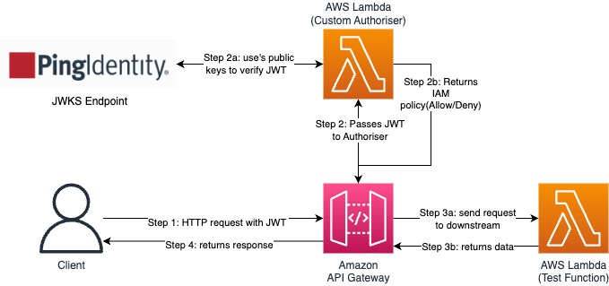

# Simple JWT API with PingOne Integration

A minimal serverless API demonstrating JWT authentication with PingOne using AWS Lambda and API Gateway.

## Architecture

### High-Level Flow


## Technologies Used

- **AWS Lambda** - Serverless compute
- **API Gateway** - HTTP API with custom authorizer
- **PingOne** - Identity provider and JWT issuer
- **Python 3.9** - Runtime environment
- **AWS SAM** - Infrastructure as Code

### Detailed Authentication Flow

When a client sends an HTTP request to a protected API, it includes a JWT token in the `Authorization: Bearer <JWT_TOKEN>` header. This request is received by the API Gateway, which is configured with a custom JWT authorizer. The authorizer function is triggered and extracts the JWT from the request. It then fetches the public keys from PingOne’s JWKS (JSON Web Key Set) endpoint to validate the token. During this process, the authorizer verifies the JWT’s signature, ensures it was issued by a trusted PingOne environment, and checks that the token has not expired. If everything is valid, the authorizer returns an IAM policy that either allows or denies access, along with any relevant user context. If access is granted, the request proceeds to the protected Lambda function behind the API. This Lambda uses the user context provided by the authorizer to generate a response. Finally, the API Gateway sends this response back to the client, including any necessary CORS headers to support web-based applications.

## Prerequisites

- AWS CLI configured with appropriate permissions
- AWS SAM CLI installed
- Python 3.9+ installed
- A PingOne account and environment

## Setup and Deployment

### Step 1: PingOne Configuration

1. **Log into PingOne Admin Console**
    - Go to your PingOne admin portal
    - Navigate to your environment

2. **Create OIDC Application**
    - Go to Applications → Add Application
    - Choose "OIDC Web App"
    - Configure the following:
        - **Name**: Simple JWT API
        - **Redirect URIs**: `http://localhost:3000/callback`
        - **Grant Types**: Authorization Code
        - **Response Types**: Code
        - **Scopes**: openid, profile, email

3. **Note Your Configuration**
    - **Environment ID**: Found in the URL or environment settings
    - **Client ID**: From your application settings
    - **Client Secret**: From your application settings


### Step 2: Build & Deploy

1. **Build the Application**
   ```bash
   sam build
   ```

2. **Deploy the Application**
   ```bash
   sam deploy --guided
   ```

3. **Note the API Endpoint**
   The deployment will output your API Gateway endpoint URL.

### Step 3: Generate Access Token

You can generate PingOne JWT tokens using multiple methods:

<details>
<summary><strong>Click to see various token generation methods</strong></summary>

#### Option 1: Using the provided script
```bash
# Set environment variables
export CLIENT_ID=your-client-id
export CLIENT_SECRET=your-client-secret
export ENVIRONMENT_ID=your-environment-id

# Get authorization URL
./get_token.sh

# Exchange auth code for token
./get_token.sh YOUR_AUTH_CODE
```

#### Option 2: PingOne Admin Console
- Log into your PingOne admin console
- Navigate to Applications → Your App → Configuration
- Use the "Test Connection" or token generation features

#### Option 3: Direct OAuth2 Flow
1. **Authorization URL:**
   ```
   https://auth.pingone.com/YOUR_ENV_ID/as/authorize?client_id=YOUR_CLIENT_ID&response_type=code&redirect_uri=http://localhost:3000/callback&scope=openid%20profile%20email
   ```

2. **Token Exchange (curl):**
   ```bash
   curl -X POST "https://auth.pingone.com/YOUR_ENV_ID/as/token" \
     -H "Content-Type: application/x-www-form-urlencoded" \
     -H "Authorization: Basic $(echo -n 'CLIENT_ID:CLIENT_SECRET' | base64)" \
     -d "grant_type=authorization_code&code=YOUR_AUTH_CODE&redirect_uri=http://localhost:3000/callback"
   ```

#### Option 4: Postman/Insomnia
- Import PingOne OAuth2 collection
- Configure your environment variables
- Use the authorization code flow

</details>

### Step 4: Test the API

Once you have an access token from any method above:

```bash
curl -H "Authorization: Bearer YOUR_ACCESS_TOKEN" YOUR_API_ENDPOINT
```

## API Endpoints

### GET /user
Returns user information after successful JWT verification.

**Response:**
```json
{
  "success": true,
  "message": "JWT verification successful - Connection established",
  "user": "<user_id>",
  "scope": "openid profile email",
  "timestamp": 29999
}
```


## Project Structure

```
├── src/
│   ├── jwt_authorizer.py    # Custom JWT authorizer function
│   ├── user_info.py         # Protected API endpoint
│   └── requirements.txt     # Python dependencies
├── template.yaml            # SAM template
├── get_token.sh            # Token generation helper (optional)
└── samconfig.toml.example  # SAM configuration template
```

## Troubleshooting

- **Invalid Token**: Check that your PingOne configuration matches your deployment
- **CORS Issues**: Ensure your redirect URI is properly configured in PingOne
- **Deployment Errors**: Verify your AWS credentials and permissions
- **Token Expiration**: PingOne tokens have limited lifespans, generate new ones as needed
- **Script Issues**: If `get_token.sh` doesn't work, use alternative token generation methods listed above


