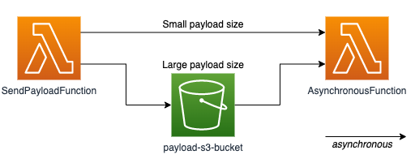

# AWS Lambda to AWS Lambda(async) - Transfer payload with S3 when the payload size is too large

This AWS SAM template creates a first Lambda function that calls a second Lambda function asynchronously. In this template, it focuses on the case when the payload is transferred to the second Lambda function.

When the payload size exceeds the invocation payload size quota, then the payload is saved to an S3 bucket as an object. The second Lambda function will be triggered by 's3:ObjectCreated' event, and the function will read the payload object from the S3 bucket.

This pattern is helpful when you have to handle large size of data that exceeds the payload quota of Amazon SNS, Amazon SQS, Amazon MSK, etc.

Learn more about this pattern at Serverless Land Patterns: https://serverlessland.com/patterns/lambda-s3-async-lambda

Important: this application uses various AWS services and there are costs associated with these services after the Free Tier usage - please see the [AWS Pricing page](https://aws.amazon.com/pricing/) for details. You are responsible for any AWS costs incurred. No warranty is implied in this example.

## Requirements

* [Create an AWS account](https://portal.aws.amazon.com/gp/aws/developer/registration/index.html) if you do not already have one and log in. The IAM user that you use must have sufficient permissions to make necessary AWS service calls and manage AWS resources.
* [AWS CLI](https://docs.aws.amazon.com/cli/latest/userguide/install-cliv2.html) installed and configured
* [Git Installed](https://git-scm.com/book/en/v2/Getting-Started-Installing-Git)
* [AWS Serverless Application Model](https://docs.aws.amazon.com/serverless-application-model/latest/developerguide/serverless-sam-cli-install.html) (AWS SAM) installed

## Deployment Instructions

1. Create a new directory, navigate to that directory in a terminal and clone the GitHub repository:
    ``` 
    git clone https://github.com/aws-samples/serverless-patterns
    ```
1. Change directory to the pattern directory:
    ```
    cd lambda-s3-async-lambda
    ```
1. From the command line, use AWS SAM to deploy the AWS resources for the pattern as specified in the template.yml file:
    ```
    sam deploy --guided
    ```
1. During the prompts:
    * Enter a stack name: eg. lambda-s3-async-lambda
    * Enter the desired AWS Region: eg. us-east-1
    * Enter the PayloadBucketName S3 bucket name: eg. lambda-s3-async-lambda-{account}
    * Accept the remaining defaults
    * Allow AWS SAM CLI to create IAM roles with the required permissions.

    Once you have run `sam deploy --guided` mode once and saved arguments to a configuration file (samconfig.toml), you can use `sam deploy` in future to use these defaults.

1. Note the outputs from the AWS SAM deployment process. These contain the resource names and/or ARNs which are used for testing.

## How it works



The AWS SAM template deploys the following resources:

| Logical ID | Type | 
| --- | --- |
| SendPayloadFunction | AWS::Lambda::Function | 
| SendPayloadFunctionRole | AWS::IAM::Role |
| AsynchronousFunction | AWS::Lambda::Function | 
| AsynchronousFunctionRole | AWS::IAM::Role |
| PayloadBucket | AWS::S3::Bucket | 
| AsynchronousFunctionPayloadCreationEventPermission | AWS::Lambda::Permission |

---

In this pattern SAM will deploy two lambda functions and one S3 bucket. Lambda functions are SendPayloadFunction and AsynchronousFunction. 

The SendPayloadFunction will call the AsynchronousFunction asynchronously and stop the function. It does not wait for the response from the AsynchronousFunction. The AsynchronousFunction will be invoked independently.

When the payload size exceeds Lambda invocation payload, then SendPayloadFunction puts the payload as an object file to S3 bucket. Then AsynchronousFunction will be triggered by 's3:ObjectCreated' event, and the function will read the payload object from S3 bucket.

For more information about Lambda quota including invocation payload, see the [Lambda: Function configuration deployment and execution](https://docs.aws.amazon.com/lambda/latest/dg/gettingstarted-limits.html#function-configuration-deployment-and-execution)

You will be able to create and delete the CloudFormation stack using the CLI commands.

This is fully functional example developed in python 3.9

At the end of test, please remove objects in S3 bucket!

## Testing

### Small size json payload test

```bash
aws lambda invoke --function-name SendPayloadFunction --payload '{"key":"value"}' response.json --cli-binary-format raw-in-base64-out
cat response.json
```


### Large size json payload test

```bash
aws lambda invoke --function-name SendPayloadFunction --payload file://payload/payload-large.json response.json --cli-binary-format raw-in-base64-out
cat response.json
```
You can see the response includes AmazonS3

## Cleanup
 
1. Run the given command to delete the resources that were created. It might take some time for the CloudFormation stack to get deleted.
    ```
    aws s3 rm s3://{PAYLOAD_BUCKET_NAME} --recursive
    sam delete
    ```
Confirm to delete all AWS SAM resources
----
Copyright 2021 Amazon.com, Inc. or its affiliates. All Rights Reserved.

SPDX-License-Identifier: MIT-0
