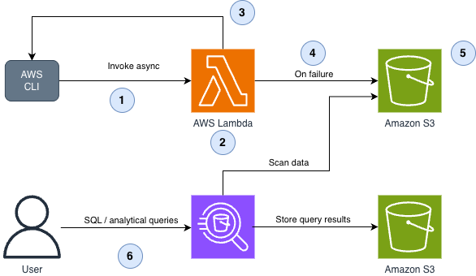

# AWS Lambda with Amazon S3 Failed-Event Destination and Amazon Athena Analytics

This pattern demonstrates how to use Amazon S3 as a failed-event destination for AWS Lambda asynchronous invocations, with Amazon Athena for analytics on failed events. The pattern includes an AWS Lambda function with business logic that can succeed or fail, automatically capturing failed events to Amazon S3 for analysis.

Learn more about this pattern at Serverless Land Patterns: [https://serverlessland.com/patterns/lambda-s3-athena-cdk-ts](https://serverlessland.com/patterns/lambda-s3-athena-cdk-ts)

Important: this application uses various AWS services and there are costs associated with these services after the Free Tier usage - please see the [AWS Pricing page](https://aws.amazon.com/pricing/) for details. You are responsible for any AWS costs incurred. No warranty is implied in this example.

## Requirements

* [Create an AWS account](https://portal.aws.amazon.com/gp/aws/developer/registration/index.html) if you do not already have one and log in. The IAM user that you use must have sufficient permissions to make necessary AWS service calls and manage AWS resources.
* [AWS CLI](https://docs.aws.amazon.com/cli/latest/userguide/install-cliv2.html) installed and configured
* [Git Installed](https://git-scm.com/book/en/v2/Getting-Started-Installing-Git)
* [Node.js and npm](https://nodejs.org/) installed
* [AWS CDK](https://docs.aws.amazon.com/cdk/latest/guide/getting_started.html) installed

## Deployment Instructions

1. Create a new directory, navigate to that directory in a terminal and clone the GitHub repository:

    ```bash
    git clone https://github.com/aws-samples/serverless-patterns
    ```

2. Change directory to the pattern directory:

    ```bash
    cd lambda-s3-athena-cdk-ts
    ```

3. Install dependencies:

    ```bash
    npm install
    ```

4. Deploy the CDK stack to your default AWS account and region:

    ```bash
    cdk deploy
    ```

5. Note the outputs from the CDK deployment process. These contain the resource names and URLs which are used for testing.

## Deployment Outputs

After deployment, CDK will display the following outputs. Save these values for configuration and testing:

| Output Key | Description | Usage |
|------------|-------------|-------|
| `LambdaFunctionName` | AWS Lambda function name | Use this name to invoke the AWS Lambda function via AWS CLI |
| `FailedEventsBucketName` | Amazon S3 bucket storing failed AWS Lambda events | Check this bucket to verify failed events are being captured |
| `AthenaResultsBucketName` | Amazon S3 bucket for Amazon Athena query results | Amazon Athena stores query results here automatically |
| `GlueDatabaseName` | AWS Glue database name (typically `failed_events_db`) | Use in Amazon Athena queries: `FROM <database>.<table>` |
| `GlueTableName` | AWS Glue table name (`failed_events`) | Use in Amazon Athena queries: `FROM <database>.<table>` |
| `AthenaWorkgroupName` | Amazon Athena workgroup name | Specify this workgroup when running Amazon Athena queries |

**Example output:**
```
Outputs:
LambdaS3AthenaCdkStack.LambdaFunctionName = processor-function-abc123
LambdaS3AthenaCdkStack.FailedEventsBucketName = lambdas3athenac-failedeventsbucket12345-abcdef
LambdaS3AthenaCdkStack.AthenaResultsBucketName = lambdas3athenac-athenaresultsbucket67890-ghijkl
LambdaS3AthenaCdkStack.GlueDatabaseName = failed_events_db
LambdaS3AthenaCdkStack.GlueTableName = failed_events
LambdaS3AthenaCdkStack.AthenaWorkgroupName = failed-events-workgroup
```

## How it works



This pattern creates an AWS Lambda function that implements simple business logic with three actions: `process`, `validate`, and `calculate`. When the AWS Lambda function fails (throws an error) during asynchronous invocation, the failed event is automatically sent to an Amazon S3 bucket configured as the failed-event destination.

The pattern also sets up AWS Glue and Amazon Athena to enable SQL-based analytics on the failed events stored in Amazon S3. This allows you to query and analyze error patterns, identify common failure scenarios, and gain insights into your application's error behavior.

Architecture flow:
1. Client invokes AWS Lambda function asynchronously via AWS CLI
2. AWS Lambda processes the request based on the action type
3. On success: AWS Lambda returns successful response
4. On failure: AWS Lambda throws error, and AWS automatically sends the failed event to Amazon S3
5. Failed events are stored in Amazon S3 as JSON files
6. Amazon Athena queries the failed events using AWS Glue Data Catalog for analytics

### AWS Lambda Destinations and Invocation Types

**Important**: AWS Lambda destinations only work with **asynchronous invocations** and **stream-based invocations** (on-failure only). They do not trigger for synchronous invocations.

| Invocation Type | Examples | Destinations Supported? |
|----------------|----------|------------------------|
| **Synchronous** | Amazon API Gateway, Application Load Balancer, SDK RequestResponse | ❌ No |
| **Asynchronous** | Amazon S3, Amazon SNS, Amazon EventBridge, SDK Event | ✅ Yes |
| **Stream/Poll-based** | Amazon Kinesis, Amazon DynamoDB Streams, Amazon SQS | ✅ On-failure only |

This pattern uses **asynchronous invocation via AWS CLI** (`--invocation-type Event`) to demonstrate the Amazon S3 failed-event destination feature.

The AWS Glue Data Catalog is required for Amazon Athena to query Amazon S3 data, providing the schema definition, data location, and SerDe configuration needed to parse the JSON files. This pattern uses a simplified configuration without a predefined schema, allowing Amazon Athena to perform full scans of all failed event files for learning and low-volume workloads.

## Testing

### Test Successful Requests

1. Get the AWS Lambda function name from the stack outputs:

    ```bash
    FUNCTION_NAME=$(aws cloudformation describe-stacks --stack-name LambdaS3AthenaCdkStack --query 'Stacks[0].Outputs[?OutputKey==`LambdaFunctionName`].OutputValue' --output text)
    ```

2. Test the `process` action (success) with asynchronous invocation:

    ```bash
    aws lambda invoke \
      --function-name $FUNCTION_NAME \
      --invocation-type Event \
      --cli-binary-format raw-in-base64-out \
      --payload '{"action": "process", "value": 10}' \
      response.json
    ```

    Expected response: `{"StatusCode": 202}` (request accepted)

3. Test the `validate` action (success):

    ```bash
    aws lambda invoke \
      --function-name $FUNCTION_NAME \
      --invocation-type Event \
      --cli-binary-format raw-in-base64-out \
      --payload '{"action": "validate", "value": "hello"}' \
      response.json
    ```

4. Test the `calculate` action (success):

    ```bash
    aws lambda invoke \
      --function-name $FUNCTION_NAME \
      --invocation-type Event \
      --cli-binary-format raw-in-base64-out \
      --payload '{"action": "calculate", "value": [1, 2, 3, 4, 5]}' \
      response.json
    ```

### Test Failed Requests

1. Test with invalid value for `process` (negative number):

    ```bash
    aws lambda invoke \
      --function-name $FUNCTION_NAME \
      --invocation-type Event \
      --cli-binary-format raw-in-base64-out \
      --payload '{"action": "process", "value": -5}' \
      response.json
    ```

2. Test with invalid value for `validate` (empty string):

    ```bash
    aws lambda invoke \
      --function-name $FUNCTION_NAME \
      --invocation-type Event \
      --cli-binary-format raw-in-base64-out \
      --payload '{"action": "validate", "value": ""}' \
      response.json
    ```

3. Test with invalid value for `calculate` (empty array):

    ```bash
    aws lambda invoke \
      --function-name $FUNCTION_NAME \
      --invocation-type Event \
      --cli-binary-format raw-in-base64-out \
      --payload '{"action": "calculate", "value": []}' \
      response.json
    ```

4. Test with unknown action:

    ```bash
    aws lambda invoke \
      --function-name $FUNCTION_NAME \
      --invocation-type Event \
      --cli-binary-format raw-in-base64-out \
      --payload '{"action": "unknown", "value": "test"}' \
      response.json
    ```

5. Wait a few minutes for the failed events to be written to Amazon S3, then verify they exist:

    ```bash
    BUCKET_NAME=$(aws cloudformation describe-stacks --stack-name LambdaS3AthenaCdkStack --query 'Stacks[0].Outputs[?OutputKey==`FailedEventsBucketName`].OutputValue' --output text)
    aws s3 ls s3://$BUCKET_NAME/ --recursive
    ```

    Note: Failed events typically appear in Amazon S3 within 1-2 minutes after the AWS Lambda invocation fails.

### Query Failed Events with Amazon Athena

1. Open the Amazon Athena console to run queries.
    * You will need to setup a query result location in Amazon S3 if you've never run a query before
    * This can be changed later in the settings

2. Query to count failed events by error type:

    ```sql
    SELECT 
        responsepayload.errortype as error_type,
        COUNT(*) as error_count
    FROM failed_events
    GROUP BY responsepayload.errortype
    ORDER BY error_count DESC;
    ```

3. Query to see detailed error messages:

    ```sql
    SELECT 
        timestamp,
        responsepayload.errortype as error_type,
        responsepayload.errormessage as error_message,
        requestpayload.body as request_body
    FROM failed_events
    ORDER BY timestamp DESC
    LIMIT 10;
    ```

4. Query to analyze errors by action type:

    ```sql
    SELECT 
        json_extract_scalar(requestpayload.body, '$.action') as action,
        responsepayload.errortype as error_type,
        COUNT(*) as count
    FROM failed_events
    GROUP BY 
        json_extract_scalar(requestpayload.body, '$.action'),
        responsepayload.errortype
    ORDER BY count DESC;
    ```

5. Query to find errors within a specific time range:

    ```sql
    SELECT 
        timestamp,
        responsepayload.errormessage as error_message,
        requestpayload.body as request_body
    FROM failed_events
    WHERE timestamp >= '2025-01-01T00:00:00Z'
    ORDER BY timestamp DESC;
    ```

## Cleanup

1. Delete the stack:

    ```bash
    cdk destroy
    ```

2. Confirm the deletion when prompted.

---

Copyright 2026 Amazon.com, Inc. or its affiliates. All Rights Reserved.

SPDX-License-Identifier: MIT-0
