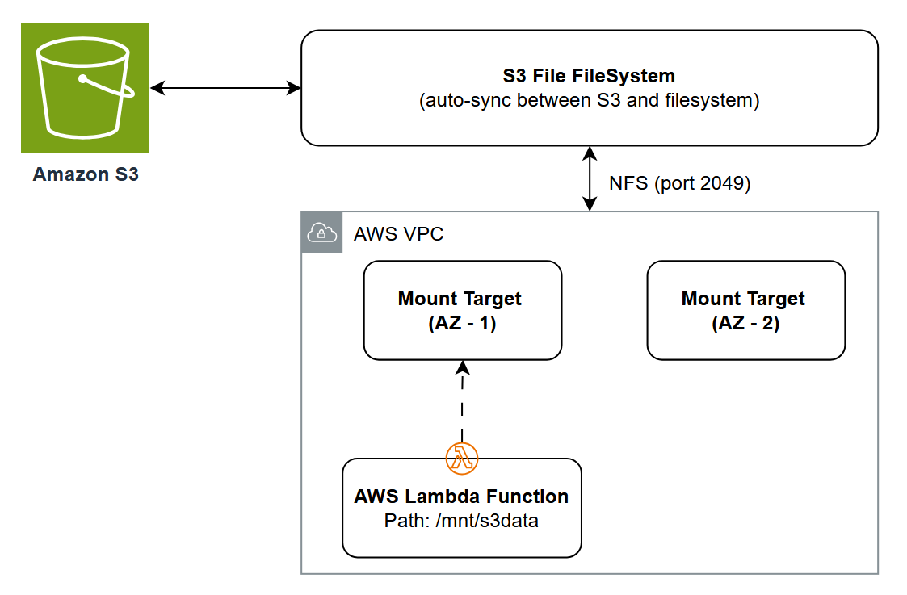

# AWS Lambda with Amazon S3 Files Mount (.NET)

This pattern deploys a Lambda function with an Amazon S3 Files file system mounted at `/mnt/s3data`. The function performs standard file operations (read, write, list) on S3 data using the local filesystem — no S3 API calls needed.

Learn more about this pattern at Serverless Land Patterns: https://serverlessland.com/patterns/lambda-s3-files-cdk-dotnet

Important: this application uses various AWS services and there are costs associated with these services after the Free Tier usage - please see the [AWS Pricing page](https://aws.amazon.com/pricing/) for details. You are responsible for any AWS costs incurred. No warranty is implied in this example.

## Requirements

* [Create an AWS account](https://portal.aws.amazon.com/gp/aws/developer/registration/index.html) if you do not already have one and log in. The IAM user that you use must have sufficient permissions to make necessary AWS service calls and manage AWS resources.
* [AWS CLI](https://docs.aws.amazon.com/cli/latest/userguide/install-cliv2.html) installed and configured
* [Git Installed](https://git-scm.com/book/en/v2/Getting-Started-Installing-Git)
* [.NET 10](https://dotnet.microsoft.com/en-us/download/dotnet/10.0) installed
* [AWS Cloud Development Kit](https://docs.aws.amazon.com/cdk/latest/guide/cli.html) (AWS CDK) installed

## Deployment Instructions

1. Clone the project to your local working directory

    ```bash
    git clone https://github.com/aws-samples/serverless-patterns
    ```

2. Change the working directory to this pattern's directory

    ```bash
    cd serverless-patterns/lambda-s3-files-cdk-dotnet
    ```

3. Publish the Lambda function

    ```bash
    dotnet publish src/S3FilesLambda -c Release -o src/S3FilesLambda/publish -r linux-x64 --self-contained false
    ```

4. Deploy the stack to your default AWS account and region

    ```bash
    cdk deploy
    ```

## How it works

S3 Files provides NFS access to S3 buckets with sub-millisecond latency on small files and full POSIX semantics. The pattern creates:

- A **VPC** with isolated private subnets (no NAT gateway — uses VPC endpoints instead)
- An **S3 Gateway VPC endpoint** for direct S3 API access from private subnets
- An **S3 bucket** with versioning enabled (required by S3 Files)
- An **S3 Files file system** backed by the bucket
- **Mount targets** in each isolated subnet for NFS connectivity
- An **access point** defining the POSIX identity and root path
- A **.NET 10 Lambda function** with the S3 Files file system mounted at `/mnt/s3data`

Multiple Lambda functions can connect to the same S3 Files file system simultaneously, sharing data through a common workspace without custom synchronization logic.

## Architecture



## Testing

After deployment, invoke the Lambda function with different payloads to test file operations.

> **Note:** Replace `<FunctionName>` in the commands below with the actual function name from the `FunctionName` output of the CloudFormation stack (visible after `cdk deploy` completes).

### Write a file

```bash
aws lambda invoke --function-name <FunctionName> \
  --payload '{"action": "write", "filename": "hello.txt", "content": "Hello from .NET Lambda!"}' \
  --cli-binary-format raw-in-base64-out \
  output.json && cat output.json
```

Expected response:
```json
{"status":"written","path":"/mnt/s3data/hello.txt","size":22}
```

### Read a file

```bash
aws lambda invoke --function-name <FunctionName> \
  --payload '{"action": "read", "filename": "hello.txt"}' \
  --cli-binary-format raw-in-base64-out \
  output.json && cat output.json
```

Expected response:
```json
{"status":"read","path":"/mnt/s3data/hello.txt","content":"Hello from .NET Lambda!","size":22}
```

### List files

```bash
aws lambda invoke --function-name <FunctionName> \
  --payload '{"action": "list"}' \
  --cli-binary-format raw-in-base64-out \
  output.json && cat output.json
```

Expected response:
```json
{"status":"listed","path":"/mnt/s3data","count":1,"entries":[{"name":"hello.txt","type":"file"}]}
```

## Cleanup

Delete the stack:

```bash
cdk destroy
```

----
Copyright 2026 Amazon.com, Inc. or its affiliates. All Rights Reserved.

SPDX-License-Identifier: MIT-0
