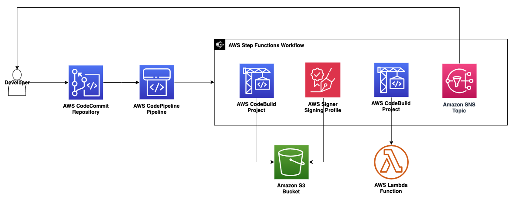

# Automated AWS Lambda Function Code Signing with AWS Signer and AWS Step Functions

This pattern automates the process of signing function code during deployments using AWS Step Functions.

Signing AWS Lambda function code helps ensure function images are valid and unmodified. However, this is an extra step in the deployment process that may dissuade developers from using it. This pattern simplifies this process by providing an AWS Step Functions workflow that automates this process.

# Prerequisites & Limitations

## Prerequisites

- AWS Account
- AWS CLI v2
- AWS Access credentials with appropriately scoped permissions
- Python3

## Limitations

### Function deployment

This pattern is limited to deploying functions using the zip method. This does not support image-based lambda functions. 

### Application stack deployment

The included build specification file deploys the application resources using AWS CloudFormation. A different application deployment method such as AWS SAM or terraform could be substituted in.

Note on using AWS SAM:

AWS SAM provides its own method of function code signing. This method abstracts away the interaction with AWS Signer, alleviating the need to directly call AWS Signer on the code artifact. This approach is more hands-off but also provides less control over responding to a failed signing event. Because we have direct access to the AWS Signing job, we are able to more resolutely respond to failed signing events. For example, this pattern uses the outcome of the signing event to take the remediation action of notifying an Amazon SNS topic but could easily extended with further remediation actions.

A similar remediation workflow could also be implemented while using AWS SAM code signing with AWS Signer events and Amazon EventBridge. This would be a more choreographic approach rather than the orchestrated approach of AWS Step Functions.

## Product Versions

Python3

AWS CLIv2

# Architecture

## Target Technology Stack

This pattern creates two stacks, an infrastructure stack providing a pipeline for function signing and deployment, and the function stack itself. The infrastructure stack will create CI/CD resources using AWS CodeCommit, AWS CodeBuild, and AWS CodePipeline. However, other CI/CD tools may be substituted in, provided they integrate with AWS Step Functions.

- Infrastructure resources
    - CI/CD Resources
        - AWS CodeCommit repository
        - AWS CodePipeline pipeline
        - AWS CodeBuild project for building the lambda function
        - AWS CodeBuild project for deploying the lambda function in a CloudFormation stack
    - Amazon SNS topic
    - Amazon Signer signing profile
    - AWS Step Functions state machine
    - Amazon S3 bucket
- Application resources
    - AWS Lambda function
    - AWS Lambda code signing configuration
    - AWS IAM Role for Lambda function

## Target Architecture



## Automation and Scale

Developers can extend the deployment workflow by adding other actions to the AWS Step Functions state machine or AWS CodePipeline pipeline. Additionally, as stated before, if different CI/CD tools are preferred, they can be substituted into the infrastructure template.

# Tools

## Tools

AWS CLI v2: https://docs.aws.amazon.com/cli/latest/userguide/getting-started-install.html

git-remote-codecommit: https://github.com/aws/git-remote-codecommit

jq: https://jqlang.github.io/jq/

# Best practices

When launching these resources, use a role with appropriately scoped-down permissions. Use the the example policy given in the repo to set permissions for your role: https://gitlab.aws.dev/wubenso/automated-lambda-code-signing/-/blob/main/userpolicy.json.

# Epics

## Deploy the Infrastructure

Deploy the infrastructure in a stack using CloudFormation

`aws cloudformation create-stack --stack-name AutomatedCodeSigningStack --template-body file://code-signer/template.yml --capabilities CAPABILITY_IAM`

## Subscribe to the notification topic

This pattern uses an SNS topic to alert an application owner when the code either passes or fails signature validation. In these steps, you will subscribe to the topic so you can simulate receiving notifications to the signature validation status.

1. Set your email address as an environment variable. This variable will be used in the next step.

    `EMAIL_ADDRESS=<YOUR_EMAIL_ADDRESS>`

2. Subscribe to the topic

    `aws sns subscribe --topic-arn $(aws cloudformation describe-stacks --stack-name AutomatedCodeSigningStack | jq -r '.Stacks[0].Outputs[2].OutputValue') --protocol email --notification-endpoint $EMAIL_ADDRESS`

3. Confirm the subscription

    You should receive a confirmation request email from SNS at your email address. Use your preferred email client to confirm the subscription to the notification topic.

## Push the application code

1. Install jq

    This pattern uses jq to parse json returned from AWS CLI commands. Follow the steps on the bellow page to install jq. 

    You may skip this step if you already have jq installed

    https://jqlang.github.io/jq/download/

2. Install git-remote-codecommit

    `pip install git-remote-codecommit`

3. Set the clone url from the stack outputs

    `CLONE_URL=codecommit://$(aws cloudformation describe-stacks --stack-name AutomatedCodeSigningStack | jq -r '.Stacks[0].Outputs[1].OutputValue')`

4. Push the code

    ```
    git remote add origin $CLONE_URL
    git push -u origin main
    ```

## Wait for the application to deploy

The previous push will have triggered an execution in the state machine. The following steps will guide you through waiting for that state machine to build, sign, and deploy our function code.

1. First retrieve the state machine ARN.

    `STATE_MACHINE_ARN=$(aws cloudformation describe-stacks --stack-name AutomatedCodeSigningStack | jq -r '.Stacks[0].Outputs[3].OutputValue')`

2. Wait for the state machine execution to start

    ```
    EXECUTIONS=0
    while [[ $EXECUTIONS -eq 0 ]]
    do
    sleep 3
    EXECUTIONS=$(aws stepfunctions list-executions --state-machine-arn $STATE_MACHINE_ARN | jq '.executions | length')
    echo $EXECUTIONS
    done
    ```

    The script will output the number of executions (0) until the first one starts.

3. Retrieve the execution ARN

    `EXECUTION_ARN=$(aws stepfunctions list-executions --state-machine-arn $STATE_MACHINE_ARN | jq -r '.executions[0].executionArn')`

4. Wait for the execution to finish

    ```
    STATUS=RUNNING
    while [[ $STATUS == RUNNING ]]
    do
    sleep 10
    STATUS=$(aws stepfunctions describe-execution --execution-arn $EXECUTION_ARN | jq -r .status)
    echo $STATUS
    done
    ```

    The script will output 'Running' until the state machine execution finishes.

## Validate the function deployment

The state machine has finished. The function has now been built, signed, and deployed. These steps will guide you through verifying this.

1. Get the name of the function

    `FUNCTION_NAME=$(aws cloudformation describe-stacks --stack-name AutomatedCodeSigningStack-SignedFunctionStack | jq -r '.Stacks[0].Outputs[0].OutputValue')`

2. Validate the function has code signing configured and update status was successful

    1. `aws lambda get-function --function-name $FUNCTION_NAME | jq '.Configuration.SigningProfileVersionArn'`

    2. `aws lambda get-function --function-name $FUNCTION_NAME | jq '.Configuration.LastUpdateStatus'`

3. Verify you recieved an email

    You should have received an email from AWS Notifications now that the deploy has finished. Verify you received this email at the address you used before. If you have not received it, give it 5 minutes to allow for propagation.

## Cleanup

1. Delete the application stack

    1. `aws cloudformation delete-stack --stack-name AutomatedCodeSigningStack-SignedFunctionStack`

    2. Wait for the deletion to complete

        `aws cloudformation wait stack-delete-complete --stack-name AutomatedCodeSigningStack-SignedFunctionStack`

2. Delete the infrastructure stack

    1. Empty the build bucket

        Delete all object verisons

        ```
        aws s3api delete-objects \
        --bucket $BUCKET_NAME \
        --delete "$(aws s3api list-object-versions \
        --bucket $BUCKET_NAME | \
        jq '{Objects: [.Versions[] | {Key:.Key, VersionId : .VersionId}], Quiet: false}')"
        ```
    
        Delete any existing delete markers (skip this step if you did not delete any objects from the build bucket). If there are no existing delete markers, you may get an error message. You can ignore that.

        ```
        aws s3api delete-objects \
        --bucket $BUCKET_NAME \
        --delete "$(aws s3api list-object-versions \
        --bucket $BUCKET_NAME | \
        jq '{Objects: [.DeleteMarkers[] | {Key:.Key, VersionId : .VersionId}], Quiet: false}')"
        ```
    
    3. Delete the stack

        `aws cloudformation delete-stack --stack-name AutomatedCodeSigningStack`
    
    4. Wait for the deletion to complete

        `aws cloudformation wait stack-delete-complete --stack-name AutomatedCodeSigningStack`


# Related Resources

## References 

AWS Signer

- https://aws.amazon.com/blogs/aws/new-code-signing-a-trust-and-integrity-control-for-aws-lambda/
- https://docs.aws.amazon.com/lambda/latest/dg/configuration-codesigning.html

CodePipeline with Step Functions

- https://docs.aws.amazon.com/codepipeline/latest/userguide/tutorials-step-functions.html
- https://aws.amazon.com/about-aws/whats-new/2020/05/codepipeline-supports-invoking-step-functions-with-a-new-action-type/

## Tutorials and videos

Setting up git-remote-codecommit: https://github.com/aws/git-remote-codecommit

