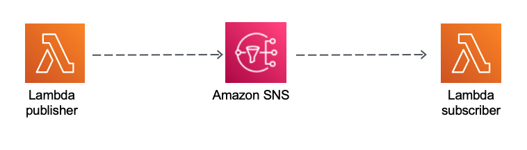

## Description
## Publisher-Subscriber Pattern - Lambda - SNS - Lambda

This pattern creates two Lambda functions and an SNS topic using AWS SAM,
and the code is implemented in Java 11.

Important: this application uses various AWS services and there are costs associated with these services after the Free Tier usage - please see the AWS Pricing page for details. You are responsible for any AWS costs incurred.

## Language:
####This is a Maven project which uses Java 11 and AWS SDK

## Framework

The framework used to deploy the infrastructure is SAM

## Services used

The AWS services used in this pattern are
#### AWS Lambda - Amazon SNS - AWS Lambda




## Description
The SAM template contains all the information to deploy AWS resources(two Lambda function and one SNS topic)
and also the permission required by these service to communicate.

You will be able to create and delete the CloudFormation stack using the AWS CLI commands.

The PaymentPublisher Lambda function is invoked with a JSON payload and publish it to an SNS topic.
The SNS Topic has one subscriber, the PaymentSubscriber, that receive a copy of the message and process it.

This is fully functional example implemented in Java 11.

## Deployment commands

````
mvn clean package

# create an S3 bucket where the source code will be stored:
aws s3 mb s3://xbasbdu92839doiadsda

# copy the source code located in the target folder:
aws s3 cp target/sourceCode.zip s3://xbasbdu92839doiadsda

# SAM will deploy the CloudFormation stack described in the template.yml file:
sam deploy --s3-bucket xbasbdu92839doiadsda --stack-name pub-sub-pattern --capabilities CAPABILITY_IAM

````

## Testing

````
##INVOKE lambda function PaymentPublisher
aws lambda invoke --function-name PaymentPublisher --cli-binary-format raw-in-base64-out --payload '{"customerId":"111-aaa","productId":"ibcd-4321","amount":"129.99"}' response.json

## display the messageId generated by SQS
cat response.json

##PaymentConsumer
##To see the message in the second PaymentSubscriber Lambda function open up the CloudWatch Logs - Log Groups of the PaymentSubscriber

````

## Cleanup

Run the given command to delete the resources that were created. It might take some time for the CloudFormation stack to get deleted.
```
aws cloudformation delete-stack --stack-name pub-sub-pattern

aws s3 rm s3://xbasbdu92839doiadsda --recursive

aws s3 rb s3://xbasbdu92839doiadsda
```

## Requirements

* [Create an AWS account](https://portal.aws.amazon.com/gp/aws/developer/registration/index.html) if you do not already have one and log in. The IAM user that you use must have sufficient permissions to make necessary AWS service calls and manage AWS resources.
* [AWS CLI](https://docs.aws.amazon.com/cli/latest/userguide/install-cliv2.html) installed and configured
* [AWS Serverless Application Model](https://docs.aws.amazon.com/serverless-application-model/latest/developerguide/serverless-sam-cli-install.html) (AWS SAM) installed

## Author bio
Razvan Minciuna
Software Architect
https://www.linkedin.com/in/razvanminciuna/
