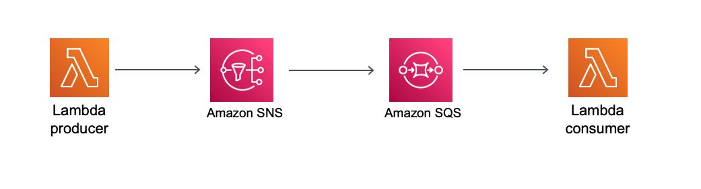

## Description
###Producer-Consumer pattern using Lambda - SNS - SQS - Lambda

This pattern creates an two Lambda function, a producer and a consumer, an SNS topic and an SQS queue using SAM and Java 11.

Important: this application uses various AWS services and there are costs associated with these services after the Free Tier usage - please see the AWS Pricing page for details. You are responsible for any AWS costs incurred.


## Language:
###This is a Maven project which uses Java 11 and AWS SDK

## Framework

The framework used to deploy the infrastructure is SAM

## Services used

The AWS services used in this pattern are
#### AWS Lambda - SNS - SQS

Topology




## Description
The SAM template contains all the information to deploy AWS resources(the Lambda functions, an SNS topic and an SNS queue)
and also the permission required by these service to communicate.

You will be able to create and delete the CloudFormation stack using the CLI commands.

The producer Lambda function will be invoked with a JSON payload, see example, and will send the message to an SNS topic.
An SQS queue which is subscribed to the SNS topic will receive the message. The Lambda consumer will be invoked and consume
the message from the queue.


## Deployment commands

````
mvn clean package

# create an S3 bucket where the source code will be stored:
aws s3 mb s3://hdeed22ad2ed

# copy the source code located in the target folder:
aws s3 cp target/sourceCode.zip s3://hdeed22ad2ed

# SAM will deploy the CloudFormation stack described in the template.yml file:
sam deploy --s3-bucket hdeed22ad2ed --stack-name orders-stack --capabilities CAPABILITY_IAM

##INVOKE lambda function OrderProducer
aws lambda invoke --function-name OrderProducer --cli-binary-format raw-in-base64-out --payload '{"userId":"ff334esq3dad", "total":"25.99"}' response.json

## display the response
cat response.json

# REMEMBER to DELETE the CloudFormation stack
aws cloudformation delete-stack --stack-name orders-stack
````

## Testing

To test the endpoint first send data using the following command. Be sure to update the endpoint with endpoint of your stack.

```
##INVOKE lambda function OrderProducer
aws lambda invoke --function-name OrderProducer --cli-binary-format raw-in-base64-out --payload '{"userId":"ff334esq3dad", "total":"25.99"}' response.json

##OrderConsumer
##To see the message in the secont OrderConsumer Lambda function open up the CloudWatch Logs - Log Groups of the OrderConsumer

```

## Cleanup

Run the given command to delete the resources that were created. It might take some time for the CloudFormation stack to get deleted.
```
aws cloudformation delete-stack --stack-name orders-stack
```

## Requirements

* [Create an AWS account](https://portal.aws.amazon.com/gp/aws/developer/registration/index.html) if you do not already have one and log in. The IAM user that you use must have sufficient permissions to make necessary AWS service calls and manage AWS resources.
* [AWS CLI](https://docs.aws.amazon.com/cli/latest/userguide/install-cliv2.html) installed and configured
* [Git Installed](https://git-scm.com/book/en/v2/Getting-Started-Installing-Git)
* [AWS Serverless Application Model](https://docs.aws.amazon.com/serverless-application-model/latest/developerguide/serverless-sam-cli-install.html) (AWS SAM) installed


## Author bio
Name: Razvan Minciuna
Linkedin: https://www.linkedin.com/in/razvanminciuna/
Description: Software Architect

