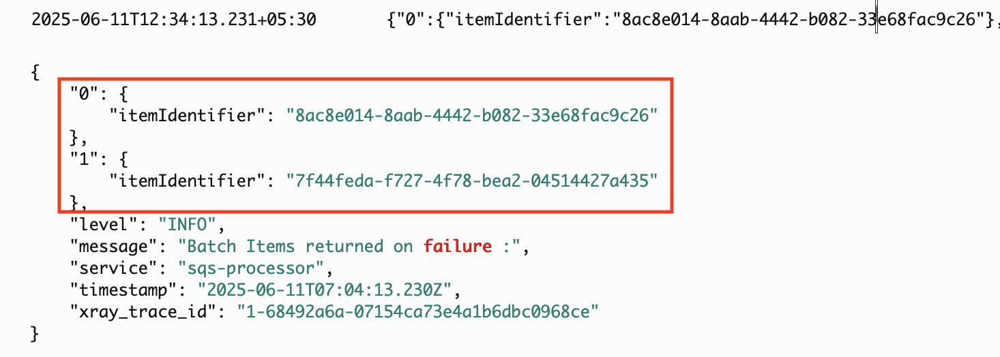

# Lambda SQS Best Practices with AWS CDK

This pattern demonstrates a production-ready implementation of AWS Lambda processing messages from Amazon SQS using AWS CDK. It serves as a reference architecture for building robust, observable, and maintainable serverless applications, featuring AWS Lambda Powertools integration for enhanced observability through structured logging, custom metrics, and distributed tracing with X-Ray. The pattern implements comprehensive error handling with automatic retries and Dead Letter Queue (DLQ) configuration, along with a detailed CloudWatch Dashboard for operational monitoring. Security is enforced through least privilege IAM roles, while operational excellence is maintained through proper resource configurations and cost optimizations. This enterprise-grade solution includes batch message processing, configurable timeouts, message validation, and a complete monitoring strategy, making it ideal for teams building production serverless applications that require high reliability, observability, and maintainability.


Important: this application uses various AWS services and there are costs associated with these services after the Free Tier usage - please see the [AWS Pricing page](https://aws.amazon.com/pricing/) for details. You are responsible for any AWS costs incurred. No warranty is implied in this example.

## Requirements

* [Create an AWS account](https://portal.aws.amazon.com/gp/aws/developer/registration/index.html) if you do not already have one and log in. The IAM user that you use must have sufficient permissions to make necessary AWS service calls and manage AWS resources.
* [AWS CLI](https://docs.aws.amazon.com/cli/latest/userguide/install-cliv2.html) installed and configured
* [Git Installed](https://git-scm.com/book/en/v2/Getting-Started-Installing-Git)
* [Node.js 20 or greater](https://nodejs.org/en/download/) installed
* [AWS CDK](https://docs.aws.amazon.com/cdk/v2/guide/getting_started.html) installed

## Deployment Instructions

1. Create a new directory, navigate to that directory in a terminal and clone the GitHub repository:
    ``` 
    git clone https://github.com/aws-samples/serverless-patterns
    ```
1. Change directory to the pattern directory:
    ```
    cd serverless-patterns/lambda-sqs-best-practices-cdk
    ```

1. Install cdk dependencies
   ```
   npm install
   ```

1. Install lambda dependencies
   ```
   cd lambda
   npm install
   ```

1. Deploy cdk stack
    ```
    cd ..
    cdk deploy

    ```

Note: If you are using CDK for the first time then bootstrap CDK in your account by using below command:

```
cdk bootstrap aws://ACCOUNT-NUMBER-1/REGION-1

```

## How it works

This pattern sets up:

1. An SQS queue with a Dead Letter Queue (DLQ) for failed message handling
2. A Lambda function with:
   - AWS Lambda Powertools integration
   - Structured logging
   - Custom metrics
   - X-Ray tracing
3. A CloudWatch Dashboard for operational monitoring
4. Least priviledge permissions implemented on roles and policies 

[ ensured by implemeting individual inline policies with only required permissions added to role ]


The Lambda function:
- Processes messages in batches
- Validates message format
- Simulates downstream API calls with random failures (5% failure rate)
- Demonstrates handling of external service dependencies
- Handles errors gracefully
- Reports metrics and traces
- Uses structured logging

Failed messages are:
- Logged with error details
- Sent to DLQ after 3 retries
- Monitored via CloudWatch metrics

## Testing

The pattern includes a load testing script to verify functionality:

1. Set the Queue URL environment variable:
```
export QUEUE_URL=$(aws cloudformation describe-stacks --stack-name LambdaSqsBestPracticesCdkStack --query 'Stacks[0].Outputs[?OutputKey==`QueueUrl`].OutputValue' --output text)

export AWS_REGION=us-east-1  # or your AWS region
```

2. Rum test script
```
npm run test           # 100 messages
npm run test:small    # 50 messages
npm run test:medium   # 200 messages
npm run test:large    # 500 messages

```


## Monitoring Guide

Locating Resources

```
1. Navigate to AWS CloudFormation Console
2. Select the stack "LambdaSqsBestPracticesCdkStack"
3. Go to the "Resources" tab
4. Here you can find:
   - All resources created by the stack
   - Direct links to each resource's console
   - Resource physical IDs and types
   - Current status of each resource
```

CloudWatch Logs

```
1. Navigate to CloudWatch Console > Log Groups
2. Find /aws/lambda/BatchProcessingLambdaFunction
3. View structured logs with:
    * Batch processing information
    * Error details
```

Example walkthrough on structured logging for a batch :
1. Batch information before starting processing


2. Success information


3. Error information of failure


4. Batch processing info


5. Failed items returned back to queue for reprocessing


6. Failed Item retried [note messageID and time for retry]


7. Additionally, in case of failed retries/poison pill


Message in moved to DLQ


Custom tracing can be used as well to get quick information on batch processing


Metrics Dashboard

```
1. Go to CloudWatch > Dashboards
2. Find the dashboard “SQS-Processing-Dashboard”
3. Monitor:
    * Message processing success rate
    * Batch size and processing time
    * Error rates
    * Monitor Queue metrics to understand Source queue depth, processing speed of messages in queue and DLQ message count
    * Lambda performance including duration 

```


## Cleanup

To remove all deployed resources:

```
cdk destroy
```

