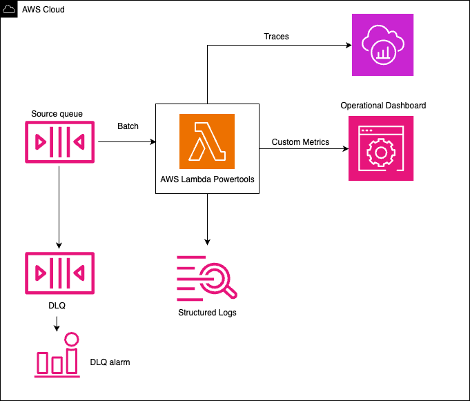
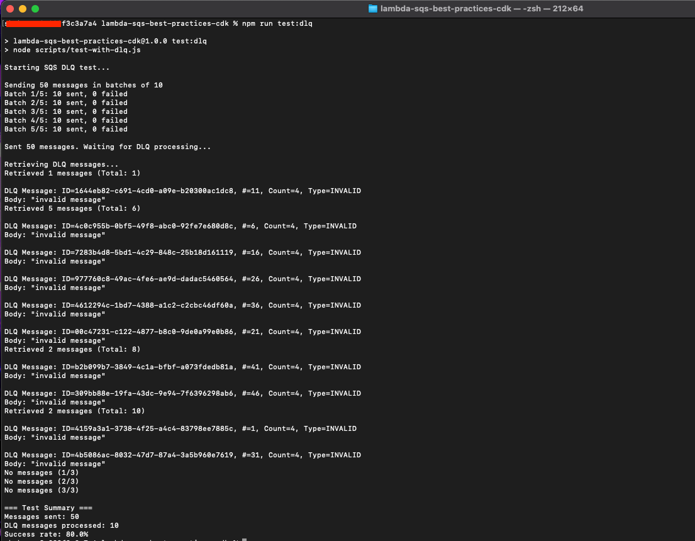
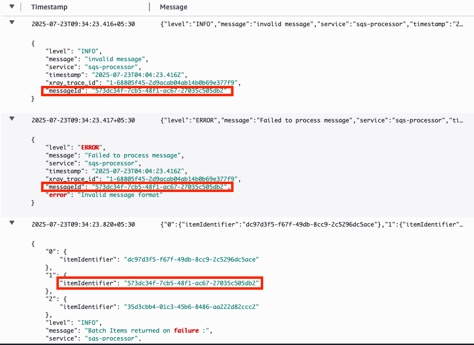

# Lambda SQS Best Practices with AWS CDK

This pattern demonstrates AWS Lambda processing messages from Amazon SQS using AWS CDK, implementing AWS best practices throughout its architecture. It incorporates observability patterns through AWS Lambda Powertools integration, featuring structured logging, custom metrics, and distributed tracing with X-Ray. Following security and operational best practices, the pattern implements comprehensive error handling with automatic retries, ReportBatchItemFailures and Dead Letter Queue (DLQ) configuration, least privilege IAM roles, and a CloudWatch Dashboard for monitoring. The solution showcases recommended approaches for batch message processing, timeout configurations, message validation, and monitoring strategies. This pattern serves as a reference implementation for teams building serverless applications, demonstrating how to implement reliability, observability, and maintainability according to AWS well-architected principles.



Important: this application uses various AWS services and there are costs associated with these services after the Free Tier usage - please see the [AWS Pricing page](https://aws.amazon.com/pricing/) for details. You are responsible for any AWS costs incurred. No warranty is implied in this example.

## Requirements

* [Create an AWS account](https://portal.aws.amazon.com/gp/aws/developer/registration/index.html) if you do not already have one and log in. The IAM user that you use must have sufficient permissions to make necessary AWS service calls and manage AWS resources.
* [AWS CLI](https://docs.aws.amazon.com/cli/latest/userguide/install-cliv2.html) installed and configured
* [Git Installed](https://git-scm.com/book/en/v2/Getting-Started-Installing-Git)
* [Node.js 20 or greater](https://nodejs.org/en/download/) installed
* [AWS CDK](https://docs.aws.amazon.com/cdk/v2/guide/getting_started.html) installed

## Deployment Instructions

1. Create a new directory, navigate to that directory in a terminal and clone the GitHub repository:
    ``` 
    git clone https://github.com/aws-samples/serverless-patterns
    ```
1. Change directory to the pattern directory:
    ```
    cd serverless-patterns/lambda-sqs-best-practices-cdk
    ```

1. Install cdk dependencies
   ```
   npm install
   ```

1. Install lambda dependencies
   ```
   cd lambda
   npm install
   ```

1. Deploy cdk stack
    ```
    cd ..
    cdk deploy

    ```

Note: If you are using CDK for the first time then bootstrap CDK in your account by using below command:

```
cdk bootstrap aws://ACCOUNT-NUMBER-1/REGION-1

```

## How it works

This pattern sets up:

1. An SQS queue with a Dead Letter Queue (DLQ) for failed message handling
2. A Lambda function with:
   - AWS Lambda Powertools integration
   - Structured logging
   - Custom metrics
   - X-Ray tracing
3. A CloudWatch Dashboard for operational monitoring
4. Least priviledge permissions implemented on roles and policies.

Navigate to IAM --> Roles --> LambdaSqsBestPracticesCdk-BatchProcessingLambdaFunc-** and review the Managed and customer inline policies.

[ ensured by implemeting individual inline policies with only required permissions added to role ]


The Lambda function:
- Processes messages in batches
- Validates message format
- Simulates downstream API calls with random failures (5% failure rate)
- Demonstrates handling of external service dependencies
- Handles errors gracefully
- Reports metrics and traces
- Uses structured logging

Failed messages are:
- Logged with error details
- Sent to DLQ after 3 retries
- Monitored via CloudWatch metrics

## Testing

The pattern includes a load testing script to verify functionality:

1. Set the Queue URL environment variable:
```
export QUEUE_URL=$(aws cloudformation describe-stacks --stack-name LambdaSqsBestPracticesCdkStack --query 'Stacks[0].Outputs[?OutputKey==`QueueUrl`].OutputValue' --output text)

export DLQ_URL=$(aws cloudformation describe-stacks --stack-name LambdaSqsBestPracticesCdkStack --query 'Stacks[0].Outputs[?OutputKey==`DlqUrl`].OutputValue' --output text)

export AWS_REGION=us-east-1  # or your AWS region
```

2. Rum test script
Success Scenario
```
npm run test:success

```
Sample result


Refer Dashboard to verify all the Messages are processed successfully and no messages in DLQ 


Also refer DLQ count on dashboard


Failure Scenario
```
npm run test:dlq
```
Sample result


Verify the same using dashboard


Additionally, confirm the messages in DLQ.

Note : Click on "Poll for messages" to view messages sent to DLQ


Note: Refer Monitoring guide to locate “SQS-Processing-Dashboard”

## Monitoring Guide

Locating Resources

```
1. Navigate to AWS CloudFormation Console
2. Select the stack "LambdaSqsBestPracticesCdkStack"
3. Go to the "Resources" tab
4. Here you can find:
   - All resources created by the stack
   - Direct links to each resource's console
   - Resource physical IDs and types
   - Current status of each resource
```

CloudWatch Logs

```
1. Navigate to CloudWatch Console > Log Groups
2. Find /aws/lambda/BatchProcessingLambdaFunction
3. View structured logs with:
    * Batch processing information
    * Error details
```

Example DeepDive walkthrough on structured logging for a batch :
1. Batch information before starting processing


2. Success information


3. Error information of failure


4. Batch processing info


5. Failed items returned back to queue for reprocessing


6. Failed Item retried [note messageID and time for retry]


7. Additionally, in case of failed retries/poison pill
Original Invocation


Retry 1 : note the timestamp and xray_trace_id


Retry 2 : note the timestamp and xray_trace_id


Message in moved to DLQ once the Receive count hit 3


Click on message to view the message details to understand failure reason


Custom tracing can be used as well to get quick information on batch processing


Metrics Dashboard

```
1. Go to CloudWatch > Dashboards
2. Find the dashboard “SQS-Processing-Dashboard”
3. Monitor:
    * Message processing success rate
    * Batch size and processing time
    * Error rates
    * Monitor Queue metrics to understand Source queue depth, processing speed of messages in queue and DLQ message count
    * Lambda performance including duration 

```


## Cleanup

To remove all deployed resources:

```
cdk destroy
```

