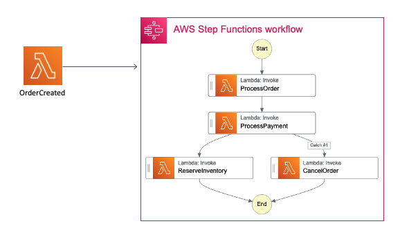
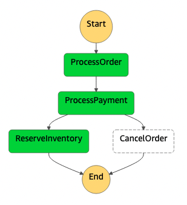
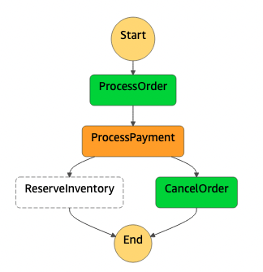

## Description
## Lambda - StepFunctions

This pattern creates an five Lambda function and an Step Functions Workflow using SAM and Java 11.

Important: this application uses various AWS services and there are costs associated with these services after the Free Tier usage - please see the AWS Pricing page for details. You are responsible for any AWS costs incurred.


## Language:
###This is a Maven project which uses Java 11 and AWS SDK

## Framework

The framework used to deploy the infrastructure is SAM

## Services used

The AWS services used in this pattern are
#### AWS Lambda - Step Functions

Topology




## Description
The SAM template contains all the information to deploy AWS resources(the Lambda functions and the Step Functions workflow)
and also the permission required by these service to communicate.

You will be able to create and delete the CloudFormation stack using the CLI commands.

The OrderEvent Lambda function will be invoked with an JSON payload which will send the message to the Step Functions workflow.
Depending on the payload, the Step Function will execute a different Lambda function.

This is fully functional example developed in Java 11.


## Deployment commands

````
mvn clean package

# create an S3 bucket where the source code will be stored:
aws s3 mb s3://jd33js2dc4rfwd

# copy the source code located in the target folder:
aws s3 cp target/sourceCode.zip s3://jd33js2dc4rfwd

# SAM will deploy the CloudFormation stack described in the template.yml file:
sam deploy --s3-bucket jd33js2dc4rfwd --stack-name orders-stack --capabilities CAPABILITY_IAM

````

## Testing

To test the endpoint first send data using the following command. Be sure to update the endpoint with endpoint of your stack.

```
##invocation #1 lambda function OrderEvent - happy path
aws lambda invoke --function-name OrderEvent --cli-binary-format raw-in-base64-out --payload '{"customer": { "customerId": "jdi398ismiw2smcw2","creditCard": "GOODCARD"}}' response.json

##invocation #2 lambda function OrderEvent - error path
aws lambda invoke --function-name OrderEvent --cli-binary-format raw-in-base64-out --payload '{"customer": { "customerId": "jdi398ismiw2smcw2","creditCard": "BADCARD"}}' response.json

```
##Step Functions
##invocation #1 Happy Path




##invocation #2 Error Path




## Cleanup

Run the given command to delete the resources that were created. It might take some time for the CloudFormation stack to get deleted.
```
aws cloudformation delete-stack --stack-name orders-stack
```

## Requirements

* [Create an AWS account](https://portal.aws.amazon.com/gp/aws/developer/registration/index.html) if you do not already have one and log in. The IAM user that you use must have sufficient permissions to make necessary AWS service calls and manage AWS resources.
* [AWS CLI](https://docs.aws.amazon.com/cli/latest/userguide/install-cliv2.html) installed and configured
* [Git Installed](https://git-scm.com/book/en/v2/Getting-Started-Installing-Git)
* [AWS Serverless Application Model](https://docs.aws.amazon.com/serverless-application-model/latest/developerguide/serverless-sam-cli-install.html) (AWS SAM) installed


## Author bio
Name: Razvan Minciuna
Linkedin: https://www.linkedin.com/in/razvanminciuna/
Description: Software Architect
