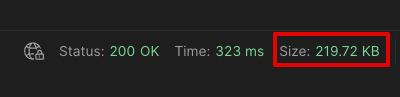

# Using data compression with AWS Lambda functions

This pattern allows you to 
1. Save on data transfer costs when using Lambda functions with NAT Gateway or VPC Endpoints
2. Receive and return payloads larger than the Lambda limit of 6MB. 

Learn more about this pattern at Serverless Land Patterns: https://serverlessland.com/patterns/lambda-with-compression

Important: this application uses various AWS services and there are costs associated with these services after the Free Tier usage - please see the [AWS Pricing page](https://aws.amazon.com/pricing/) for details. You are responsible for any AWS costs incurred. No warranty is implied in this example.

## Requirements

* [Create an AWS account](https://portal.aws.amazon.com/gp/aws/developer/registration/index.html) if you do not already have one and log in. The IAM user that you use must have sufficient permissions to make necessary AWS service calls and manage AWS resources.
* [AWS CLI](https://docs.aws.amazon.com/cli/latest/userguide/install-cliv2.html) installed and configured
* [Git Installed](https://git-scm.com/book/en/v2/Getting-Started-Installing-Git)
* [AWS Cloud Development Kit](https://aws.amazon.com/cdk/) (AWS CDK) installed

## Deployment Instructions

1. Create a new directory, navigate to that directory in a terminal and clone the GitHub repository:
    ``` 
    git clone https://github.com/aws-samples/serverless-patterns
    ```
1. Change directory to the pattern directory:
    ```
    cd lambda-with-compression
    ```
2. From the command line, use AWS CDK to deploy the AWS resources for the pattern:
    ```
    cdk deploy
    ```
3. Allow CDK CLI to create IAM roles with the required permissions.

4. Note the output from the CDK deployment process. It contain the FunctionUrl you will use for testing.

## How it works

The AWS Lambda Invoke API does not provide support for data compression. You can send requests and receive responses in plain-text formats only (such as JSON). The payload size for both request and response is limited to 6MB. 

While the Invoke API does not provide native compression support, you can easily introduce compression in your function code. In case you're invoking the function directly via the Invoke API or AWS SDK - you will be responsible for compression/decompression on both server and client side. However if you're invoking functions with API Gateway or Function URLs, those services can handle the compression for you, as illustrated in this sample. 

In the sample code, a 1MB data chunk is generated in function handler, compressed to ~200KB, returned via Function URL, and decompressed on the client side by a supporting client, such as Postman, back to its original form and length. 

## Testing

See results using Postman, or similar tool. A 1MB data chunk is returned as a 200KB compressed payload. 



## Saving on data transfer costs

It is common for cloud solutions residing in a VPC to invoke Lambda functions. For example an EKS-based control plane needs to invoke a series of Lambda functions. This is usually achieved through either NAT Gateway or VPC Endpoint. VPC Endpoint, in this scenario, will be less expensive - see [NAT Gateway pricing](https://aws.amazon.com/vpc/pricing/) and [VPC Endpoint pricing](https://aws.amazon.com/privatelink/pricing/).

Both NAT Gateway and VPC Endpoint are priced per GB of data processed, so reducing the volume of data by compressing it will also reduce the cost. On the other side, compressing/decompressing data is a CPU-intensive activity, which will increase function invocation duration, and as a result Lambda cost. Below performance results illustrate a series of tests ran to estimate the impact of data compression of Lambda function invocation duration, Lambda function invocation cost, and data transfer costs with both NAT Gateway and VPC Endpoint. 

> Note that these calculations were performed with a series of assumptions and randomly generated JSON data. You should always perform your own performance/cost estimates with representative payloads. 

## Assumptions

* Lambda cost (GB-s, ARM) - $0.000013 [(pricing)](https://aws.amazon.com/lambda/pricing/)
* NAT Gateway cost (per GB) - $0.045 [(pricing)](https://aws.amazon.com/vpc/pricing/)
* VPC Endpoint cost (per GB) - $0.010 [(pricing)](https://aws.amazon.com/privatelink/pricing/).
* Test with different payload sizes - randomly generated JSON, 10KB, 100KB, 1MB, 5MB
* Test with different function memory configurations - 512MB, 1GB, 2GB
* Estimate cost deltas for processing 1,000,000 requests
* Use gzip for data compression 

## Testing results

Mean compression rate ~30%

### Invocation duration delta (ms) (compressed vs uncompressed)

|       | 512MB | 1GB | 2GB |
| ----- | ----: | --: | --: |
| 10KB  | 1     | 1   | 1   |
| 100KB | 27    | 13  | 9   |
| 1MB   | 251   | 124 | 70  |
| 5MB   | 1210  | 588 | 342 |

### Added cost - invocation duration delta cost (compressed vs uncompressed)

|       | 512MB | 1GB   | 2GB   |
| ----- | ----: | ----: | ----: |
| 10KB  | $0.01 | $0.01 | $0.03 |
| 100KB | $0.18 | $0.17 | $0.24 |
| 1MB   | $1.67 | $1.65 | $1.87 |
| 5MB   | $8.07 | $7.84 | $8.64 |

### Savings - data transfer delta cost (compressed vs uncompressed)

|       | NAT Gateway | VPC Endpoint |
| ----- | ----------: | -----------: |
| 10KB  | $0.16       | $0.04        |
| 100KB | $1.33       | $0.30        |
| 1MB   | $12.74      | $2.83        |
| 5MB   | $63.72      | $14.16       |

## Conclusion

In all test cases the savings from processing compressed data with NAT Gateway or VPC Endpoint were higher than the added cost of compressing data in Lambda. The data compression technique can be applied as an efficient cost savings mechanism if you can tolerate added latency. In addition, the same compression technique can be applied for sending and receiving payloads with sizes over the 6MB limit. 

## Notes

* Using other compression methods, such as [zstd](https://facebook.github.io/zstd/), may yield different results
* For functions configured with >2GB of RAM it is important to use compression method that supports multiple vCPUs for maximum efficiency. 
* While this experiment was focused on Lambda, the same technique can be applied to any other service, e.g. reducing message sizes of large messages flowing through SQS. 

## Cleanup
 
Delete the stack

```bash
cdk destroy
```
----
Copyright 2023 Amazon.com, Inc. or its affiliates. All Rights Reserved.

SPDX-License-Identifier: MIT-0