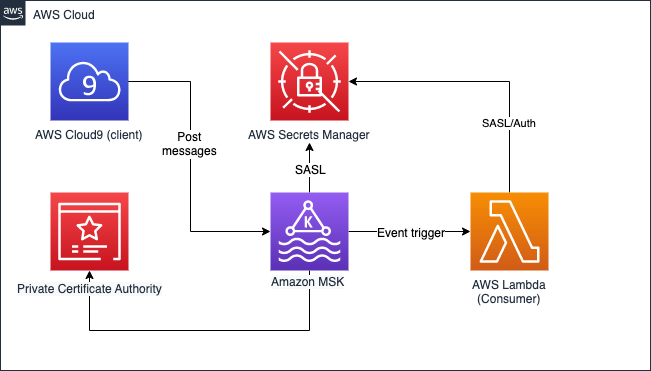

# Amazon Managed Streaming for Apache Kafka (Amazon MSK) to AWS Lambda with SASL/SCRAM

Amazon MSK also supports the following authentication methods for Kafka APIs:
* IAM access control
* Mutual TLS authentication
* SASL/SCRAM authentication

This pattern deploys a Lambda function that uses an Amazon MSK topic as an event source over SASL (Simple Authorization Security Layer)/SCRAM (Salted Challenge Response Authentication Mechanism). You can control access to your Amazon MSK clusters using sign-in credentials that are stored and secured using AWS Secrets Manager. Storing user credentials in Secrets Manager reduces the overhead of cluster authentication such as auditing, updating, and rotating credentials. Secrets Manager also lets you share user credentials across clusters.

**How it works**
Sign-in credentials authentication for Amazon MSK uses SASL/SCRAM authentication. To set up sign-in credentials authentication for a cluster, you create a Secret resource in AWS Secrets Manager, and associate sign-in credentials with that secret. And, configure your MSK cluster with this secret.


[//]: # (Learn more about this pattern at Serverless Land Patterns: https://serverlessland.com/patterns/msk-lambda-sasl)


## Pre-requisites
Ensure you have met the following:
* [Create an AWS account](https://portal.aws.amazon.com/gp/aws/developer/registration/index.html) if you do not already have one and log in. The IAM user that you use must have sufficient permissions to make necessary AWS service calls and manage AWS resources.
* [AWS CLI](https://docs.aws.amazon.com/cli/latest/userguide/install-cliv2.html) installed and configured
* [Git Installed](https://git-scm.com/book/en/v2/Getting-Started-Installing-Git)
* [AWS Serverless Application Model](https://docs.aws.amazon.com/serverless-application-model/latest/developerguide/serverless-sam-cli-install.html) (AWS SAM) installed
* Deploy a provisioned Amazon MSK cluster - <br>
   Please follow instructions in `create-cluster-cfn/README.md` to deploy a provisioned MSK cluster. SASL/SCRAM authentication is only available for provisioned Amazon MSK cluster. So while deploying the stack, select `EnvType` as `Provisoned`. After deployment, make a note of following from the cloud formation output - 
    - ProvisionedMSKArn - MSK cluster arn
    - CredentialsSecretArn - ARN for secret manager secret with credentials
    - PrivateSubnetMSKOne, PrivateSubnetMSKTwo, and PrivateSubnetMSKThree - Subent ids
    - SecurityGroupId - Secruity group id
* Complete `Basic Set up` and `SASL/SCRAM authentication` sections in `create-cluster-cfn/README.md` 
## Design
The following diagram describes how MSK and Lambda event driven patter using SASL/SCRAM authentication mechanism.

## Deployment Instructions

1. Create a new directory, navigate to that directory in a terminal and clone the GitHub repository:
    ``` 
    git clone https://github.com/aws-samples/serverless-patterns.git
    ```
1. Change directory to the pattern directory:
    ```
    cd msk-cfn-sasl-lambda
    ```
1. From the command line, use AWS SAM to deploy the AWS resources for the pattern as specified in the template.yml file:
    ```
    sam deploy --guided
    ```
1. During the prompts:
    * Enter a stack name (e.g. `msk-lambda-sasl-sample-stack`)
    * Enter the desired AWS Region (e.g. `us-east-1`)
    * Parameter MSKClusterId arn (e.g. `arn:aws:kafka:us-east-1:1234567890:cluster/msk-sample-sasl-cluster-cluster/34xxxx-23xx-4311-bbd1-429fxxx-11`)
    * Parameter Secret Arn (e.g. `arn:aws:secretsmanager:us-east-1:1234567890:secret:AmazonMSK_Credentials-sda2w`)
    * Parameter TopicName (e.g. `DemoSASLTopic`)
    * Parameter SubnetIds (e.g. `subnet-xxxxxx,subnet-yyyyyyy,subnet-zzzzzz`)
    * Parameter SecurityGroups (e.g. `sg-xxx222yyy11zz`)
    * Allow SAM CLI to create IAM roles with the required permissions.

Keep the rest of the default values. After successful run of sam deploy you would see the  message like - _Successfully created/updated stack - msk-lambda-sasl-sample-stack in us-east-1_

Once you have run `sam deploy --guided` mode once and saved arguments to a configuration file (samconfig.toml), you can use `sam deploy` in future to use these defaults.

Note the outputs from the SAM deployment process. These contain the resource names and/or ARNs which are used for testing.

## How it works

Lambda is a consumer application for your Kafka topic. It processes records from one or more partitions and sends the payload to the target function. Lambda continues to process batches until there are no more messages in the topic.

Lambda internally polls for new messages from the event source and then synchronously invokes the target Lambda function. Lambda reads the messages in batches and provides these to your function as an event payload. The maximum batch size is configurable. (The default is 100 messages.) 

The Lambda function’s event payload contains an array of records. Each array item contains details of the topic and Kafka partition identifier, together with a timestamp and base64 encoded message:

```
{   "eventSource": "aws:kafka",
    "eventSourceArn": "arn:aws:kafka:sa-east-1:123456789012:cluster/vpc-2priv-2pub/751d2973-a626-431c-9d4e-d7975eb44dd7-2",
    "records": {
      "mytopic-0": [
          {
            topic: 'DemoSASLTopic',
            partition: 0,
            offset: 7,
            timestamp: 1679601299111,
            timestampType: 'CREATE_TIME',
            value: 'bmV3IG1lc3NhZ2Ugb24gbWFyY2ggMjM=',
            headers: []
          }
      ]
    }
}
```

## Testing

1. Publish messages to the Amazon MSK topic. You can start the producer with the following command.

```
./bin/kafka-console-producer.sh --broker-list BootstrapBrokerStringSaslScram --topic DemoSASLTopic --producer.config client_sasl.properties

```
2. Open the Lambda function, check the MSK trigger, if the trigger is disabled, make sure you are using the sane topic name when sending the messages via the producer.

3. Retrieve the topic messages from the logs of Lambda function with the following command. Alternatively you can check in the Lambda logs from the Amazon CloudWatch Logs.

```bash
sam logs --stack-name msk-lambda-sasl-nj-sample --tail
```
## Documentation
- [Using Lambda with Amazon MSK](https://docs.aws.amazon.com/lambda/latest/dg/with-msk.html)
- [Using Amazon MSK as an event source for AWS Lambda](https://aws.amazon.com/blogs/compute/using-amazon-msk-as-an-event-source-for-aws-lambda/)
- [Log file polling using sam commands](https://docs.aws.amazon.com/serverless-application-model/latest/developerguide/sam-cli-command-reference-sam-logs.html)
## Cleanup
 
1. Delete the stack
    ```bash
    sam delete
    ```
2. Delete the cloudformation stack that you deployed as prerequisite. 

----
Copyright 2023 Amazon.com, Inc. or its affiliates. All Rights Reserved.

SPDX-License-Identifier: MIT-0
