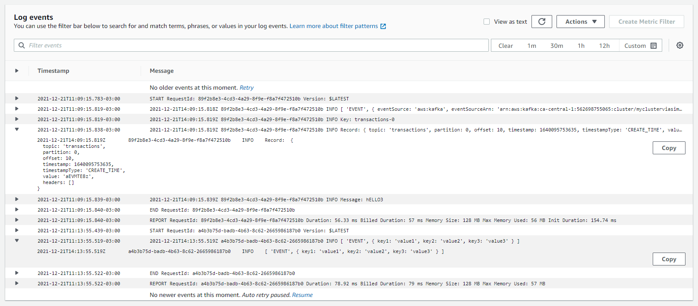

# MSK to Lambda

This CDK stack deploys a Lambda function, an Amazon MSK topic, and the minimum IAM resources required to run the application. Learn more about this pattern at https://serverlessland.com/patterns/msk-lambda-cdk.

When items are published to the Amazon MSK topic, the changes are sent to a stream. This pattern configures a Lambda function to poll this stream, and log some information to CloudWatch. The function is invoked with a payload containing the information of the event.

Important: this application uses various AWS services and there are costs associated with these services after the Free Tier usage - please see the [AWS Pricing page](https://aws.amazon.com/pricing/) for details. You are responsible for any AWS costs incurred. No warranty is implied in this example.

## Requirements

- [Create an AWS account](https://portal.aws.amazon.com/gp/aws/developer/registration/index.html) if you do not already have one and log in. The IAM user that you use must have sufficient permissions to make necessary AWS service calls and manage AWS resources.
- [AWS CLI](https://docs.aws.amazon.com/cli/latest/userguide/install-cliv2.html) installed and configured
- [Node and NPM](https://nodejs.org/en/download/) installed
- [Git Installed](https://git-scm.com/book/en/v2/Getting-Started-Installing-Git)
- [AWS Cloud Development Kit](https://docs.aws.amazon.com/cdk/latest/guide/getting_started.html#getting_started_install) (AWS CDK) installed

## Useful commands

 * `npm run build`   compile typescript to js
 * `npm run watch`   watch for changes and compile
 * `npm run test`    perform the jest unit tests
 * `cdk deploy`      deploy this stack to your default AWS account/region
 * `cdk diff`        compare deployed stack with current state
 * `cdk synth`       emits the synthesized CloudFormation template

## Deployment Instructions

1. Create a new directory, navigate to that directory in a terminal and clone the GitHub repository:
   ```sh
   git clone https://github.com/aws-samples/serverless-patterns
   ```
1. Change directory to the pattern directory:
   ```sh
   cd msk-lambda-cdk
   ```
1. From the command line, use npm to install dependencies:
   ```sh
   npm install
   ```
1. Finally, use AWS CDK to deploy the AWS resources for the pattern as specified in the `lib/msk-to-lambda-cdk-stack.ts` file:

   ```sh
   cdk bootstrap aws://accountnumber/region
   cdk deploy
   ```

## How it works

Lambda is a consumer application for your Kafka topic. It processes records from one or more partitions and sends the payload to the target function. Lambda continues to process batches until there are no more messages in the topic.

Lambda internally polls for new messages from the event source and then synchronously invokes the target Lambda function. Lambda reads the messages in batches and provides these to your function as an event payload. The maximum batch size is configurable. (The default is 100 messages.) 

The Lambda function’s event payload contains an array of records. Each array item contains details of the topic and Kafka partition identifier, together with a timestamp and base64 encoded message:

```
{   "eventSource": "aws:kafka",
    "eventSourceArn": "arn:aws:kafka:sa-east-1:123456789012:cluster/vpc-2priv-2pub/751d2973-a626-431c-9d4e-d7975eb44dd7-2",
    "records": {
      "mytopic-0": [
          {
            "topic": "mytopic"
            "partition": "0",
            "offset": 15,
            "timestamp": 1545084650987,
            "timestampType": "CREATE_TIME",
            "value": "SGVsbG8sIHRoaXMgaXMgYSB0ZXN0Lg==",
          }
      ]
    }
}
```

## Testing

1. In a [Client Machine](https://docs.aws.amazon.com/msk/latest/developerguide/create-client-machine.html) 

2. Install required softwares

```bash
sudo yum install java-1.8.0 -y 
cd ~
wget https://archive.apache.org/dist/kafka/2.2.1/kafka_2.12-2.2.1.tgz 
tar -xzf kafka_2.12-2.2.1.tgz 

cd kafka_2.12-2.2.1 
sudo cp /usr/lib/jvm/jre-1.8.0-openjdk-1.8.0.312.b07-1.amzn2.0.2.x86_64/lib/security/cacerts /tmp/kafka.client.truststore.jks  

cd ~/kafka_2.12-2.2.1/bin/  
cat > client.properties <<EOF
security.protocol=SSL
ssl.truststore.location=/tmp/kafka.client.truststore.jks
EOF
```

3. Create a topic

```bash
REGION=ca-central-1
TOPIC=transactions

kafka_arn=$(aws kafka list-clusters --region $REGION --output text --query 'ClusterInfoList[0].ClusterArn') && echo "$kafka_arn" 
zookeeperConnectString=`aws kafka describe-cluster --region $REGION --cluster-arn "$kafka_arn" --output text --query 'ClusterInfo.ZookeeperConnectString'` && echo $zookeeperConnectString 
bootstrapBroker=`aws kafka get-bootstrap-brokers --region $REGION --output text --cluster-arn $kafka_arn` && echo $bootstrapBroker

./kafka-topics.sh --create --zookeeper $zookeeperConnectString --replication-factor 2 --partitions 1 --topic $TOPIC
```

4. List topics
```bash
./kafka-console-producer.sh --broker-list $bootstrapBroker --producer.config client.properties --topic $TOPIC
```

## Documentation

- [Using Lambda with Amazon MSK](https://docs.aws.amazon.com/lambda/latest/dg/with-msk.html)
- [Using Amazon MSK as an event source for AWS Lambda](https://aws.amazon.com/blogs/compute/using-amazon-msk-as-an-event-source-for-aws-lambda/)



## Cleanup

1. Delete the stack
   ```bash
   cdk destroy
   ```
1. Confirm the stack has been deleted
   ```bash
   aws cloudformation list-stacks --query "StackSummaries[?contains(StackName,'STACK_NAME')].StackStatus"
   ```

---

Copyright 2021 Amazon.com, Inc. or its affiliates. All Rights Reserved.

SPDX-License-Identifier: MIT-0
