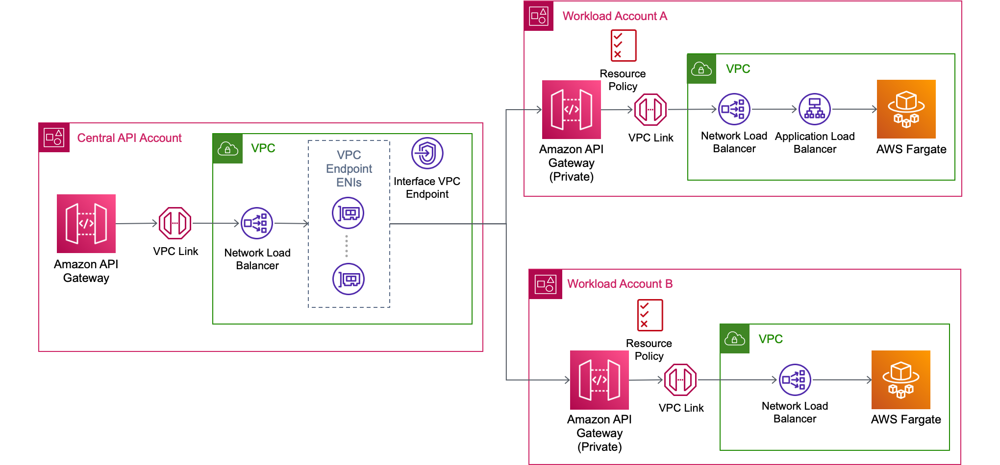
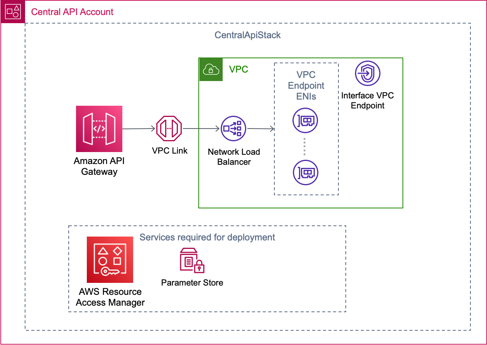
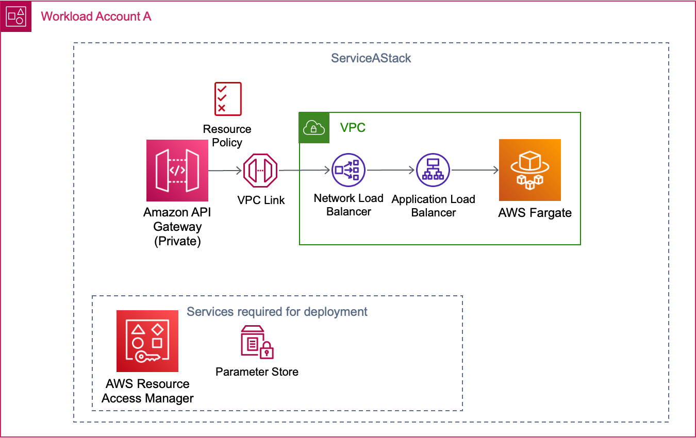
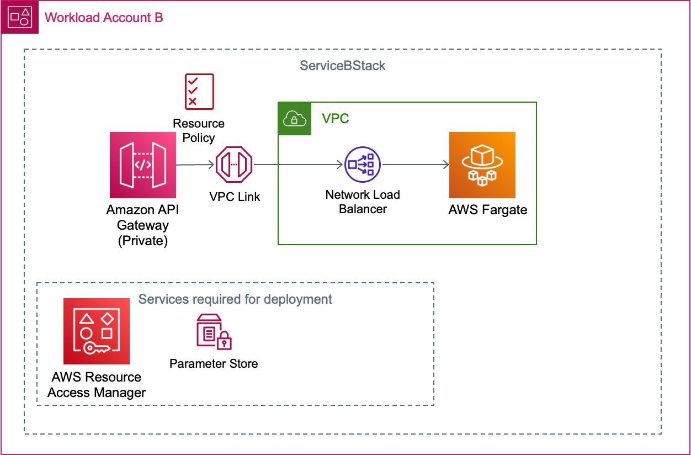
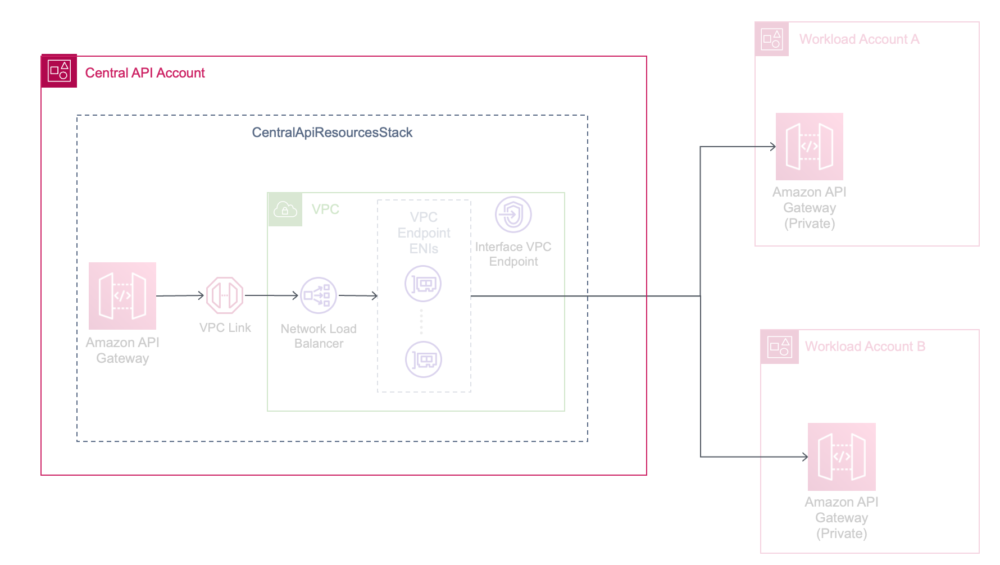

# Multi-Account centralized API Gateway with Private APIs as integration targets

This CDK template implements an Amazon API Gateway REST API, as a front door for private API Gateway services residing in separate AWS accounts. This pattern allows for centralized governance and security and provides flexibility to development teams to develop their applications in their own accounts.

Learn more about this pattern at Serverless Land Patterns: << Add the live URL here >>

Important: this application uses various AWS services and there are costs associated with these services after the Free Tier usage - please see the [AWS Pricing page](https://aws.amazon.com/pricing/) for details. You are responsible for any AWS costs incurred. No warranty is implied in this example.

## Architecture Overview



- The `Central API Account` hosts an API Gateway Regional API which acts as the central API for services in the two workload accounts. A VPC link is created in this account to enable the backend integration to the Private APIs in the workload accounts. The VPC link connectivity is established using an NLB, which has a target group consisting of the Elastic Network Interfaces (ENIs) for the API Gateway Interface VPC Endpoint.

- In `Workload Account A`, one of the Private APIs is hosted with a Fargate service and an ALB as the backend integration. A VPC link and NLB are created to allow connectivity to the ALB of the Fargate service. The NLB is required as [only an NLB is supported as a target for the VPC link when using API Gateway REST APIs](https://docs.aws.amazon.com/apigateway/latest/developerguide/http-api-vs-rest.html#http-api-vs-rest.differences.integrations).

- In `Workload Account B`, the other Private API is hosted with a Fargate service and an NLB as the backend integration. A VPC link is created to allow connectivity to the NLB of the Fargate service.

- For simplicity, a [public image for a Demo API](https://gallery.ecr.aws/bstraehle/rest-api) was used for both Fargate services.

## Requirements

* [Three AWS accounts](https://portal.aws.amazon.com/gp/aws/developer/registration/index.html) if you do not already have one and log in. The IAM user that you use must have sufficient permissions to make necessary AWS service calls and manage AWS resources.
* [AWS CLI](https://docs.aws.amazon.com/cli/latest/userguide/install-cliv2.html) installed and configured
* [Git](https://git-scm.com/book/en/v2/Getting-Started-Installing-Git)
* [Node and NPM](https://nodejs.org/en/download)
* [AWS Cloud Development Kit (AWS CDK)](https://docs.aws.amazon.com/cdk/v2/guide/getting_started.html)

## Deployment Instructions

1. Create a new directory, navigate to that directory in a terminal and clone the GitHub repository:
    ``` 
    git clone https://github.com/aws-samples/serverless-patterns
    ```
1. Change directory to the pattern directory:
    ```
    cd multi-account-central-api-private-apigw-targets-cdk-typescript
    ```
1. Install dependencies:
    ```
    npm install
    ```

1. Open `src/config.json` and modify the cidrs if you require:
    ```
    ...
    "cidrs": {
    "serviceA": "10.5.0.0/16",
    "serviceB": "10.6.0.0/16",
    "centralAPI": "10.7.0.0/16"
    }
    ...
    ```

1. Set Environment Variables:
    ```
    export REGION=ca-central-1
    export CENTRAL_API_ACCOUNT_NUMBER=XXXXXXXXXXXX
    export SERVICE_A_ACCOUNT_NUMBER=XXXXXXXXXXXX
    export SERVICE_B_ACCOUNT_NUMBER=XXXXXXXXXXXX
    ```

1. Configure AWS CDK for each AWS account:
    ```
    cdk bootstrap --profile <your-profile-name> $CENTRAL_API_ACCOUNT_NUMBER/$REGION 
    cdk bootstrap --profile <your-profile-name> $SERVICE_A_ACCOUNT_NUMBER/$REGION 
    cdk bootstrap --profile <your-profile-name> $SERVICE_B_ACCOUNT_NUMBER/$REGION 
    ```

1. Deploy using AWS CDK:
    ```
    cdk deploy CentralApiStack --profile <your-profile-name>
    cdk deploy ServiceAStack --profile <your-profile-name>
    cdk deploy ServiceBStack --profile <your-profile-name>
    cdk deploy CentralApiResourcesStack --profile <your-profile-name>
    ```


## How it works

The CDK application consists of the following 4 stacks.

### CentralApiStack




In this stack, the central Regional REST API is deployed with the VPC, VPC Link, Network Load Balancer and API Gateway VPC Endpoint. In addition to these core components, an Advanced Parameter and an AWS Resource Manager Share are created to store the API Gateway VPC Endpoint ID and share it to the workload accounts. The workload accounts need the endpoint ID to use in their API Gateway resource policies.

### ServiceAStack



In this stack, the following are deployed: a Private REST API with a resource policy, Fargate, ALB, NLB, and VPC Link. In addition to these core components, an Advanced Parameter and an AWS Resource Manager Share are created to store the API Gateway Endpoint URL and share it to the `Central API` Account. The Central API Account needs this URL to setup the HTTP_Proxy for this service. 

### ServiceBStack



In this stack, the following are deployed: a Private REST API with a resource policy, Fargate, NLB, and VPC Link. In addition to these core components, an Advanced Parameter and an AWS Resource Manager Share are created to store the API Gateway Endpoint URL and share it to the `Central API` Account. The Central API Account needs this URL to setup the HTTP_Proxy for this service. 

### CentralApiResourcesStack



In this stack, the API resources and integrations to the workload accounts are created using the shared API Gateway Endpoint URLs.

## Testing

Use the following commands to get the Endpoint URL for Service A and Service B.

    ```
    export SERVICE_A_URL=$(aws cloudformation describe-stacks --stack-name CentralApiResourcesStack --query "Stacks[0].Outputs[?ExportName=='ServiceAEndpoint'].OutputValue" --output text --profile <your-profile-name>)

    export SERVICE_B_URL=$(aws cloudformation describe-stacks --stack-name CentralApiResourcesStack --query "Stacks[0].Outputs[?ExportName=='ServiceBEndpoint'].OutputValue" --output text --profile <your-profile-name>)
    ```


The APIs for both Service A and Service B are the same. Here is a list of available endpoints:

    ```
    GET /swagger (This is for the API definition)
    GET /Demo
    POST /Demo
    GET /Demo/{id}
    PUT /Demo/{id}
    DELETE /Demo/{id}
    ```

Here are example commands that can be used:


1. Get a list of items
    ```
    curl $SERVICE_A_URL/Demo
    curl $SERVICE_B_URL/Demo
    ```

1. Add an item to the data store
    ```
    curl -X POST $SERVICE_A_URL/Demo -d '{"id":"1234", "name":"Service A test"}' -H "Content-Type: application/json"
    curl -X POST $SERVICE_B_URL/Demo -d '{"id":"1234", "name":"Service B test"}' -H "Content-Type: application/json"
    ```

1. Get the item added in step 2
    ```
    curl $SERVICE_A_URL/Demo/1234
    curl $SERVICE_B_URL/Demo/1234
    ```

1. Update the item added in step 2
    ```
    curl -X PUT $SERVICE_A_URL/Demo/1234 -d '{"id":"1234", "name":"This is a test for Service A"}' -H "Content-Type: application/json"
    curl -X PUT $SERVICE_B_URL/Demo/1234 -d '{"id":"1234", "name":"This is a test for Service B"}' -H "Content-Type: application/json"
    ```

1. Delete the item added in step 2
    ```
    curl -X DELETE $SERVICE_A_URL/Demo/1234
    curl -X DELETE $SERVICE_B_URL/Demo/1234
    ```

## Cleanup
 
1. Destroy the stacks

    ```
    cdk destroy CentralApiResourcesStack --profile <your AWS config profile>
    cdk destroy ServiceBStack --profile <your AWS config profile>
    cdk destroy ServiceAStack --profile <your AWS config profile>
    cdk destroy CentralApiStack --profile <your AWS config profile>
    ```

1. Wait for the resources to delete and confirm their removal
----
Copyright 2024 Amazon.com, Inc. or its affiliates. All Rights Reserved.

SPDX-License-Identifier: MIT-0
